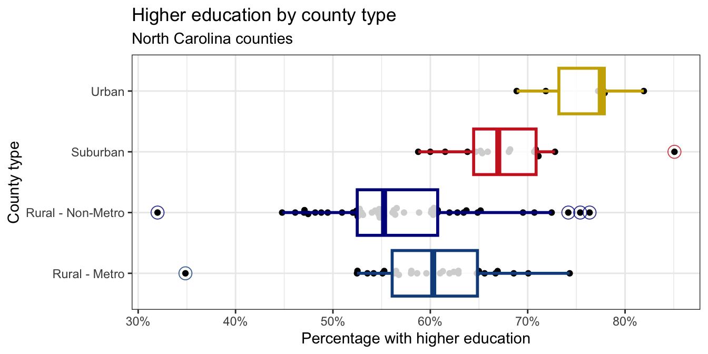

# Goals

In this assignment, you will...

- Gain proficiency in data wrangling
- Apply principles of effective data visualization to a real dataset
- Continue developing a workflow for reproducible data analysis.

# Getting Started

To get started on this assignment, do the following:

- Download `R_HW_04.qmd` and place it in your STAT_7500 folder.
- Download `nc-county.csv` and place it in the `data` subfolder.

You will complete the assignment by adding code and text responses to `R_HW_04.qmd`.

::: column-margin
Keep your data, images, and analysis files together in your project. Use relative paths such as `"data/nc-county.csv"` so the analysis does not depend on a location specific to your computer.
:::

## Packages

You will use the **tidyverse** package for data wrangling and visualization, **scales** for better axis labels, and **ggbeeswarm** for the optional bonus visualization.

If needed, install packages in the Console using `install.packages("nameofpackage")`. Load them in your document using the code below.

```{r}
#| label: load-packages
#| message: false
#| warning: false

library(tidyverse)
library(scales)
library(ggbeeswarm)
```


# Exercises 

Remember that continuing to develop a sound workflow for reproducible data analysis is important as you complete assignments in this course. You should provide adequate comments to your code and narrative text interpreting your results. 

# Data: The Midwest (revisited)

We will use the `midwest` data frame once again for this homework.
The data contains demographic characteristics of counties in the Midwest region of the United States.
Because the data set is part of the **ggplot2** package, you can read documentation for the data set, including variable definitions by typing `?midwest` in the Console or searching for `midwest` in the Help pane.

## Counting observations

::: callout-note
### Exercise 1

Calculate the number of counties in each state and display your results in descending order of number of counties. Which state has the highest number of counties, and how many? Which state has the lowest number, and how many?
:::

```{r}
#| label: counties-by-state

```

## Finding shared county names

::: callout-note
### Exercise 2

While two counties in a given state can’t have the same name, some county names might be shared across states. A classmate says “Look at that, there is a county called `___` in each state in this dataset!” 

+ In a single pipeline, discover all counties that could fill in the blank. Your response should be a data frame with only the county names that could fill in the blank and the number of times they appear in the data, and narrative stating the county names that could fill in this blank.
:::

::: column-margin
You will want to use the `filter()` function in your answer, which requires a logical condition to describe what you want to filter for.
For example, `filter(x > 2)` means filter for values of `x` greater than 2, and `filter(y <= 3)` means filter for values of y less than or equal to 3.
:::

The table below is a summary of logical operators and how to articulate them in R.

| operator      | definition                |
|---------------|---------------------------|
| `<`           | less than                 |
| `<=`          | less than or equal to     |
| `>`           | greater than              |
| `>=`          | greater than or equal to  |
| `==`          | exactly equal to          |
| `!=`          | not equal to              |
| `x & y`       | `x` AND `y`               |
| `x` \| `y`    | `x` OR `y`                |
| `is.na(x)`    | test if `x` is `NA`       |
| `!is.na(x)`   | test if `x` is not `NA`   |
| `x %in% y`    | test if `x` is in `y`     |
| `!(x %in% y)` | test if `x` is not in `y` |
| `!x`          | not `x`                   |

```{r}
#| label: shared-county-names

```

⏸️ ➡️ ✅ *This is a good place to pause and Render to check for errors.*

## Filtering and selecting

::: callout-note
### Exercise 3

Consider the box plot below of population densities that has large outliers. For each of the following, answer using a single data wrangling pipeline for each part. Your response should be a data frame with five columns: county name, state name, population density, total population, and area, in this order. If your response has multiple rows, the data frame should be arranged in descending order of population density.

+ Identify the counties with a population density higher than 25,000. Your code must use the `filter()` function.

+ Identify the county with the highest population density. Your code must use the `max()` function.
:::

```{r}
#| label: popdensity-boxplot
#| fig-width: 5
#| fig-height: 3
#| echo: false
#| eval: true

ggplot(midwest, aes(x = popdensity)) +
  geom_boxplot() +
  labs(
    title = "Population densities of midwest counties",
    x = "Population density"
  )
```

```{r}
#| label: high-popdensity-counties

```

```{r}
#| label: highest-popdensity-county

```

## Summarizing a distribution

::: callout-note
### Exercise 4

The plot below displays the distribution of population densities.
The following is one acceptable description that touches on the shape, center, and spread of this distribution. Calculate the values that should go into the blanks.

> *"The distribution of population density of counties is unimodal and extremely right-skewed. A typical Midwestern county has population density of `____` people per unit area. The middle 50% of the counties have population densities between `____` and `____` people per unit area."*
:::

::: column-margin
Think about which measures of center and spread are appropriate for skewed distributions.
:::

```{r}
#| label: popdensity-histogram
#| echo: false
#| fig-fullwidth: true

ggplot(midwest, aes(x = popdensity)) +
  geom_histogram(color = "white", bins = 10)
```

```{r}
#| label: popdensity-summary

```

## Calculating proportions

::: callout-note
### Exercise 5

The visualization below shows the proportion of counties located in a metropolitan area in each state. Calculate these proportions in a single data pipeline.
:::

::: column-margin
Remember, you'll first need to create a new variable called `metro` which takes on the value `Yes` if the value of `inmetro` is 1, and `No` otherwise.
You can refer to the in-class data-wrangling code if you need a refresher.
:::

```{r}
#| label: metro-barplot
#| fig-width: 7
#| fig-height: 3
#| echo: false
#| eval: true
midwest |>
  mutate(metro = if_else(inmetro == 1, "Yes", "No")) |>
  ggplot(aes(x = state, fill = metro)) +
  geom_bar(position = "fill") +
  labs(
    title = "Do metropolitan county proportions differ across states?",
    x = "State",
    y = "Proportion in metro area",
    fill = "In metro area?"
  )
```

```{r}
#| label: metro-proportions

```

⏸️ ➡️ ✅ *This is a good place to pause and Render to check for errors.*

# Data: North Carolina

For the remaining questions on the homework, you will use data on counties in North Carolina. The dataset contains information on North Carolina counties retrieved from the 2020 Census as well as from [myFutureNC Dashboard](https://dashboard.myfuturenc.org/county-data-and-resources/) maintained by Carolina Demography at the University of North Carolina at Chapel Hill.

This dataset should be stored in a file called `nc-county.csv` in the `data` folder of your project/repository.

The variables in the dataset and their descriptions are:

-   `county`: Name of county.
-   `land_area_m2`: Land area of county in meters-squared, based on the 2020 census.
-   `land_area_mi2`: Land area of county in miles-squared, based on the 2020 census.
-   `pop_2020`: Population of county, based on the 2020 Census.
-   `pop_dens_2020`: Population density calculated as population (`pop_2020`) divided by land area in miles-squared (people per mile-squared).
-   `county_type`: Peer county type classification based on population characteristics, socioeconomic status, and geographic features used for grouping counties with similar demographic, social, and economic characteristics, allowing them to be compared and benchmarked against one another.
-   `median_hh_income`: Median household income.
-   `p_foreign_born`: Percentage of population that is foreign-born.
-   `p_child_poverty`: Percentage of children living in poverty.
-   `p_single_parent_hh`: Percentage of households with children that are single-parent households.
-   `p_broadband`: Percentage of households with broadband internet access.
-   `p_home_ownership`: Percentage of homes that are owner-occupied.
-   `p_family_sustaining_wage`: Percentage of adults that earn a family-sustaining wage -- typically a wage that covers essential costs like housing, food, childcare, transportation, and healthcare for a family's basic needs within a specific geographic area
-   `p_edu_lths`: Percentage of 25-44-year-olds with less than a high school diploma.
-   `p_edu_hsged`: Percentage of 25-44-year-olds with a high school diploma or equivalent.
-   `p_edu_scnd`: Percentage of 25-44-year-olds with some college or an associate degree.
-   `p_edu_ndc`: Percentage of 25-44-year-olds with non-degree credentials -- certifications, licenses, or other credentials that demonstrate specific skills or knowledge but do not confer a formal academic degree.
-   `p_edu_assoc`: Percentage of 25-44-year-olds with an associate degree.
-   `p_edu_ba`: Percentage of 25-44-year-olds with a bachelor's degree.
-   `p_edu_mapl`: Percentage of 25-44-year-olds with a master's, professional, or doctoral degree.
-   `p_edu_hs_grad_rate`: High school graduation rate.
-   `p_edu_chronic_absent_rate`: Chronic absenteeism rate.

You can read this file into R with the following code:

```{r}
#| label: import-nc-county
#| message: false
#| warning: false

nc_county <- read_csv("data/nc-county.csv")
```

## Creating a variable

::: callout-note
### Exercise 6

Report the number of rows and columns in `nc_county`. Then, create a new variable called `p_edu_he` (short for "percentage of population with higher education") that is the sum of the percentages of 

- 25-44-year-olds with some college or an associate degree (`p_edu_scnd`), 
- non-degree credentials (`p_edu_ndc`), 
- an associate degree (`p_edu_assoc`), 
- a bachelor's degree (`p_edu_ba`), and
- a master's, professional, or doctoral degree (`p_edu_mapl`).

and store this variable in the `nc_county` data frame.

Confirm the number of rows and columns in `nc_county` after adding this variable.
:::

```{r}
#| label: create-higher-education

```

### Quick check

If you don't create the new variable `p_edu_he` above, you will not be able to answer the remaining questions on the homework.

Therefore, here is a quick check to make sure you created the variable correctly -- after creating the variable, run the following code:

```{r}
#| label: check-higher-education
#| eval: false

nc_county |> 
  select(p_edu_he) |> 
  slice_head(n = 3)
```

You should see the following output:

```
# A tibble: 3 × 1
  p_edu_he
     <dbl>
1    0.615
2    0.525
3    0.525
```

If you do not see this output, please revisit the exercise above and make sure you created the variable correctly. 
Ask for help in class or in office hours if you need assistance.

## Overall summaries

::: callout-note
### Exercise 7

In a single pipeline, calculate the 

- minimum,
- first quartile (25th percentile),
- median (50th percentile),
- mean,
- third quartile (75th percentile), and
- maximum

of `p_edu_he`.
:::

```{r}
#| label: higher-education-summary

```

## Grouped summaries

::: callout-note
### Exercise 8

In a single pipeline, calculate the same statistics as in the previous part, but for each `county_type`.
:::

```{r}
#| label: higher-education-by-type

```

⏸️ ➡️ ✅ *This is a good place to pause and Render to check for errors.*

## Identifying outliers

::: callout-note
### Exercise 9

The plot below shows the distribution of `p_edu_he` by `county_type`. In a single pipeline, identify the outliers in the plot and return a data frame with the county name, county type, percentage with higher education. This data frame should be arranged in ascending order of county type and descending order of percentage with higher education.
:::



```{r}
#| label: higher-education-outliers

```

## Connecting education and income

::: callout-note
### Exercise 10

Create a scatter plot with percentage of 25-44 year olds with higher education (`p_edu_he`) on the x-axis and median household income (`median_hh_income`) on the y-axis. Describe the relationship between these two variables. In your description, make sure to comment on the direction, form, strength, and any unusual observations. For unusual observations, identify the counties that correspond to these observations, and make sure to include the code you used to identify them as part of your answer. Your code should output the county name, percentage with higher education, and median household income for each unusual observation.

Requirements for the plot (use documentation, a web search, and/or AI to determine how to do this):

- The x-axis should be formatted as percentages, e.g., 30%, not 0.3.
- The y-axis should be formatted as dollar amounts, e.g., \$40,000, not 4e+04.
:::

```{r}
#| label: education-income-plot
#| fig-fullwidth: true

```

```{r}
#| label: unusual-counties

```

## Open exploration

::: callout-note
### Exercise 11

Come up with a question that you could answer with the `nc_county` data frame and the new `p_edu_he` variable you created in Question 6 and state it explicitly. Then, answer your question with an appropriate data visualization and/or data transformation pipeline and a brief description of your findings.
:::

```{r}
#| label: open-exploration

```

## Bonus: Recreate a visualization

::: callout-note
### Optional bonus 

Recreate the boxplot given in Exercise 9. You can use the following tips:

- Points: The points are drawn with the `geom_beeswarm()` function from the **ggbeeswarm** package.

- Outliers: The outliers in the box plots are drawn as _open circles_. You can specify this with the `outlier.shape` argument in `geom_boxplot()`. You can also adjust the size of the outliers with the `outlier.size` argument. The ggplot2 [aesthetic specifications documentation](https://ggplot2.tidyverse.org/articles/ggplot2-specs.html#point) has a list of shape names you can use for help.

- Color palette: The colors for the box plots are manually specified in a `scale_color_manual()` layer. You do not need to worry about the exact colors, but you should try to get close, e.g., use blue-ish colors for Rural counties, red-ish for Suburban, and brown-ish for Urban. You can use HEX codes for colors or look up named colors in R in the [R colors cheatsheet](https://www.nceas.ucsb.edu/sites/default/files/2020-04/colorPaletteCheatsheet.pdf)

- Transparency: You should adjust the transparency of the box plots. You don't have to worry about the exact transparency value, but you should try to get close.

- Theme: This plot uses a non-default theme. See [theme options documentation](https://ggplot2.tidyverse.org/reference/ggtheme.html) for options.

- Aspect ratio and width: You can adjust the aspect ratio and width of your plot in your _rendered document_ by setting `fig-asp` and `fig-width` options in the code cell.
:::

```{r}
#| label: bonus-boxplot
#| fig-fullwidth: true

```

➡️ ✅ *Render one last time and open `R_HW_04`.html` in a web browser. Check that your code, output, visualizations, and written responses are organized and readable.*

# Submit

::: {.callout-important}

To submit, you need to upload your R_HW_04.html file to the R HW 04 assignment on Brightspace. The html file should be located in the same folder on your computer where you placed your .qmd (STAT_7500). 

:::

# Grading (10 points)

Homework assignments are opportunities to practice the skills and habits you will use on larger course projects. They are graded holistically rather than point-by-point.

Your homework will be evaluated for:

- **Completion and substantive correctness (8 points):** You have attempted all exercises, your code and results are generally correct, and your written responses appropriately interpret and engage with the data.
- **Reproducible workflow and presentation (2 points):** Your document renders successfully and your code, output, visualizations, and responses are organized and readable.

Minor mistakes will not be penalized individually. You may also receive feedback about misconceptions or habits to improve even when they do not result in a point deduction. Use this feedback in future homework assignments and projects.

### Homework rubric — 10 points total

#### Completion and substantive correctness — 8 points

| Score | Description |
|---|---|
| **8** | Complete and substantively correct. Code and analyses accomplish what was asked, and written responses appropriately interpret the results. Minor imperfections are okay. |
| **7** | Mostly complete and correct, with one notable error, omission, or misunderstanding. |
| **6** | Several errors or omissions, but the work demonstrates reasonable understanding of the main ideas. |
| **4–5** | Significant errors, omissions, or misunderstandings that should be addressed before moving on. |
| **0–3** | Substantially incomplete, incorrect, or shows limited engagement with the homework. |

#### Reproducible workflow and presentation — 2 points

| Score | Description |
|---|---|
| **2** | Document renders successfully; code, output, visualizations, and written responses are reasonably organized and readable. |
| **1** | Some problems with reproducibility, organization, readability, or presentation. |
| **0** | Major problems with reproducibility, organization, readability, or presentation. |

**Total: 10 points**

