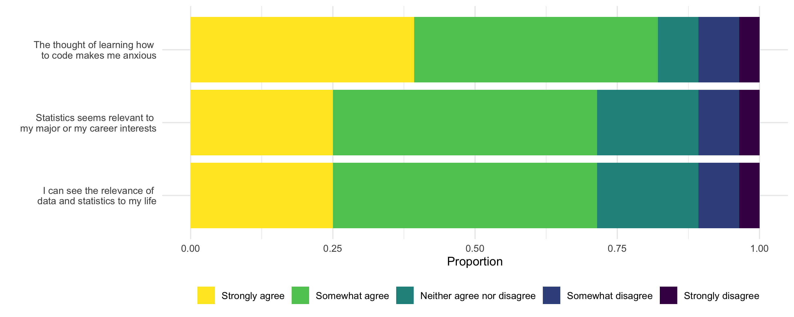

# Goals

In this assignment, you will...

- Develop proficiency cleaning survey data
- Consider implications of question types (e.g., multiple choice, select all that apply, open-ended) on data quality and analysis
- Wrangle data to create desired visualizations
- Discover interconnections between data cleaning, analysis, and communication strategies

# Getting started

To get started on this assignment, do the following:

- Download `R_HW_05.qmd` and place it in your STAT_7500 folder.

You will complete the assignment by adding code and text responses to `R_HW_05.qmd`.


# Packages

We will use the **tidyverse** package for this assignment, and you'll need `lubridate` to work with dates. If you wish to use the viridis color palettes, you will need the **viridis** package as well. 

```{r load-package, message = FALSE, warning = FALSE}
library(tidyverse)
library(viridis)
library(lubridate)
```

# Data 

The data come from an intro survey I give my Intro Stats students. Emails and names have been removed for anonymity. We'll read in the data from a url:

```{r, message = FALSE, warning = FALSE}
survey <- read_csv("https://docs.google.com/spreadsheets/d/e/2PACX-1vSWWS4oNf69Rhx9COxKH445CXPl2xq7FpyabaMFpib8f9bFBFDuznskYfWIi97e8lQYl-q1M6zZ62RR/pub?output=csv")
```

The data are currently in the form exactly as provided from a Google Form. You will need to take many necessary cleaning steps to get it in a form that is appropriate for analysis. 

# Exercises

::: callout-note
### Exercise 1

+ Take a look at the column names.

```{r, eval = FALSE}
names(survey)
```

+ Create a vector of new names using `c()` and save this vector as `new_names`. You should choose concise and informative names. 

```{r, eval = FALSE}
new_names <- c("variable_1", "variable_2", ...)
```

+ Then use the code `names(survey) <- new_names` to covert the existing column names to the new names. 
+ Inspect your data to ensure that `survey` now has the desired variable names
:::


::: callout-note
### Exercise 2

+ Using the `glimpse()` function will reveal that many of the variables are stored as characters, including the Timestamp variable. 
+ Use the function `mdy_hms()` inside a `mutate()` function to convert the timestamp variable to a date. 
+ Then create a histogram of this new variable. 
+ What does this reveal about the data?
:::


::: callout-note
### Exercise 3

Reproduce the following visualization. Note, you will need to re-order the levels of your year variable.


:::


::: column-margin :::
\
*Hint: `theme_light()` and the color `navyblue` were used*
:::

::: callout-note
### Exercise 4

What is the distribution of gender in Intro Stats? 

+ Create an appropriate visualization. 
+ Make decisions about how to clean up the levels and combine as necessary. A `case_when()` inside a mutate may be useful. 
+ Comment on the pros and cons of making this a multiple choice vs open-ended question in a survey. 
:::

::: callout-note
### Exercise 5

*"On a scale from 1 to 10, how anxious are you about taking MATH 130 - Intro to Statistics?"*

Create an appropriate visualization or summary table to explore this variable.
:::

::: callout-note
### Exercise 6

Reproduce the following visualization. Note, you may need to re-order the levels of your variable.


::: 

::: column-margin :::
\
*Hint: Set `y = 1` inside your `aes()` function. And add a `theme` layer where `axis.text.y` and `axis.ticks.y` are set equal to `element_blank()`*
:::

::: callout-note

### Exercise 7

What majors are represented in MATH 130? 

+ Create a visualization to explore this variable. 
+ Make decisions about how to clean up the levels and combine as necessary. 
+ A `case_when()` inside a mutate may be useful. Comment on your decisions. 
:::

::: column-margin :::
\
*Note: ChatGPT/AI can be helpful in providing an initial solution to a tedious task like this, but make sure to review its suggestions and override if necessary - you are the analyst, responsible for analysis decisions!*
:::

::: {.callout-important}
Select all that apply questions in a survey pose some difficult wrangling tasks. Consider the laptop variable. Suppose we want to explore what percentage of students have each of the three types: Mac laptop, iPad, or PC/Windows laptop.

The following code creates three new variables to indicate if a student has access to each type. Note you will need to adapt this code if you named your variable something other than `laptop.`

```{r, eval = FALSE}
survey <- survey |> 
  mutate(Mac = if_else(grepl("Mac laptop", laptop), "Yes", "No"),
         iPad = if_else(grepl("iPad", laptop), "Yes", "No"),
         PC = if_else(grepl("PC/Windows laptop", laptop), 
                      "Yes", "No"))
```
:::


::: column-margin :::
\
The `grepl()` function searches for a given string (e.g. "Mac laptop") in a given object (`laptop`). It returns the value `TRUE` if the string is present, and `FALSE` if it is not. Combined with the `if_else()` statement, this results in the new variable having the value "Yes" if the string is found and "No" if it is not. 
:::

::: {.callout-note}
### Exercise 8

+ Use a `pivot_longer` to pivot the columns `Mac:PC`. 
+ Consider using `names_to = "laptop_type"` and `values_to = "laptop_access"` to name the new pivoted columns. 
+ Then, recreate the following visualization.  


:::

::: column-margin :::
\
See the GIF below as a reminder of how `pivot_longer()` works
```{r echo = FALSE}
knitr::include_graphics("img/tidyr-longer-wider.gif")
```
:::

::: {.callout-note}
### BONUS 1
Create a new variable called `semester` that uses the time variable to designate whether each student was in MATH 130 in a Fall or Spring semester. . Use this new variable to investigate whether students in the Fall or Spring semester were more anxious about MATH 130 on average.  

:::

::: column-margin :::
\
*Hint: the function `month()` applied to a date will extract just the month, `year()` will extract the year, etc, which may helpful in determining semester.*
:::

::: {.callout-note}
### BONUS 2

Attempt to recreate this visualization as closely as possible. 


:::

::: column-margin :::
\
*Hint: you will first need to use a `pivot_longer` and then use a `case_when()` to recode the levels of the new variable to be the full statements seen on the y-axis)*. 
::: 

➡️ ✅ *Render one last time and open `r-hw-04`.html` in a web browser. Check that your code, output, visualizations, and written responses are organized and readable.*

# Submit

::: {.callout-important}

To submit, you need to upload your R_HW_04.html file to the R HW 04 assignment on Brightspace. The html file should be located in the same folder on your computer where you placed your .qmd (STAT_7500). 

:::

# Grading (10 points)

Homework assignments are opportunities to practice the skills and habits you will use on larger course projects. They are graded holistically rather than point-by-point.

Your homework will be evaluated for:

- **Completion and substantive correctness (8 points):** You have attempted all exercises, your code and results are generally correct, and your written responses appropriately interpret and engage with the data.
- **Reproducible workflow and presentation (2 points):** Your document renders successfully and your code, output, visualizations, and responses are organized and readable.

Minor mistakes will not be penalized individually. You may also receive feedback about misconceptions or habits to improve even when they do not result in a point deduction. Use this feedback in future homework assignments and projects.

### Homework rubric — 10 points total

#### Completion and substantive correctness — 8 points

| Score | Description |
|---|---|
| **8** | Complete and substantively correct. Code and analyses accomplish what was asked, and written responses appropriately interpret the results. Minor imperfections are okay. |
| **7** | Mostly complete and correct, with one notable error, omission, or misunderstanding. |
| **6** | Several errors or omissions, but the work demonstrates reasonable understanding of the main ideas. |
| **4–5** | Significant errors, omissions, or misunderstandings that should be addressed before moving on. |
| **0–3** | Substantially incomplete, incorrect, or shows limited engagement with the homework. |

#### Reproducible workflow and presentation — 2 points

| Score | Description |
|---|---|
| **2** | Document renders successfully; code, output, visualizations, and written responses are reasonably organized and readable. |
| **1** | Some problems with reproducibility, organization, readability, or presentation. |
| **0** | Major problems with reproducibility, organization, readability, or presentation. |

**Total: 10 points**