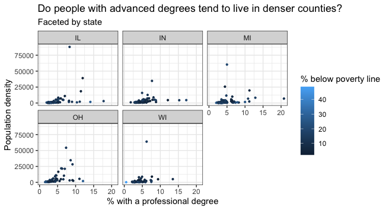

## Goals

In this activity, you will...

-   learn how to effectively visualize numeric and categorical data.
-   continue developing a workflow for reproducible data analysis.

## Getting started

Hit **Render** to begin. You may need to change the Settings (Gear & Sprocket icon) to "Preview in Viewer Pane" to view the html file in the Viewer pane.

# Packages

We will use the **tidyverse** and **viridis** packages to create and customize plots in R.

```{r}
#| label: load-packages
#| message: false
#| echo: false
#| warning: false
library(tidyverse)
library(viridis)
```

# Data: Let's take a trip to the Midwest

The data in this lab is in the `midwest` data frame. It is part of the **ggplot2** R package, so the `midwest` data set is automatically loaded when you load the tidyverse package.

The data contains demographic characteristics of counties in the Midwest region of the United States.

Because the data set is part of the **ggplot2** package, you can read documentation for the data set, including variable definitions by typing `?midwest` in the **console**.

# Exercises

As we've discussed in lecture, your plots should include an informative title, axes should be labeled, and careful consideration should be given to aesthetic choices.

Remember that continuing to develop a sound workflow for reproducible data analysis is important as you complete all assignments in this course. Paying attention to how this .qmd is organized and formatted will help you learn best practices for creating your own reports. That is, pay attention to how code chunks are labeled, how headers and sub-headers and font changes are used, and how spacing and line breaks are used in the code.

Also keep in mind that you're not just practicing your technical coding skills, but you're also developing your investigative skills as a data scientist - **be curious about the data** and **dig further** into it when your visualizations reveal certain patterns or unusual observations.

## Exercise 1

Make a histogram to visualize the population density of counties. Set the number of bins to 10 and include axes labels and a title.

```{r}
#| label:  hist-pop-density
#insert code here
```

## Exercise 2

Create a scatterplot of the percentage of people with a college degree (`percollege`) versus percentage below poverty (`percbelowpoverty`) with points colored by `state`. Label the axes and legend and give the plot a title. Use the `scale_color_viridis` function to apply the viridis color palette to your plot.

```{r}
#| label: scatter-college-poverty
#insert code here
```

## Exercise 3

Now, let's examine the relationship between the same two variables, using a separate plot for each state.

-   Label the axes and give the plot a title.

-   Add a layer called `geom_smooth` with the argument `se = FALSE` to add a smooth curve fit to the data.

-   Which plot do you prefer - this plot or the plot in Ex 2?

```{r}
#| label: scatter-college-poverty-by-state
#insert code here
```

## Exercise 4

*Do some states have counties that tend to be geographically larger than others?* To explore this question, create side-by-side boxplots of area (`area`) of a county based on state (`state`).

-   Describe what you observe from the plot.

-   Which state has the single largest county? How do you know based on the plot?

```{r}
#| label: side-by-side-box
#insert code here
```

> YOUR NARRATIVE TEXT HERE

## Exercise 5

*Do some states have a higher percentage of their counties located in a metropolitan area?*

Create a segmented bar chart with one bar per state and the fill determined by the distribution of `metro`, whether a county is considered in a metro area. The y axis of the segmented barplot should range from 0 to 1.

-   What do you notice from the plot?

Note: For this exercise, you should begin with the data wrangling code below. We will learn more about data wrangling code next week.

```{r}
#| label: wrangle-metro
midwest <- midwest |>
  mutate(metro = ifelse(inmetro == 1, "Yes", "No"))
```

```{r}
#| label: segmented-bar
#insert code here
```

## Exercise 6

What are two more questions you could investigate using this data? For each, state the question and produce a visualization to investigate it.

> Question 1 HERE

```{r}
#| label: question1-viz

```

> Question 2 HERE

```{r}
#| label: question2-viz

```

## BONUS FUN

Recreate the plot below. (You can view the image on the course website; if you want to embed it in this document, download the image and put it in a folder called images that shares the same root directory as this .qmd file).(Hints for creating the plot: [The `ggplot2` reference page](https://ggplot2.tidyverse.org/reference/ggtheme.html) will be helpful in determining the theme. The `size` of the points is 0.75.)


