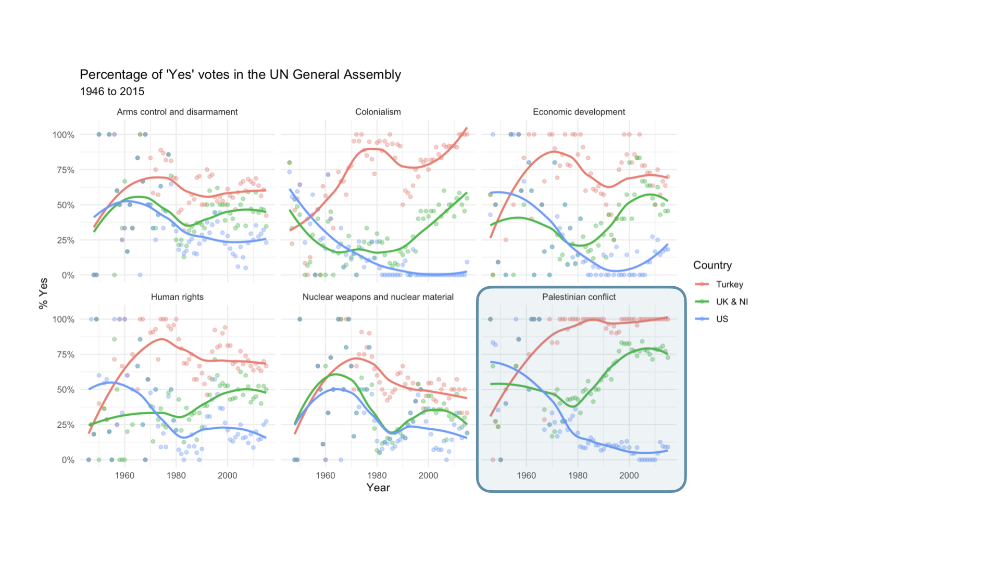
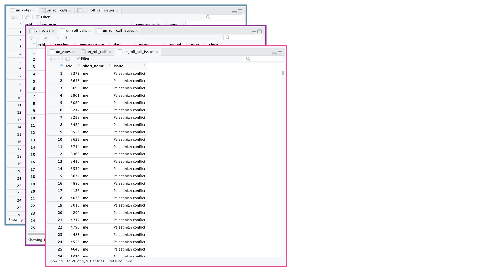
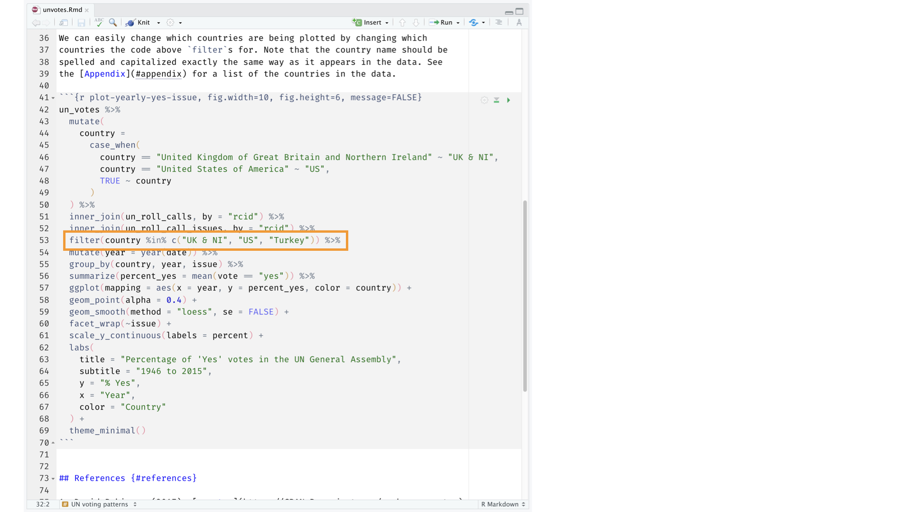
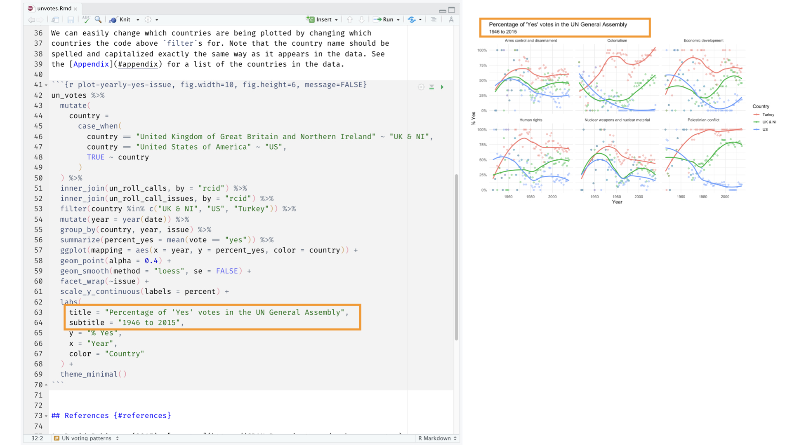

```{r setup}
knitr::opts_chunk$set(
  echo = TRUE,
  fig.width = 8,
  fig.asp = 0.618,
  out.width = "60%",
  fig.align = "center",
  dpi = 300,
  message = FALSE,
  warning = FALSE
)

library(tidyverse)
library(rvest)
```

## STAT 7500: Statistical Programming {.section-divider .center .middle}

### aka Data Science I 

## What is data science?

- Data science is an exciting discipline that allows you to turn raw data into understanding, insight, and knowledge.

- Set of tools to help us be better **stewards of information**

- We're going to learn to do this in a `tidy` and reproducible way -- more on that later!

## Our central goal

Ultimately, the goal is that you will be able to...

. . .

- gain insight from data

. . .

- gain insight from data, **reproducibly**

. . .

- gain insight from data, reproducibly **(with literate programming)**

. . .

- gain insight from data, reproducibly (with literate programming), **using modern programming tools and techniques**

## Some of what you will learn / do

::: {.columns}
::: {.column width="50%"}
- Fundamentals of R/RStudio & Python

- Ask productive questions of real-world data

- Explore, visualize, and wrangle data, especially with the `tidyverse`

- Make and justify data-processing decisions


:::

::: {.column width="50%"}

- Data science workflow and scientific practice

- Data visualization & communication

- Data ethics

- Conduct reproducible, shareable analyses with Quarto and Jupyter notebooks
:::
:::

## Course FAQ

**Q - What data science background does this course assume?**  
A - None. Pre-req: one stats class, no prior programming knowledge expected

. . .

**Q - Is this a statistics course?**  
A - While statistics $\neq$ data science, they are very closely related and have tremendous overlap. Hence, this course will help you utilize and further your statistical thinking. However this course is not your typical statistics course - we will emphasize working and thinking with data, not statistical inference or modeling.

. . .

**Q - Will this course make me an expert programmer?**  
A - No, but it should give you a strong foundation, strategies for solving unfamiliar problems, and practice finding and evaluating resources.


## Course "climate" or "learning environment"

. . .

**What’s the BEST class you’ve ever taken? What was different about that course that helped you thrive?**

. . .

  + What did the instructor do in that course?
  + What did your classmates do in that course?
  + What did YOU do in that course?

. . .

**What’s the WORST class you’ve ever taken? What prevented you from thriving?**


## About The Course {.section-divider .center .middle}

## Course Toolkit

**Brightspace**: Central hub of the course. Assignments, Announcements, Gradebook, HELP Forum

**RStudio:** Software -- more on this later!

**GitHub repo:** Assignment templates -- more on this later!

**Perusall:** Community Reading Annotations (data ethics)

## A typical class period

+ "Active lecture"
+ Bring laptop, expect to code each week
+ Slides and code/data files posted in Brightspace

## A typical week (what's due)

+ Homework (8 in R, 4 in Python) - due Tuesdays, 6:15pm
+ Perusall Reading Annotations - due Sundays, 11:59pm

. . .

+ Optional (but encouraged & appreciated): weekly check-in survey, sent Tuesdays at end of class. 

. . .

See syllabus for late work policy – can request extension BEFORE the due date (on most assignments)


## Where to find help

- In-class!

. . .

- Attend (drop-in) Student Hours
  - Tuesdays 2-2:30 (Mendel 115)
  - Tuesdays 4 – 5:30 (SAC 370)\*
  - Thursdays 1:15 – 2:15 (SAC 370)\*
  
\*Zoom available upon request

. . .

- Use the HELP Forum (under Discussions in Brightspace) for any questions about course content and/or assignments, since other students may benefit from the response. And it's easier to type code and math, compared to email.

. . .

- Use email for questions regarding personal matters and/or grades.


## R and RStudio {.section-divider .center .middle}

## R and RStudio

::: {.columns}
::: {.column width="50%"}
{width="25%"}
:::

::: {.column width="50%"}
{width="50%"}
:::
:::

- R is an open-source statistical **programming language**
- RStudio is a convenient interface for R called an **IDE** (integrated development environment), e.g. *"I write R code in the RStudio IDE"*
- At its simplest:<sup>*</sup>
    - R is like a car’s engine
    - RStudio is like a car’s dashboard

::: {.footnote}
*Source: [Modern Dive](https://moderndive.com/)
:::

## R packages

- **Packages** are the fundamental units of reproducible R code. They include reusable R functions, the documentation that describes how to use them, and sample data<sup>1</sup>

- As of August 2026, there are over 24,700 R packages available on **CRAN** (the Comprehensive R Archive Network)<sup>2</sup>

- We're going to work with a small (but important) subset of these!

::: {.footnote}
<sup>1</sup> Wickham and Bryan, [R Packages](https://r-pkgs.org/).

<sup>2</sup> [CRAN contributed packages](https://cran.r-project.org/web/packages/).
:::

## tidyverse

::: {.columns}
::: {.column width="50%"}
{width="99%"}
:::

::: {.column width="50%"}
::: {.center .large}
[tidyverse.org](https://www.tidyverse.org/)
:::

- The **tidyverse** is an opinionated collection of R packages designed for data science
- All packages share an underlying philosophy and a common grammar
:::
:::

## Tour: R and RStudio

{width="80%"}


## A short list (for now) of R essentials

- Functions are (most often) verbs, followed by what they will be applied to in parentheses:

```{r eval=FALSE}
do_this(to_this)
do_that(to_this, to_that, with_those)
```

. . .

- Packages are installed with the `install.packages` function and loaded with the `library` function, once per session:

```{r eval=FALSE}
install.packages("package_name")
library(package_name)
```

## R essentials (continued)

- Columns (variables) in data frames are accessed with `$`:

::: {.small}
```{r eval=FALSE}
dataframe$var_name
```
:::

. . .

- Object documentation can be accessed with `?`

```{r eval=FALSE}
?mean
```


## Reproducible data analysis {.section-divider .center .middle}

## Reproducibility checklist

::: {.question}
What does it mean for a data analysis to be "reproducible"?
:::

. . .

Near-term goals:

- Are the tables and figures reproducible from the code and data?
- Does the code actually do what you think it does?
- In addition to what was done, is it clear *why* it was done? 

Long-term goals:

- Can the code be used for other data?
- Can you extend the code to do other things?

## Toolkit for reproducibility

- Scriptability $\rightarrow$ R

. . .

- Literate programming (code, narrative, output in one place) $\rightarrow$ Quarto

. . .

- Sharability $\rightarrow$ R Projects & GitHub

## Quarto {.section-divider .center .middle}

## Quarto

::: {.center .large}
[https://quarto.org/](https://quarto.org/)
:::

- **Quarto** and the various packages that support it enable R users to write their code and prose in reproducible computational documents
    + each time you render, the analysis is run from the beginning
- Quarto documents have a `.qmd` file extension
- Simple markdown syntax for text
- Code goes in chunks, defined by three backticks, narrative goes outside of chunks

## Tour: Quarto

{height="100%"}

## Environments

::: {.tip}
The environment of your Quarto document is separate from the Console!
:::

Remember this, and expect it to bite you a few times as you're learning to work 
with Quarto!

## Environments

::: {.columns}
::: {.column width="50%"}
First, run the following in the console

::: {.small}
```{r eval = FALSE}
x <- 2
x * 3
```
:::

::: {.question}
All looks good, eh?
:::
:::

::: {.column .fragment width="50%"}
Then, add the following in an R chunk in your Quarto document

::: {.small}
```{r eval = FALSE}
x * 3
```
:::

::: {.question}
What happens? Why the error?
:::
:::
:::

## How will we use Quarto?

- Every R assignment will be a Quarto document
- You'll always have a template Quarto document to start with
- The amount of scaffolding in the template will decrease over the semester

## What's with all the hexes?

{width="60%"}

::: {.footnote}
Mitchell O'Hara-Wild, [useR! 2018 feature wall](https://www.mitchelloharawild.com/blog/user-2018-feature-wall/)
:::

## Let's dive into some data! {.section-divider .center .middle}

## {.background-slide background-image="img/unvotes/unvotes-01.jpeg"}

## {.image-slide .inverse}
{.full-slide-image}

## {.image-slide .inverse}
{.full-slide-image}

## {.image-slide .inverse}
{.full-slide-image}

## {.image-slide .inverse}
{.full-slide-image}

## {.image-slide .inverse}
{.full-slide-image}

## {.image-slide .inverse}
{.full-slide-image}

## {.image-slide .inverse}
{.full-slide-image .image-90}

## {.image-slide .inverse}
{.full-slide-image .image-90}

## {.image-slide .inverse}
{.full-slide-image .image-90}

## {.image-slide .inverse}
{.full-slide-image .image-90}

## {.image-slide .inverse}
{.full-slide-image .image-90}

## {.image-slide .inverse}
{.full-slide-image}

## {.image-slide .inverse}
{.full-slide-image}

## Let's edit!

+ Brightspace --> Overview & Course Links --> Github

+ Download week_01.qmd and place it in your STAT_7500 folder

## Your turn! R HW 01

+ Brightspace --> Overview & Course Links --> Github

+ Download lab_01.qmd and place it in your STAT_7500 folder

+ Navigate to R HW 01 in Brightspace & click on link provided
