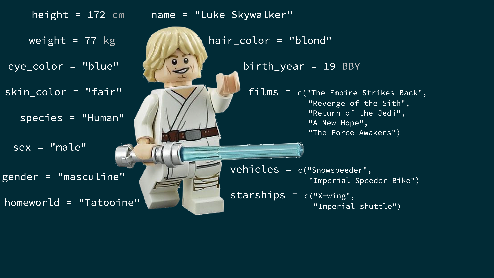
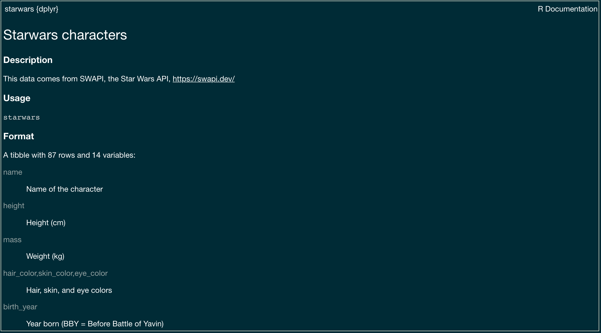
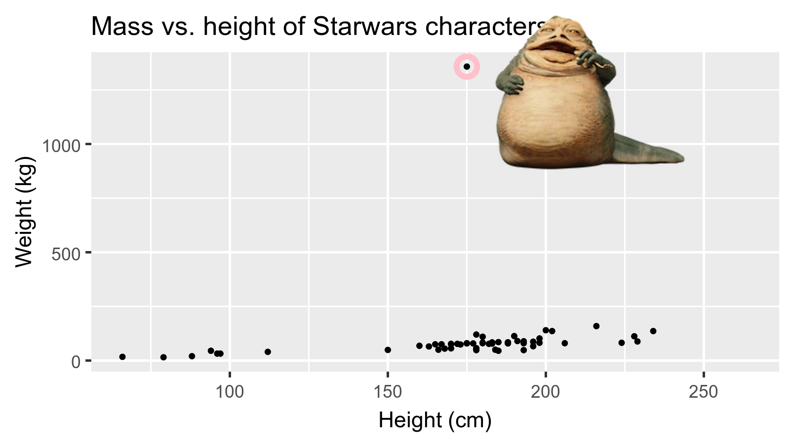

```{r setup, include=FALSE}
deck_lib <- "/Users/kfitzg24/Library/R/4.6/library"
.libPaths(unique(c(deck_lib, .libPaths())))
options(
  htmltools.dir.version = FALSE,
  dplyr.print_min = 6,
  dplyr.print_max = 6,
  tibble.width = 65,
  width = 65
)
knitr::opts_chunk$set(
  echo = TRUE,
  fig.width = 8,
  fig.asp = 0.618,
  out.width = "60%",
  fig.align = "center",
  dpi = 300,
  message = FALSE,
  warning = FALSE
)
ggplot2::theme_set(ggplot2::theme_gray(base_size = 16))
set.seed(1234)

library(tidyverse)
if (requireNamespace("magick", quietly = TRUE, lib.loc = deck_lib)) library(magick, lib.loc = deck_lib)
if (requireNamespace("Tmisc", quietly = TRUE, lib.loc = deck_lib)) library(Tmisc, lib.loc = deck_lib)
if (requireNamespace("dsbox", quietly = TRUE, lib.loc = deck_lib)) library(dsbox, lib.loc = deck_lib)
if (requireNamespace("openintro", quietly = TRUE, lib.loc = deck_lib)) library(openintro, lib.loc = deck_lib)
if (requireNamespace("hexbin", quietly = TRUE, lib.loc = deck_lib)) library(hexbin, lib.loc = deck_lib)
if (exists("loans_full_schema")) {
  loans_full_schema <- loans_full_schema |>
    mutate(grade = factor(grade, ordered = TRUE))
}
```


## Data basics in R {.middle}

---

## Creating objects 

To create an object `x` in your Environment that has the value 5...

```{r}
x <- 5 #preferred method

5 -> x #useful in some cases

x = 5 #works but discouraged
```

. . .

To print the object...

```{r}
x #one of rare instances that doesn't need ()

print(x) #works but unnecessary

```

---

## Most manipulations in R are done using vectors

+ Vectors are used for (statistical) random variables
+ Vectors are created by combining values using the `c()` function

```{r}
height <- c(59, 62, 55, 68)
height/12

gender <- c("F","M","F","F")
```

+ For character data, you can use either single or double quotes, but you can’t mix them
+ REMINDER: everything in R, including variable names, is case sensitive

---

## Creating dataframes

Can combine multiple vectors into a data frame

::: {.columns}
::: {.column width="50%"}
```{r}
height <- c(59, 62, 55, 68)
gender <- c("F","M","F","F")

data <- data.frame(height, gender)
data
```
:::

::: {.column width="50%"}
```{r}
data2 <- data.frame(height = c(59, 62, 55, 68),
                    gender = c("F","M","F","F"))
data2
```
:::
:::

---

## Useful commands for data entry

```{r}
60:72

seq(60, 72, by = 2)   

seq(60, 70, length = 3) 
```

---

## Extracting data using []


```{r}
height <- c(59, 62, 55, 68)
gender <- c("F","M","F","F")
data <- data.frame(height, gender)

height[2]
data[2,]
data[,2]
```

---

## Useful commands for data entry

```{r}
rep(60, 5)

rep(c(60, 72), 3)   

rep(c(60, 66, 72), c(1, 2, 3))  
```

---

## Missing data

+ Missing data in R is denoted by NA
+ Some functions produce NA when any data are missing
```{r}
mean(c(1, 2, NA))
mean(c(1, 2, NA), na.rm = TRUE)
```

---

## Summary statistics

::: {.columns}
::: {.column width="50%"}
```{r}
summary(data)

data$gender <- factor(data$gender)
summary(data)
```

:::

::: {.column width="50%"}
+ `mean()`
+ `var()`
+ `sd()`
+ `min()`
+ `max()`
+ `length()`
+ `quantile(x, c(0.25, 0.75))`


```{r}
table(data$gender)
```

:::
:::
---

## Statistical inference

```{r, eval = FALSE}
t.test() #one and two-sample t-tests
chisq.test() #Chi-squared GOF or Indep 
wilcox.test() #signed rank or rank sum test
binom.test() #exact test for binomial/bernoulli
aov() #ANOVA
lm() #linear models
glm() #generalized linear models
lmer() #linear mixed effects models 
```

---

## What is in a dataset? {.middle}

---

## Data frames / Tibbles in R

- Each row is an **observation**
- Each column is a **variable**

::: {.small}

```{r message=FALSE}
starwars
```

:::

---

## Luke Skywalker



---

## What's in the Star Wars data?

Take a `glimpse` at the data:

```{r}
glimpse(starwars)
```

---

::: {.question}
How many rows and columns does this dataset have?
What does each row represent?
What does each column represent?
:::

```{r eval = FALSE}
?starwars
```



---

::: {.question}
How many rows and columns does this dataset have?
:::

::: {.columns}
::: {.column width="50%"}
```{r}
nrow(starwars) # number of rows
ncol(starwars) # number of columns
dim(starwars)  # dimensions (row column)
```
:::
:::

---

## Exploratory data analysis {.middle}

---

## What is EDA?

- Exploratory data analysis (EDA) is an approach to analysing data sets to summarize its main characteristics
- Often, this is visual -- this is what we'll focus on first
- But we might also calculate summary statistics and perform data wrangling/manipulation/transformation at (or before) this stage of the analysis -- this is what we'll focus on next

---

## Mass vs. height

::: {.question}
How would you describe the relationship between mass and height of Starwars characters?
What other variables would help us understand data points that don't follow the overall trend?
Who is the not so tall but really chubby character?
:::

```{r fig.width = 8, warning=FALSE, echo=FALSE, out.width = "50%"}
ggplot(data = starwars, mapping = aes(x = height, y = mass)) +
  geom_point() +
  labs(title = "Mass vs. height of Starwars characters",
       x = "Height (cm)", y = "Weight (kg)") +
  geom_point(data = starwars |> filter(name == "Jabba Desilijic Tiure"), size = 5, pch = 1, color = "pink", stroke = 3)
```

---

## Jabba!

```{r echo = FALSE, warning = FALSE, cache = TRUE, out.width = "80%", message = FALSE}
# jabba <- image_read("img/jabba.png")
# 
# fig <- image_graph(width = 1600, height = 900, res = 200)
# ggplot(data = starwars, mapping = aes(x = height, y = mass)) +
#   geom_point() +
#   labs(title = "Mass vs. height of Starwars characters",
#        x = "Height (cm)", y = "Weight (kg)") +
#   geom_point(data = starwars |> filter(name == "Jabba Desilijic Tiure"), size = 5, pch = 1, color = "pink", stroke = 3)
# dev.off()
# 
# out <- fig |> image_composite(jabba, offset = "+1000+30")
# 
# image_write(out, "img/jabbaplot.png", format = "png")
# 
# 
# library(ggplot2)
# library(dplyr)
plot <- ggplot(data = starwars, aes(x = height, y = mass)) +
  geom_point() +
  labs(
    title = "Mass vs. height of Starwars characters",
    x = "Height (cm)", y = "Weight (kg)"
  ) +
  geom_point(data = starwars |> filter(name == "Jabba Desilijic Tiure"), size = 5, pch = 1, color = "pink", stroke = 3) +
  theme_minimal()

if (requireNamespace("ggimage", quietly = TRUE, lib.loc = deck_lib)) {
  jabba_data <- starwars |>
    filter(name == "Jabba Desilijic Tiure") |>
    mutate(image = "img/jabba.png", mass = mass - 250, height = height + 35)
  plot <- plot + ggimage::geom_image(data = jabba_data, aes(image = image), size = 0.5)
}

plot

```

## Working with external data {.section-divider .middle}

## Where does data come from?

So far, we have worked with data already available in R.

Data are often stored in external files:

- `.csv`: plain-text, rectangular data
- `.xlsx`: Microsoft Excel workbook
- `.rds`: an R object saved to a file

Today, we will focus on importing `.csv` and `.xlsx` files.

## Organizing your project

A project might be organized like this:

```         
project/
├── analysis.qmd
└── data/
    └── nobel.csv
```

From `analysis.qmd`, the relative path to the data is:

```r
"data/nobel.csv"
```

Relative paths allow the project to work on another computer.

## Importing a CSV file

The `read_csv()` function from the **readr** package imports comma-separated data.

```{r}
nobel <- read_csv("data/nobel.csv")
```

- `read_csv()` reads the file.
- `<-` saves the resulting data frame as `nobel`.
- The file path must be inside quotation marks.

## Trust, but verify

ALWAYS inspect a dataset after importing it.

Check:

- Does each row represent the expected observational unit?
- Are the expected variables present?
- Do the variable types look reasonable?
- Are the dimensions plausible?

```{r}
glimpse(nobel)
```


## R makes an initial interpretation

When importing data, `read_csv()` determines a type for each column:

- `<chr>`: character
- `<dbl>`: numerical
- `<lgl>`: logical
- `<date>`: date

These interpretations are usually helpful—but they are not always correct.

For now, inspect the result. We will learn how to correct problematic variables during data cleaning.

## Missing values are not always recorded consistently

R represents missing values with `NA`, but a data file might use:

- an empty cell
- `NA` or `N/A`
- `.`
- `9999`
- text such as `"Not applicable"`

How missingness is recorded can affect how R interprets an entire variable.

## Your turn: Import and inspect

Import `df-na.csv`:

```{r}
df_na_raw <- read_csv("data/df-na.csv")
```

Then use `glimpse()` to inspect it.

1. What type did R assign to each variable?
2. Based on its values, what type should `x` be?
3. Why did R interpret `x` as a character variable?


## Identifying missing values during import

We can tell `read_csv()` which values represent missingness:

```{r}
df_na <- read_csv(
  "data/df-na.csv",
  na = c("", "NA", ".", "9999", "Not applicable")
)

glimpse(df_na)
```

Once `"."` is interpreted as missing, `x` can be stored as a numerical variable.

Missing-value codes should come from the data documentation—not from guessing.

## Exporting a data frame

The `write_csv()` function saves a data frame as a CSV file.

```{r eval=FALSE}
write_csv(
  nobel,
  "data/nobel_clean.csv"
)
```

- The first argument is the data frame to save.
- The second argument is the output file path.
- `write_csv()` does not modify the object stored in R.

## Importing an Excel file

The `read_excel()` function from the **readxl** package imports `.xls` and `.xlsx` files.

```{r eval=FALSE}
survey <- readxl::read_excel(
  "data/survey.xlsx",
  sheet = "responses"
)
```

An Excel workbook can contain multiple sheets, so we may need to specify which sheet to import.


## A typical data-analysis workflow

1. **Import** the data.
2. **Inspect** its structure and contents.
3. Identify the relevant **question and variables**.
4. **Clean** the data as necessary
5. **Visualize** and analyze the data.
6. **Communicate** what you learn.

We will return to importing when we learn how to clean messy data.

## Data visualization {.middle}

---

## Data visualization

> *"The simple graph has brought more information to the data analyst's mind than any other device." --- John Tukey*

- Data visualization is the creation and study of the visual representation of data
- Many tools for visualizing data -- R is one of them
- Many approaches/systems within R for making data visualizations -- **ggplot2** is one of them, and that's what we're going to use

---

## ggplot2 $\in$ tidyverse

::: {.columns}
::: {.column width="50%"}
{width="80%"}
:::
::: {.column width="50%"}
- **ggplot2** is tidyverse's data visualization package 
- `gg` in "ggplot2" stands for Grammar of Graphics 
- Inspired by the book **Grammar of Graphics** by Leland Wilkinson
:::
:::

---

## Grammar of Graphics

::: {.columns}
::: {.column width="30%"}
A grammar of graphics is a tool that enables us to concisely describe the components of a graphic
:::
::: {.column width="70%"}
{width="100%"}
:::
:::

.footnote[ Source: [BloggoType](http://bloggotype.blogspot.com/2016/08/holiday-notes2-grammar-of-graphics.html)]

---


::: {.question}
- What are the functions doing the plotting?
- What is the dataset being plotted?
- Which variables map to which features (aesthetics) of the plot?
- What does the warning mean?<sup>+</sup>
:::

```{r mass-height, eval = FALSE}
ggplot(data = starwars, mapping = aes(x = height, y = mass)) +
  geom_point() +
  labs(title = "Mass vs. height of Starwars characters",
       x = "Height (cm)", y = "Weight (kg)")
```

.footnote[
<sup>+</sup>Suppressing warning to subsequent slides to save space
]

---

## Hello ggplot2!

::: {.columns}
::: {.column width="70%"}
- `ggplot()` is the main function in ggplot2
- Plots are constructed in layers
- Structure of the code for plots can be summarized as

```{r eval = FALSE}
ggplot(data = [dataset], 
       mapping = aes(x = [x-variable], y = [y-variable])) +
   geom_xxx() +
   other options
```

- The ggplot2 package comes with the tidyverse

```{r}
library(tidyverse)
```

- For help with ggplot2, see [ggplot2.tidyverse.org](http://ggplot2.tidyverse.org/)
:::
:::

---

## Why do we visualize? {.middle}

---

## Anscombe's quartet

```{r quartet-for-show, eval = FALSE, echo = FALSE}
library(Tmisc)
quartet
```

::: {.columns}
::: {.column width="50%"}
```{r quartet-view1, echo = FALSE}
quartet[1:20,]
```
:::
::: {.column width="50%"}
```{r quartet-view2, echo = FALSE}
quartet[23:42,]
```
:::
:::

---

## Summarising Anscombe's quartet

```{r quartet-summary}
quartet |>
  group_by(set) |>
  summarise(
    mean_x = mean(x), 
    mean_y = mean(y),
    sd_x = sd(x),
    sd_y = sd(y),
    r = cor(x, y)
  )
```

---

## Visualizing Anscombe's quartet

```{r quartet-plot, echo = FALSE, out.width = "80%", fig.asp = 0.5}
ggplot(quartet, aes(x = x, y = y)) +
  geom_point() +
  facet_wrap(~ set, ncol = 4)
```


---

## Data: Palmer Penguins

Measurements for penguin species, island in Palmer Archipelago, size (flipper length, body mass, bill dimensions), and sex.

::: {.columns}
::: {.column width="30%"}
{width="80%"}
:::
::: {.column width="70%"}
```{r}
library(palmerpenguins, lib.loc = deck_lib)
penguins <- palmerpenguins::penguins
glimpse(penguins)
```
:::
:::

---

::: {.panel-tabset}
### Plot
```{r ref.label = "penguins", echo = FALSE, warning = FALSE, out.width = "70%", fig.width = 8}
```
### Code

```{r penguins, fig.show = "hide"}
ggplot(data = penguins, 
       mapping = aes(x = bill_depth_mm, y = bill_length_mm,
                     colour = species)) +
  geom_point() +
  labs(title = "Bill depth and length",
       subtitle = "Dimensions for Adelie, Chinstrap, and Gentoo Penguins",
       x = "Bill depth (mm)", y = "Bill length (mm)",
       colour = "Species")
```
:::

---

## Coding out loud {.middle}

---

::: {.midi}
> **Start with the `penguins` data frame**
:::

::: {.columns}
::: {.column width="50%"}
```{r penguins-0, fig.show = "hide", warning = FALSE}
ggplot(data = penguins) #<<
```
:::
::: {.column width="50%"}
```{r ref.label = "penguins-0", echo = FALSE, warning = FALSE, out.width = "100%", fig.width = 8}
```
:::
:::

---

::: {.midi}
> Start with the `penguins` data frame,
> **map bill depth to the x-axis**
:::

::: {.columns}
::: {.column width="50%"}
```{r penguins-1, fig.show = "hide", warning = FALSE}
ggplot(data = penguins,
       mapping = aes(x = bill_depth_mm)) #<<
```
:::
::: {.column width="50%"}
```{r ref.label = "penguins-1", echo = FALSE, warning = FALSE, out.width = "100%", fig.width = 8}
```
:::
:::

---

::: {.midi}
> Start with the `penguins` data frame,
> map bill depth to the x-axis
> **and map bill length to the y-axis.**
:::

::: {.columns}
::: {.column width="50%"}
```{r penguins-2, fig.show = "hide", warning = FALSE}
ggplot(data = penguins,
       mapping = aes(x = bill_depth_mm,
                     y = bill_length_mm)) #<<
```
:::
::: {.column width="50%"}
```{r ref.label = "penguins-2", echo = FALSE, warning = FALSE, out.width = "100%", fig.width = 8}
```
:::
:::

---

::: {.midi}
> Start with the `penguins` data frame,
> map bill depth to the x-axis
> and map bill length to the y-axis. 
> **Represent each observation with a point**
:::

::: {.columns}
::: {.column width="50%"}
```{r penguins-3, fig.show = "hide", warning = FALSE}
ggplot(data = penguins,
       mapping = aes(x = bill_depth_mm,
                     y = bill_length_mm)) + 
  geom_point() #<<
```
:::
::: {.column width="50%"}
```{r ref.label = "penguins-3", echo = FALSE, warning = FALSE, out.width = "100%", fig.width = 8}
```
:::
:::

---

::: {.midi}
> Start with the `penguins` data frame,
> map bill depth to the x-axis
> and map bill length to the y-axis. 
> Represent each observation with a point
> **and map species to the colour of each point.**
:::

::: {.columns}
::: {.column width="50%"}
```{r penguins-4, fig.show = "hide", warning = FALSE}
ggplot(data = penguins,
       mapping = aes(x = bill_depth_mm,
                     y = bill_length_mm,
                     colour = species)) + #<<
  geom_point()
```
:::
::: {.column width="50%"}
```{r ref.label = "penguins-4", echo = FALSE, warning = FALSE, out.width = "100%", fig.width = 8}
```
:::
:::

---

::: {.midi}
> Start with the `penguins` data frame,
> map bill depth to the x-axis
> and map bill length to the y-axis. 
> Represent each observation with a point
> and map species to the colour of each point.
> **Title the plot "Bill depth and length"**
:::

::: {.columns}
::: {.column width="50%"}
```{r penguins-5, fig.show = "hide", warning = FALSE}
ggplot(data = penguins,
       mapping = aes(x = bill_depth_mm,
                     y = bill_length_mm,
                     colour = species)) +
  geom_point() +
  labs(title = "Bill depth and length") #<<
```
:::
::: {.column width="50%"}
```{r ref.label = "penguins-5", echo = FALSE, warning = FALSE, out.width = "100%", fig.width = 8}
```
:::
:::

---

::: {.midi}
> Start with the `penguins` data frame,
> map bill depth to the x-axis
> and map bill length to the y-axis. 
> Represent each observation with a point
> and map species to the colour of each point.
> Title the plot "Bill depth and length", 
> **add the subtitle "Dimensions for Adelie, Chinstrap, and Gentoo Penguins"**
:::

::: {.columns}
::: {.column width="50%"}
```{r penguins-6, fig.show = "hide", warning = FALSE}
ggplot(data = penguins,
       mapping = aes(x = bill_depth_mm,
                     y = bill_length_mm,
                     colour = species)) +
  geom_point() +
  labs(title = "Bill depth and length",
       subtitle = "Dimensions for Adelie, Chinstrap, and Gentoo Penguins") #<<
```
:::
::: {.column width="50%"}
```{r ref.label = "penguins-6", echo = FALSE, warning = FALSE, out.width = "100%", fig.width = 8}
```
:::
:::

---

::: {.midi}
> Start with the `penguins` data frame,
> map bill depth to the x-axis
> and map bill length to the y-axis. 
> Represent each observation with a point
> and map species to the colour of each point.
> Title the plot "Bill depth and length", 
> add the subtitle "Dimensions for Adelie, Chinstrap, and Gentoo Penguins", 
> **label the x and y axes as "Bill depth (mm)" and "Bill length (mm)", respectively**
:::

::: {.columns}
::: {.column width="50%"}
```{r penguins-7, fig.show = "hide", warning = FALSE}
ggplot(data = penguins,
       mapping = aes(x = bill_depth_mm,
                     y = bill_length_mm,
                     colour = species)) +
  geom_point() +
  labs(title = "Bill depth and length",
       subtitle = "Dimensions for Adelie, Chinstrap, and Gentoo Penguins",
       x = "Bill depth (mm)", y = "Bill length (mm)") #<<
```
:::
::: {.column width="50%"}
```{r ref.label = "penguins-7", echo = FALSE, warning = FALSE, out.width = "100%", fig.width = 8}
```
:::
:::

---

::: {.midi}
> Start with the `penguins` data frame,
> map bill depth to the x-axis
> and map bill length to the y-axis. 
> Represent each observation with a point
> and map species to the colour of each point.
> Title the plot "Bill depth and length", 
> add the subtitle "Dimensions for Adelie, Chinstrap, and Gentoo Penguins", 
> label the x and y axes as "Bill depth (mm)" and "Bill length (mm)", respectively,
> **label the legend "Species"**
:::

::: {.columns}
::: {.column width="50%"}
```{r penguins-8, fig.show = "hide", warning = FALSE}
ggplot(data = penguins,
       mapping = aes(x = bill_depth_mm,
                     y = bill_length_mm,
                     colour = species)) +
  geom_point() +
  labs(title = "Bill depth and length",
       subtitle = "Dimensions for Adelie, Chinstrap, and Gentoo Penguins",
       x = "Bill depth (mm)", y = "Bill length (mm)",
       colour = "Species") #<<
```
:::
::: {.column width="50%"}
```{r ref.label = "penguins-8", echo = FALSE, warning = FALSE, out.width = "100%", fig.width = 8}
```
:::
:::

---

::: {.midi}
> Start with the `penguins` data frame,
> map bill depth to the x-axis
> and map bill length to the y-axis. 
> Represent each observation with a point
> and map species to the colour of each point.
> Title the plot "Bill depth and length", 
> add the subtitle "Dimensions for Adelie, Chinstrap, and Gentoo Penguins", 
> label the x and y axes as "Bill depth (mm)" and "Bill length (mm)", respectively,
> label the legend "Species", 
> **and add a caption for the data source.**
:::

::: {.columns}
::: {.column width="50%"}
```{r penguins-9, fig.show = "hide", warning = FALSE}
ggplot(data = penguins,
       mapping = aes(x = bill_depth_mm,
                     y = bill_length_mm,
                     colour = species)) +
  geom_point() +
  labs(title = "Bill depth and length",
       subtitle = "Dimensions for Adelie, Chinstrap, and Gentoo Penguins",
       x = "Bill depth (mm)", y = "Bill length (mm)",
       colour = "Species",
       caption = "Source: Palmer Station LTER / palmerpenguins package") #<<
```
:::
::: {.column width="50%"}
```{r ref.label = "penguins-9", echo = FALSE, warning = FALSE, out.width = "100%", fig.width = 8}
```
:::
:::

---

::: {.midi}
> Start with the `penguins` data frame,
> map bill depth to the x-axis
> and map bill length to the y-axis. 
> Represent each observation with a point
> and map species to the colour of each point.
> Title the plot "Bill depth and length", 
> add the subtitle "Dimensions for Adelie, Chinstrap, and Gentoo Penguins", 
> label the x and y axes as "Bill depth (mm)" and "Bill length (mm)", respectively,
> label the legend "Species", 
> and add a caption for the data source.
> **Finally, use a discrete colour scale that is designed to be perceived by viewers with common forms of colour blindness.**
:::

::: {.columns}
::: {.column width="50%"}
```{r penguins-10, fig.show = "hide", warning = FALSE}
ggplot(data = penguins,
       mapping = aes(x = bill_depth_mm,
                     y = bill_length_mm,
                     colour = species)) +
  geom_point() +
  labs(title = "Bill depth and length",
       subtitle = "Dimensions for Adelie, Chinstrap, and Gentoo Penguins",
       x = "Bill depth (mm)", y = "Bill length (mm)",
       colour = "Species",
       caption = "Source: Palmer Station LTER / palmerpenguins package") +
  scale_colour_viridis_d() #<<
```
:::
::: {.column width="50%"}
```{r ref.label = "penguins-10", echo = FALSE, warning = FALSE, out.width = "100%", fig.width = 8}
```
:::
:::

---

::: {.panel-tabset}
### Plot
```{r ref.label="penguins-10-nohighlight", echo = FALSE, warning = FALSE, out.width = "70%", fig.width = 8}
```
### Code

```{r penguins-10-nohighlight, fig.show = "hide"}
ggplot(data = penguins,
       mapping = aes(x = bill_depth_mm,
                     y = bill_length_mm,
                     colour = species)) +
  geom_point() +
  labs(title = "Bill depth and length",
       subtitle = "Dimensions for Adelie, Chinstrap, and Gentoo Penguins",
       x = "Bill depth (mm)", y = "Bill length (mm)",
       colour = "Species",
       caption = "Source: Palmer Station LTER / palmerpenguins package") +
  scale_colour_viridis_d()
```
### Narrative
::: {.columns}
::: {.column width="70%"}
::: {.midi}
Start with the `penguins` data frame,
map bill depth to the x-axis
and map bill length to the y-axis. 

Represent each observation with a point
and map species to the colour of each point.

Title the plot "Bill depth and length", 
add the subtitle "Dimensions for Adelie, Chinstrap, and Gentoo Penguins", 
label the x and y axes as "Bill depth (mm)" and "Bill length (mm)", respectively,
label the legend "Species", 
and add a caption for the data source.

Finally, use a discrete colour scale that is designed to be perceived by viewers with common forms of colour blindness.
:::
:::
:::
:::

---

## Argument names

::: {.tip}
You can omit the names of first two arguments when building plots with `ggplot()`.
:::

::: {.columns}
::: {.column width="50%"}
```{r named-args, eval = FALSE}
ggplot(data = penguins,
       mapping = aes(x = bill_depth_mm,
                     y = bill_length_mm,
                     colour = species)) +
  geom_point() +
  scale_colour_viridis_d()
```
:::
::: {.column width="50%"}
```{r not-named-args, eval = FALSE}
ggplot(penguins,
       aes(x = bill_depth_mm,
           y = bill_length_mm,
           colour = species)) +
  geom_point() +
  scale_colour_viridis_d()
```
:::
:::

---

## Aesthetics {.middle}

---

## Aesthetics options

Commonly used characteristics of plotting characters that can be **mapped to a specific variable** in the data are

- `colour`
- `shape`
- `size`
- `alpha` (transparency)

---

## Colour

::: {.columns}
::: {.column width="50%"}
```{r colour, fig.show = "hide", warning = FALSE}
ggplot(penguins,
       aes(x = bill_depth_mm, 
           y = bill_length_mm,
           colour = species)) + #<<
  geom_point() +
  scale_colour_viridis_d()
```
:::
::: {.column width="50%"}
```{r ref.label = "colour", echo = FALSE, warning = FALSE, out.width = "100%"}
```
:::
:::

---

## Shape

Mapped to a different variable than `colour`

::: {.columns}
::: {.column width="50%"}
```{r shape-island, fig.show = "hide", warning = FALSE}
ggplot(penguins,
       aes(x = bill_depth_mm, 
           y = bill_length_mm,
           colour = species,
           shape = island)) + #<<
  geom_point() +
  scale_colour_viridis_d()
```
:::
::: {.column width="50%"}
```{r ref.label = "shape-island", echo = FALSE, warning = FALSE, out.width = "100%"}
```
:::
:::

---

## Shape

Mapped to same variable as `colour`

::: {.columns}
::: {.column width="50%"}
```{r shape-species, fig.show = "hide", warning = FALSE}
ggplot(penguins,
       aes(x = bill_depth_mm, 
           y = bill_length_mm,
           colour = species,
           shape = species)) + #<<
  geom_point() +
  scale_colour_viridis_d()
```
:::
::: {.column width="50%"}
```{r ref.label = "shape-species", echo = FALSE, warning = FALSE, out.width = "100%"}
```
:::
:::

---

## Size

::: {.columns}
::: {.column width="50%"}
```{r size, fig.show = "hide", warning = FALSE}
ggplot(penguins,
       aes(x = bill_depth_mm, 
           y = bill_length_mm,
           colour = species,
           shape = species,
           size = body_mass_g)) + #<<
  geom_point() +
  scale_colour_viridis_d()
```
:::
::: {.column width="50%"}
```{r ref.label = "size", echo = FALSE, warning = FALSE, out.width = "100%"}
```
:::
:::

---

## Alpha

::: {.columns}
::: {.column width="50%"}
```{r alpha, fig.show = "hide", warning = FALSE}
ggplot(penguins,
       aes(x = bill_depth_mm, 
           y = bill_length_mm,
           colour = species,
           shape = species,
           size = body_mass_g,
           alpha = flipper_length_mm)) + #<<
  geom_point() +
  scale_colour_viridis_d()
```
:::
::: {.column width="50%"}
```{r ref.label = "alpha", echo = FALSE, warning = FALSE, out.width = "100%"}
```
:::
:::

---

::: {.columns}
::: {.column width="50%"}
**Mapping**

```{r warning = FALSE, out.width = "100%"}
ggplot(penguins,
       aes(x = bill_depth_mm,
           y = bill_length_mm,
           size = body_mass_g, #<<
           alpha = flipper_length_mm)) + #<<
  geom_point()
```
:::
::: {.column width="50%"}
**Setting**

```{r warning = FALSE, out.width = "100%"}
ggplot(penguins,
       aes(x = bill_depth_mm,
           y = bill_length_mm)) + 
  geom_point(size = 2, alpha = 0.5) #<<
```
:::
:::

---

## Mapping vs. setting

- **Mapping:** Determine the size, alpha, etc. of points based on the values of a variable in the data
  - goes into `aes()`

- **Setting:** Determine the size, alpha, etc. of points **not** based on the values of a variable in the data
  - goes into `geom_*()` (this was `geom_point()` in the previous example, but we'll learn about other geoms soon!)
  
---

## Faceting {.middle}

---

## Faceting

- Smaller plots that display different subsets of the data
- Useful for exploring conditional relationships and large data

---

::: {.panel-tabset}
### Plot
```{r ref.label = "facet", echo = FALSE, warning = FALSE, out.width = "70%"}
```
### Code

```{r facet, fig.show = "hide"}
ggplot(penguins, aes(x = bill_depth_mm, y = bill_length_mm)) + 
  geom_point() +
  facet_grid(species ~ island) #<<
```
:::

---

## Various ways to facet

::: {.question}
In the next few slides describe what each plot displays. Think about how the code relates to the output.

**Note:** The plots in the next few slides do not have proper titles, axis labels, etc. because we want you to figure out what's happening in the plots.
But you should always label your plots!
:::

---

```{r warning = FALSE}
ggplot(penguins, aes(x = bill_depth_mm, y = bill_length_mm)) + 
  geom_point() +
  facet_grid(species ~ sex) #<<
```

---

```{r warning = FALSE}
ggplot(penguins, aes(x = bill_depth_mm, y = bill_length_mm)) + 
  geom_point() +
  facet_grid(sex ~ species) #<<
```

---

```{r warning = FALSE, fig.asp = 0.5}
ggplot(penguins, aes(x = bill_depth_mm, y = bill_length_mm)) + 
  geom_point() +
  facet_wrap(~ species) #<<
```

---

```{r warning = FALSE, fig.asp = 0.5}
ggplot(penguins, aes(x = bill_depth_mm, y = bill_length_mm)) + 
  geom_point() +
  facet_grid(. ~ species) #<<
```

---

```{r warning = FALSE}
ggplot(penguins, aes(x = bill_depth_mm, y = bill_length_mm)) + 
  geom_point() +
  facet_wrap(~ species, ncol = 2) #<<
```

---

## Faceting summary

- `facet_grid()`:
    - 2d grid
    - `rows ~ cols`
    - use `.` for no split
- `facet_wrap()`: 1d ribbon wrapped according to number of rows and columns specified or available plotting area

---

## Facet and color

::: {.columns}
::: {.column width="30%"}
```{r facet-color-legend, fig.show = "hide", warning = FALSE}
ggplot(
  penguins, 
  aes(x = bill_depth_mm, 
      y = bill_length_mm, 
      color = species)) + #<<
  geom_point() +
  facet_grid(species ~ sex) +
  scale_color_viridis_d() #<<
```
:::
::: {.column width="70%"}
```{r ref.label = "facet-color-legend", echo = FALSE, warning = FALSE, out.width = "100%"}
```
:::
:::

---

## Facet and color, no legend

::: {.columns}
::: {.column width="30%"}
```{r facet-color-no-legend, fig.show = "hide", warning = FALSE}
ggplot(
  penguins, 
  aes(x = bill_depth_mm, 
      y = bill_length_mm, 
      color = species)) +
  geom_point() +
  facet_grid(species ~ sex) +
  scale_color_viridis_d() +
  guides(color = FALSE) #<<
```
:::
:::
