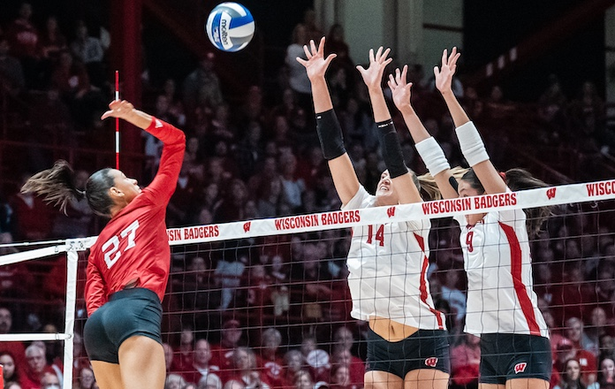
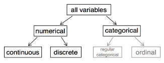

```{r setup, include=FALSE}
deck_lib <- "/tmp/stat4380-r-lib"
.libPaths(unique(c(deck_lib, .libPaths())))
options(
  htmltools.dir.version = FALSE,
  dplyr.print_min = 6,
  dplyr.print_max = 6,
  tibble.width = 65,
  width = 65
)
knitr::opts_chunk$set(
  echo = TRUE,
  fig.width = 8,
  fig.asp = 0.618,
  out.width = "60%",
  fig.align = "center",
  dpi = 300,
  message = FALSE,
  warning = FALSE
)
ggplot2::theme_set(ggplot2::theme_gray(base_size = 16))
set.seed(1234)

library(tidyverse)
library(ggridges)
```

## ggplot `r emo::ji("heart")` `r emo::ji("volleyball")` {.section-divider .middle}

## Data: Volleyball

NCAA women's volleyball season-level statistics for 2022-2023 season.

::: {.columns}
::: {.column width="30%"}
```{r echo=FALSE, out.width="80%"}

```
:::
::: {.column width="70%"}
```{r}
library(tidyverse)
volleyball <- read_csv("./data/volleyball_ncaa_div1_2022_23_clean.csv")
glimpse(volleyball)
```
:::
:::

## Number of variables involved

- Univariate data analysis - distribution of single variable
- Bivariate data analysis - relationship between two variables
- Multivariate data analysis - relationship between many variables at once, usually focusing on the relationship between two while conditioning for others

## Types of variables

- **Numerical variables** can be classified as **continuous** or **discrete** based on whether or not the variable can take on an infinite number of values or only non-negative whole numbers, respectively.
- If the variable is **categorical**, we can determine if it is **ordinal** based on whether or not the levels have a natural ordering.



## Visualizing 1 numeric variable {.section-divider .middle}

## Describing shapes of numerical distributions

- shape:
    - skewness: right-skewed, left-skewed, symmetric (skew is to the side of the longer tail)
    - modality: unimodal, bimodal, multimodal, uniform
- center: mean (`mean`), median (`median`), mode (not always useful)
- spread: range (`range`), standard deviation (`sd`), inter-quartile range (`IQR`)
- unusual observations

## 1 numeric variable: histogram

::: {.panel-tabset}
### Plot
```{r ref.label = "hist", echo = FALSE, out.width = "50%", fig.width = 8}
```
### Code
```{r hist, fig.show = "hide"}
ggplot(volleyball, aes(x = kills_per_set)) +
  geom_histogram(color = "white")
```
:::

## Histograms and binwidth

::: {.panel-tabset}
### binwidth = 0.1
```{r out.width = "50%"}
ggplot(volleyball, aes(x = kills_per_set)) +
  geom_histogram(color = "white", binwidth = 0.1)
```
### binwidth = 0.5
```{r out.width = "50%"}
ggplot(volleyball, aes(x = kills_per_set)) +
  geom_histogram(color = "white", binwidth = 0.5)
```
### binwidth = 1
```{r out.width = "50%"}
ggplot(volleyball, aes(x = kills_per_set)) +
  geom_histogram(color = "white", binwidth = 1)
```
:::

## 1 numeric variable: Density plot

```{r}
ggplot(volleyball, aes(x = kills_per_set)) +
  geom_density()
```

## Density plots and adjusting bandwidth

::: {.panel-tabset}
### adjust = 0.5
```{r out.width = "50%"}
ggplot(volleyball, aes(x = kills_per_set)) +
  geom_density(adjust = 0.5)
```
### adjust = 1
```{r out.width = "50%"}
ggplot(volleyball, aes(x = kills_per_set)) +
  geom_density(adjust = 1) # default bandwidth
```
### adjust = 2
```{r out.width = "50%"}
ggplot(volleyball, aes(x = kills_per_set)) +
  geom_density(adjust = 2)
```
:::

## 1 numeric variable: Box plot

```{r}
ggplot(volleyball, aes(x = kills_per_set)) +
  geom_boxplot()
```

## Customizing box plots

::: {.panel-tabset}
### Plot
```{r ref.label = "box-custom", echo = FALSE, warning = FALSE}
```
### Code
```{r box-custom, fig.show = "hide", warning = FALSE}
ggplot(volleyball, aes(x = kills_per_set)) +
  geom_boxplot() +
  labs(
    x = "Kills per set",
    y = NULL,
    title = "Kills per set is left-skewed with a median around 12.5"
  ) +
  theme(
    axis.ticks.y = element_blank(),
    axis.text.y = element_blank()
  )
```
:::

## Let's try it! `week_03.qmd` Cycle 1

## Visualizing 1 numeric + 1 categorical variable {.section-divider .middle}

## Faceted histograms

::: {.panel-tabset}
### Plot
```{r ref.label = "facet_hist", echo = FALSE, out.width = "50%", fig.width = 8}
```
### Code
```{r facet_hist, fig.show = "hide"}
ggplot(volleyball, aes(x = kills_per_set)) +
  geom_histogram(color = "white", binwidth = 1) +
  facet_wrap(~ region)
```
:::

## Overlapping densities

::: {.panel-tabset}
### Plot
```{r ref.label = "o_dens", echo = FALSE, out.width = "50%", fig.width = 8}
```
### Code
```{r o_dens, fig.show = "hide"}
ggplot(volleyball, aes(x = kills_per_set,
                       fill = region,
                       color = region)) +
  geom_density(alpha = 0.3)
```
:::

## Ridge plots

::: {.panel-tabset}
### Plot
```{r ref.label = "ridge", echo = FALSE, out.width = "50%", fig.width = 8}
```
### Code
```{r ridge, fig.show = "hide"}
ggplot(volleyball, aes(x = kills_per_set,
                       y = region)) +
  geom_density_ridges()
```
:::

## Side-by-side Box plots

```{r}
ggplot(volleyball, aes(x = kills_per_set, y = region)) +
  geom_boxplot()
```

## Side-by-side violin plots

```{r}
ggplot(volleyball, aes(x = kills_per_set, y = region)) +
  geom_violin()
```

## Visualizing 1 categorical variable {.section-divider .middle}

## 1 categorical variable: bar plot

::: {.panel-tabset}
### color
```{r out.width = "50%"}
ggplot(volleyball, aes(y = conference)) +
  geom_bar(color = "navyblue")
```
### fill
```{r out.width = "50%"}
ggplot(volleyball, aes(y = conference)) +
  geom_bar(fill = "navyblue")
```
### both
```{r out.width = "50%"}
ggplot(volleyball, aes(y = conference)) +
  geom_bar(fill = "navyblue", color = "pink")
```
:::

## 2 categorical variables {.section-divider .middle}

## 2 categorical variables: stacked bar plot

::: {.panel-tabset}
### Plot
```{r ref.label = "two-cat-stacked", echo = FALSE, warning = FALSE, out.width = "70%", fig.width = 8}
```
### Code
```{r two-cat-stacked, fig.show = "hide"}
ggplot(volleyball, aes(y = conference, fill = winning_season)) +
  geom_bar()
```
:::

## 2 categorical: standardized bar plot

::: {.panel-tabset}
### Plot
```{r ref.label = "two-cat-standardized", echo = FALSE, warning = FALSE, out.width = "70%", fig.width = 8}
```
### Code
```{r two-cat-standardized, fig.show = "hide"}
ggplot(volleyball, aes(y = conference, fill = winning_season)) +
  geom_bar(position = "fill") +
  labs(x = "proportion")
```
:::

## Let's try it! `week_03.qmd` Cycle 2

## 2 numeric variables {.section-divider .middle}

## 2 numeric variables: scatterplot

::: {.panel-tabset}
### Plot
```{r ref.label = "scatter", echo = FALSE, warning = FALSE, out.width = "70%", fig.width = 8}
```
### Code
```{r scatter, fig.show = "hide"}
ggplot(volleyball, aes(x = digs_per_set, y = kills_per_set)) +
  geom_point()
```
:::

## 2 numeric variables: hexplot

::: {.panel-tabset}
### Plot
```{r ref.label = "hex", echo = FALSE, warning = FALSE, out.width = "70%", fig.width = 8}
```
### Code
```{r hex, fig.show = "hide"}
ggplot(volleyball, aes(x = digs_per_set, y = kills_per_set)) +
  geom_hex()
```
:::

## More than 2: scatterplot w/ color

::: {.panel-tabset}
### Plot
```{r ref.label = "two-plus", echo = FALSE, warning = FALSE, out.width = "70%", fig.width = 8}
```
### Code
```{r two-plus, fig.show = "hide"}
ggplot(volleyball, aes(x = hitting_pctg, y = opp_hitting_pctg,
                        color = win_pctg)) +
  geom_point()
```
:::

## More than 2: faceted scatterplot w/ color

::: {.panel-tabset}
### Plot
```{r ref.label = "four", echo = FALSE, warning = FALSE, out.width = "70%", fig.width = 8}
```
### Code
```{r four, fig.show = "hide"}
ggplot(volleyball, aes(x = hitting_pctg, y = opp_hitting_pctg,
                       color = win_pctg)) +
  geom_point() +
  facet_wrap(~region)
```
:::

## And many more!

- [Directory of visualizations](https://clauswilke.com/dataviz/directory-of-visualizations.html)

## Let's try it! `week_03.qmd` Cycle 3