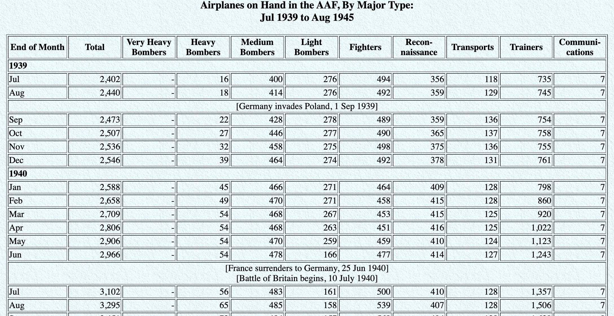
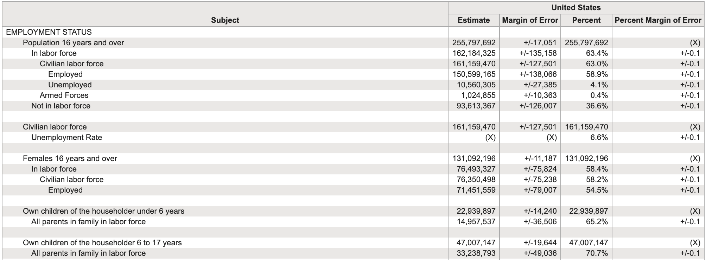

```{r}
#| label: setup
#| include: false
options(
  htmltools.dir.version = FALSE,
  dplyr.print_min = 4,
  dplyr.print_max = 4,
  tibble.width = 65,
  width = 65
)
knitr::opts_chunk$set(
  fig.width = 8,
  fig.asp = 0.618,
  out.width = "60%",
  fig.align = "center",
  dpi = 300
)
library(tidyverse)
library(nycflights13)
flights <- nycflights13::flights
```

<!--
INSTRUCTOR GUIDE
Use alongside the MathLink activity and a separate flights live-coding QMD.
The six activity slides mark the switch points. They are intentionally
placeholders, with objectives rather than a second copy of the activity.
All times below are minutes elapsed since class begins.

0–10: opening quiz, outside this deck.
10–20: opening through the flights introduction.
20–38: tactile cycle 1. Use the following verb slides to debrief selected
       operations as needed; do not lecture through them again afterward.
38–58: pipe bridge and flights cycle 1, including student practice.
58–70: tactile cycle 2; use mutate/saving slides during the debrief.
70–80: break.
80–95: flights cycle 2.
95–113: tactile cycle 3 and a short summary/grouping demonstration.
113–137: flights cycle 3, including student practice.
137–145: synthesis and exit check.
145–150: buffer and homework launch.

The slides after “Additional examples and reference” are for independent
review or targeted use when questions arise, not additional planned lecture.
The main-deck worked examples are reference material too: select one to
explain during each bridge, then switch to the flights QMD.

Dependencies: existing stat7500-slides.css and the existing img/ folder;
R packages tidyverse and nycflights13. The hotel CSV and emo are not needed.
-->

## Thinking with data

By the end of class, you should be able to:

- Translate a question into a sequence of data transformations.
- Predict how an operation changes rows, columns, or their meaning.
- Check whether the result answers the intended question.

::: {.tip}
Before running a pipeline: **What should the dimensions be? What should one row of the result represent?**
:::

::: {.notes}
Opening quiz has already taken 10 minutes. Spend 10 minutes total on the
opening slides through the flights introduction. Today's three cycles are
choosing observations, creating variables, and summarizing groups.
:::

## Tidy data

> Happy families are all alike; every unhappy family is unhappy in its own way.
>
> Leo Tolstoy

::: {.fragment}
> Tidy datasets are all alike; every untidy dataset is untidy in its own way.
:::

::: {.columns}
::: {.column width="50%" .fragment}
**Characteristics of tidy data:**

- Each variable forms a column.
- Each observation forms a row.
- Each type of observational unit forms a table.
:::

::: {.column width="50%" .fragment}
**Characteristics of untidy data:**

!@#$%^&*()
:::
:::

## What would one row represent?

{height="390px" fig-align="center"}

::: {.question}
What are the variables? What would one row represent in a tidy version?
:::

::: {.footnote}
Source: [Gapminder, estimated HIV prevalence among 15–49 year olds](https://www.gapminder.org/data)
:::

::: {.notes}
Use this one example in class. Years stored as column headings can be values
of a year variable. For country-year observations, columns would include
country, year, and prevalence. Explain the structure without teaching pivoting.
The other original examples remain in the reference section.
:::

## A grammar of data wrangling

**dplyr** provides functions that act as verbs for working with data frames.

| Our goal | Functions |
|---|---|
| Choose columns | `select()` |
| Choose or order rows | `filter()`, `arrange()`, `slice()` |
| Create or change variables | `mutate()` |
| Describe groups | `group_by()`, `summarise()`, `count()` |
| Identify unique values or combinations | `distinct()` |

::: {.notes}
Orient students to the three cycles. This is a map, not a list to memorize now.
:::


## Tactile activity {.section-divider .middle}

## Data: NYC flights

Each row represents a flight scheduled to depart from **JFK, LGA, or EWR in 2013**.

```{r}
#| message: false
#| warning: false
library(tidyverse)
library(nycflights13)
flights <- nycflights13::flights

glimpse(flights)
```

## `filter()` chooses rows

Keep flights whose destination is LAX:

```{r}
#| eval: false
flights |>
  filter(dest == "LAX")
```

- R evaluates `dest == "LAX"` for each row.
- `filter()` keeps rows where the condition is `TRUE`.
- All columns remain; retained rows keep their relative order.
- A condition that evaluates to `NA` does not retain that row.

::: {.tip}
Use `==` to test equality. Use `=` to name an argument or a new column.
:::

## Combining conditions

::: {.columns}
::: {.column width="50%"}
**AND:** both conditions must hold.

```{r}
#| eval: false
flights |>
  filter(
    dest == "LAX",
    arr_delay < 0
  )
```

Within `filter()`, commas combine conditions with AND.
:::
::: {.column width="50%"}
**OR:** at least one condition must hold.

```{r}
#| eval: false
flights |>
  filter(
    dep_delay < 0 |
      arr_delay < 0
  )
```

A row satisfying both conditions is included once.
:::
:::

## Logical operators in R

::: {.columns}
::: {.column width="50%"}
| Operator | Meaning |
|---|---|
| `<` | Less than |
| `<=` | Less than or equal to |
| `>` | Greater than |
| `>=` | Greater than or equal to |
| `==` | Equal to |
| `!=` | Not equal to |
:::
::: {.column width="50%"}
| Expression | Meaning |
|---|---|
| `x & y` | Both conditions |
| `x \| y` | At least one condition |
| `!x` | Negation of a condition |
| `is.na(x)` | Is missing |
| `!is.na(x)` | Is observed |
| `x %in% y` | Is among the values in `y` |
:::
:::

::: {.notes}
Reference slide. Introduce the relevant operator at the point of use.
The comma-as-AND rule belongs to filter(), not to R functions generally.
:::

## Membership and combined logic

```{r}
#| eval: false
flights |>
  filter(
    dest %in% c("LAX", "BUR", "LGB"),
    (dep_delay < 0 | arr_delay < 0)
  )
```

The destination condition **and** the parenthesized condition must hold.

<!-- -- -->

<!-- Keep flights to LAX, BUR, or LGB that departed early **or** arrived early -->

::: {.question}
Would replacing `|` with `&` keep more rows, fewer rows, or possibly the same number?
:::

::: {.fragment}
Fewer or the same number: both delays must now be negative.
:::

## `select()` chooses columns

```{r}
flights |>
  select(dep_delay, arr_delay)
```

All `r nrow(flights)` observations remain, in their original order.

::: {.tip}
`select()` changes which variables are available. It does not test their values.
:::

## `arrange()` reorders rows

::: {.columns}
::: {.column width="50%"}
**Ascending:** smallest first.

```{r}
#| eval: false
flights |>
  arrange(dep_delay)
```
:::
::: {.column width="50%"}
**Descending:** largest first.

```{r}
#| eval: false
flights |>
  arrange(desc(dep_delay))
```
:::
:::

Every observation and column remains. **Entire rows move together.**

For these local data frames, missing values sort last in either direction.

## `slice()` chooses row positions

The first five rows **in the current order**:

```{r}
#| eval: false
flights |>
  slice(1:5)
```

The five flights with the largest departure delays:

```{r}
#| eval: false
flights |>
  arrange(desc(dep_delay)) |>
  slice(1:5)
```

Sorting first determines which observations occupy those positions.

## Input and output

For the data-frame verbs used here:

- The first argument is the data frame.
- Subsequent arguments describe the operation.
- The result is another data frame.
- The original object is unchanged unless we assign a result to it.

```{r}
#| eval: false
select(flights, dep_delay, arr_delay)
```

::: {.question}
Which object is the input? Which variables will the output contain?
:::

## What is a pipe?

`|>` passes the result on its left to the function on its right.
For these calls, it supplies the **first argument**.

These expressions return the same result:

```{r}
#| eval: false
select(flights, dep_delay, arr_delay)

flights |>
  select(dep_delay, arr_delay)
```

Read the pipe as **“and then.”**

::: {.notes}
Start the cycle 1 R bridge here if the earlier slides were used during the
tactile debrief. Explain one short pipeline, then move into the separate QMD.
:::

## Data wrangling, step by step

```{r}
#| eval: false
flights |>
  select(month, day, flight, dep_delay) |>
  arrange(desc(dep_delay)) |>
  slice(1:5)
```

1. Start with the flights data.
2. Keep four variables.
3. Order flights from largest to smallest departure delay.
4. Keep the first five rows of that result.

::: {.fragment}
**Output:** 5 rows and 4 columns. Each row still represents a flight.
:::

## Live coding and practice: Cycle 1 {.section-divider .middle}

::: {.your-turn}
**Switch to the flights QMD: choosing and ordering flights**

Predict the output, write a pipeline, then inspect the result.

Focus: choosing columns, filtering conditions, and the order of operations.
:::

Before running: What should the rows and columns represent?

::: {.notes}
38–58 minutes includes the preceding pipe bridge and this coding block.
In the separate QMD: demonstrate a select/arrange/slice pipeline, then have
pairs find the largest delays, early arrivals at LAX, and the combined
LAX/BUR/LGB condition. Debrief filter-before-slice versus slice-before-filter.
Do not repeat every example from the reference slides during this block.
:::

## Tactile activity: Cycle 2 {.section-divider .middle}

::: {.your-turn}
**Switch to MathLink: creating a variable**

Create a new column using values already in each row.

Focus: `mutate()` and saving a result.
:::

Does creating a variable change the number of observations?

::: {.notes}
58–70 minutes includes the tactile task and the following short debrief.
Use a derived variable such as new_value = red + blue. Record values on paper
if the required shapes are unavailable. Contrast creating and replacing a
column. Explain that the physical result represents R's returned output;
an unsaved pipeline does not change the original object. Defer ifelse tasks.
:::

## `mutate()` creates or changes variables

```{r}
#| eval: false
flights |>
  mutate(air_time_hours = air_time / 60)
```

- Compute a value for each flight using its `air_time`.
- A new name adds a column; an existing name replaces that column.
- Existing rows remain, in their original order.

::: {.tip}
Check the units: minutes divided by 60 gives hours.
:::

## New variables can use earlier ones

```{r}
#| eval: false
flights |>
  mutate(
    air_time_hours = air_time / 60,
    mph = distance / air_time_hours
  )
```

`air_time_hours` is available to the next calculation in the same call.

`mph` describes average miles per hour using **time in the air**.

::: {.question}
Why would dividing `distance` by `air_time` produce a different unit?
:::

## Saving the result

This expression displays a result; it does not add a column to `flights`:

```{r}
#| eval: false
flights |>
  mutate(air_time_hours = air_time / 60)
```

Assign the result to use it later:

```{r}
#| eval: false
flights_work <- flights |>
  mutate(air_time_hours = air_time / 60)
```

`flights` retains the original data. `flights_work` contains the new column.

## Logical variables

```{r}
#| eval: false
flights |>
  mutate(on_time = arr_delay <= 0)
```

| Arrival delay | `on_time` |
|---|---|
| Negative or zero | `TRUE` |
| Positive | `FALSE` |
| Missing | `NA` |

::: {.tip}
Here “on time” means arriving at or before the scheduled arrival time.
The definition is part of the analysis.
:::

## Break {.section-divider .middle}

10 minutes

::: {.notes}
70–80 minutes elapsed. Resume with the flights QMD for cycle 2.
:::

## Live coding and practice: Cycle 2 {.section-divider .middle}

::: {.your-turn}
**Switch to the flights QMD: creating flight variables**

Create `air_time_hours`, `mph`, and `on_time`.
Save the result as `flights_work`.
:::

Inspect the relevant columns. Check one calculation by hand.

::: {.notes}
80–95 minutes. Use the three tasks in the separate QMD. Students should
write the logical expression directly, without an ifelse wrapper. Ask what
happens for missing air_time or arr_delay. Have students verify row count,
new column names, and units. Keep the original flights object available.
:::

## Tactile activity: Cycle 3 {.section-divider .middle}

::: {.your-turn}
**Switch to MathLink: summarizing observations**

Compute an overall summary. Then group the rows and compute a summary for each group.

Focus: `summarise()`, `group_by()`, and `count()`.
:::

What does one row of the **summary table** represent?

::: {.notes}
95–113 minutes includes the tactile round and a short R demonstration.
Reset the blocks. Compute max(red), then group by blue and compute max(red)
within each group. Use a grouping column with repeated values. Write the
summary table on paper. Count observations in each group to introduce count().
Use the next slides during the debrief, then demonstrate one flight summary.
:::

## `summarise()` computes summary statistics

```{r}
flights |>
  summarise(
    mean_delay = mean(dep_delay, na.rm = TRUE)
  )
```

For an ungrouped data frame, these summary calculations produce **one row**.

Give each output column a meaningful name, such as `mean_delay`.

::: {.tip}
The result describes a collection of flights. It no longer contains one row per flight.
:::

## Missing values in summaries

```{r}
mean(c(5, 10, NA))
mean(c(5, 10, NA), na.rm = TRUE)
```

`na.rm = TRUE` excludes missing values **from that calculation**.
It does not remove rows from the original data frame.

::: {.question}
Whose delays contribute to our mean?
:::

::: {.fragment}
Only flights with observed departure delays. An observed mean does not tell us the missing delays.
:::

## `group_by()` defines groups

```{r}
#| eval: false
flights |>
  group_by(month) |>
  summarise(
    mean_delay = mean(dep_delay, na.rm = TRUE)
  )
```

- `group_by(month)` retains the rows and columns, adding grouping information.
- `summarise()` performs the calculation within each month.
- The result has 12 rows and 2 columns: `month` and `mean_delay`.

**One row now represents one month.**

## Multiple summary statistics

```{r}
#| eval: false
flights |>
  group_by(month) |>
  summarise(
    mean_delay = mean(dep_delay, na.rm = TRUE),
    median_delay = median(dep_delay, na.rm = TRUE),
    n_observed = sum(!is.na(dep_delay)),
    .groups = "drop"
  )
```

Each month has a mean, a median, and a count of observed departure delays.

`.groups = "drop"` returns an ungrouped summary table.

::: {.notes}
Do not make .groups a separate lesson. Explain that it explicitly ends the
grouping for later operations. The appendix provides more detail.
:::

## `count()` creates a frequency table

These give the same counts for the ungrouped `flights` data:

::: {.columns}
::: {.column width="50%"}
```{r}
#| eval: false
flights |>
  group_by(origin) |>
  summarise(n = n())
```
:::
::: {.column width="50%"}
```{r}
#| eval: false
flights |>
  count(origin)
```
:::
:::

`n()` counts rows in a group, including rows with missing values in other columns.

::: {.tip}
`n()` and `sum(!is.na(dep_delay))` answer different questions.
:::

## Live coding and practice: Cycle 3 {.section-divider .middle}

::: {.your-turn}
**Switch to the flights QMD: comparing months**

How does departure delay vary across months?
Does the answer depend on whether we compare means or medians?
:::

Sketch the output table before coding. Explain what each row represents afterward.

::: {.notes}
113–137 minutes. In the separate QMD, compute an overall mean, then monthly
means, medians, and observed counts. Sort by mean delay and interpret.
If time permits, plot the monthly summaries using familiar ggplot syntax.
Keep on-time proportions as follow-up material; the appendix explains
both denominators and why filtering too early changes the question.
:::

## What changed?

For the ungrouped data and ordinary uses shown today:

::: {.midi}
| Operation | Rows | Columns / meaning |
|---|---|---|
| `select()` | Preserved | Chosen columns |
| `filter()` | Qualifying rows | Columns preserved |
| `arrange()` | Reordered | Columns preserved |
| `slice()` | Chosen positions | Columns preserved |
| `mutate()` | Preserved | New or changed variables |
| `group_by()` | Preserved | Grouping information added |
| `summarise()` | One per group | Group keys and summaries |
| `count()` | One per observed combination | Group keys and frequencies |
:::

## Check the pipeline

```{r}
#| eval: false
flights |>
  select(month, origin) |>
  group_by(month) |>
  summarise(mean_delay = mean(dep_delay, na.rm = TRUE))
```

::: {.question}
What prevents this pipeline from answering the question?
:::

::: {.fragment}
`select()` removed `dep_delay`. Keep it until its last use, or omit that selection.
:::

::: {.notes}
137–145 minutes includes this check and the next two slides. Allow thinking
time before revealing the explanation. Ask students to propose a repair.
:::

## Check the final output

```{r}
#| eval: false
flights |>
  mutate(on_time = arr_delay <= 0) |>
  filter(on_time)
```

Which statement describes the **final output**?

A. All original flights, with a new logical column.

B. Flights with observed arrival delays of zero or less, with `on_time` retained.

C. One row reporting the number of on-time flights.

::: {.fragment}
**B.** `mutate()` adds the column; `filter()` then retains qualifying rows.
:::

## Before you trust the result

- **Rows:** What does one row represent now?
- **Columns:** Are the necessary variables still available?
- **Values:** Do units, ranges, and missing values make sense?
- **Question:** Did the operation order select the intended observations?

::: {.question}
Which check would have helped you catch a mistake today?
:::

::: {.notes}
End the planned class content here. Allow five minutes for buffer and the
homework launch. The following slides remain available for later study.
:::

## Additional examples and reference {.section-divider .middle}

Worked examples and details for review

::: {.notes}
Not an additional lecture block. These slides preserve breadth from the
original deck and support independent study and subsequent practice.
:::

## Another tidy-data example

{height="400px" fig-align="center"}

What variables appear in headings or labels? Which values are summaries?

::: {.footnote}
Source: [Army Air Forces Statistical Digest, WW II](https://www.ibiblio.org/hyperwar/AAF/StatDigest/aafsd-3.html)
:::

## Another tidy-data example: Census tables

{height="400px" fig-align="center"}

How would you separate variable names, estimates, and labels into a data table?

::: {.footnote}
Source: US Census Bureau, General Economic Characteristics, ACS 2017.
:::

## Inspecting a data frame

```{r}
#| eval: false
names(flights)       # column names

glimpse(flights)     # dimensions, types, example values

nrow(flights)        # number of rows
ncol(flights)        # number of columns

?nycflights13::flights
```

Documentation explains definitions and units that column names alone may not reveal.

## More ways to `select()`

::: {.columns}
::: {.column width="50%"}
Exclude a column:

```{r}
#| eval: false
flights |>
  select(-dep_delay)
```

Select a consecutive range:

```{r}
#| eval: false
flights |>
  select(year:day)
```
:::
::: {.column width="50%"}
Select by a name pattern:

```{r}
#| eval: false
flights |>
  select(ends_with("delay"))
```

The range `year:day` follows the **current column order**, including both endpoints.
:::
:::

## Select helpers

::: {.midi}
| Helper | Selects columns whose names… |
|---|---|
| `starts_with("dep")` | Start with `dep` |
| `ends_with("delay")` | End with `delay` |
| `contains("time")` | Contain `time` |
| `matches("pattern")` | Match a regular expression |
| `num_range("x", 1:3)` | Are `x1`, `x2`, or `x3` |
| `all_of(vars)` | Appear in the character vector `vars`; all must exist |
| `any_of(vars)` | Appear in `vars`; absent names are skipped |
| `everything()` | Include all remaining columns |
| `last_col()` | Identify the last column |
:::

## Pipelines and plot layers

Use `|>` to pass a data frame into the next operation.
Use `+` to add layers to a ggplot.

```{r}
#| eval: false
flights |>
  filter(dest == "LAX") |>
  ggplot(aes(x = dep_delay)) +
  geom_histogram(binwidth = 15)
```

The filtered data become the first argument to `ggplot()`.
`geom_histogram()` then adds a layer to that plot.

::: {.tip}
Swapping `|>` and `+` changes what the code means; they are not interchangeable.
:::

## Pipe notation, style, and comments

You may encounter `%>%` in older examples. We use `|>` in this course.
Both support the simple data-frame pipelines shown here.

```{r}
#| eval: false
# Keep flights to LAX that arrived early
flights |>
  filter(dest == "LAX", arr_delay < 0)
```

- Put spaces around operators and after commas.
- Put each pipeline step on a new line, with `|>` at the end of the preceding line.
- Text after `#` on a code line is a comment; R does not execute it.

## Does the order matter?

::: {.columns}
::: {.column width="50%"}
```{r}
#| eval: false
flights |>
  filter(dest == "LAX") |>
  arrange(desc(dep_delay)) |>
  slice(1:5)
```

Five largest departure delays **among LAX flights**.
:::
::: {.column width="50%"}
```{r}
#| eval: false
flights |>
  arrange(desc(dep_delay)) |>
  slice(1:5) |>
  filter(dest == "LAX")
```

Any LAX flights **among the five largest departure delays overall**.
:::
:::

The second pipeline may return fewer than five rows.

## Missing values and conditions

```{r}
NA <= 0
is.na(NA)
```

Keep flights whose arrival delays are observed:

```{r}
#| eval: false
flights |>
  filter(!is.na(arr_delay))
```

Use `is.na()` to identify missing values. `arr_delay == NA` cannot test whether a value is missing.

## `distinct()` finds unique combinations

::: {.columns}
::: {.column width="50%"}
```{r}
flights |>
  distinct(origin) |>
  arrange(origin)
```

One row per origin airport.
:::
::: {.column width="50%"}
```{r}
#| eval: false
flights |>
  distinct(origin, dest) |>
  arrange(origin, dest)
```

One row per observed origin–destination combination.
:::
:::

`distinct()` identifies which combinations occur. `count()` also reports how often.

## Counting and sorting

```{r}
flights |>
  count(origin, sort = TRUE)
```

`sort = TRUE` puts the largest frequencies first.

```{r}
#| eval: false
flights |>
  count(origin) |>
  arrange(n)
```

`arrange(n)` puts the smallest frequencies first.

## Counting combinations

```{r}
#| eval: false
flights |>
  count(origin, dest)

flights |>
  count(dest, origin)
```

Both count the same origin–destination combinations.

Changing the argument order changes the column order and default row ordering,
**not the frequency associated with each combination**.

## Useful summary functions

| Function | Calculates |
|---|---|
| `mean(x)` | Arithmetic mean |
| `median(x)` | Median |
| `min(x)`, `max(x)` | Smallest and largest values |
| `sd(x)` | Sample standard deviation |
| `sum(x)` | Sum |
| `quantile(x, probs = 0.25)` | First quartile |
| `n()` | Number of rows in the current group |

The functions taking `x` above accept `na.rm = TRUE`.
`n()` counts rows and does not take a variable or `na.rm` argument.

## `mutate()` versus `summarise()`

::: {.columns}
::: {.column width="50%"}
```{r}
#| eval: false
flights |>
  mutate(
    delay_hours = dep_delay / 60
  )
```

A value for each flight.

Rows still represent flights.
:::
::: {.column width="50%"}
```{r}
#| eval: false
flights |>
  summarise(
    mean_delay = mean(
      dep_delay, na.rm = TRUE
    )
  )
```

A summary across flights.

One row describes the collection.
:::
:::

## Grouping persists until it is removed

```{r}
#| eval: false
flights |>
  group_by(month, origin) |>
  summarise(
    mean_delay = mean(dep_delay, na.rm = TRUE),
    .groups = "drop"
  )
```

One row represents a month–origin combination.

- With these summaries, omitting `.groups` drops the last grouping level; earlier levels can remain.
- `.groups = "drop"` removes all grouping from the result.
- `ungroup()` removes grouping from an existing grouped data frame.

## Proportions need a denominator

Define the question before calculating an on-time proportion:

| Denominator | Interpretation |
|---|---|
| Flights with observed arrival delays | Fraction on time among flights with known arrival outcomes |
| All scheduled flights | Fraction of scheduled flights known to have arrived on time |

These can differ when arrival delays are missing.

::: {.tip}
Missing arrival information is not evidence of either an on-time or a late arrival.
:::

## On-time proportions among observed arrivals

```{r}
#| eval: false
flights |>
  filter(!is.na(arr_delay)) |>
  mutate(on_time = arr_delay <= 0) |>
  group_by(month) |>
  summarise(
    n_observed = n(),
    n_on_time = sum(on_time),
    prop_on_time = n_on_time / n_observed,
    .groups = "drop"
  )
```

The denominator is the number of flights with observed arrival delay **in that month**.

::: {.tip}
Filtering to `on_time` before counting the denominator would remove the late flights.
:::

## Overall versus within-group proportions

::: {.columns}
::: {.column width="50%"}
**Among all flights:**

```{r}
#| eval: false
flights |>
  count(origin, dest) |>
  mutate(prop = n / sum(n))
```

The proportions sum to 1 across the whole table.
:::
::: {.column width="50%"}
**Within each origin:**

```{r}
#| eval: false
flights |>
  count(origin, dest) |>
  group_by(origin) |>
  mutate(prop = n / sum(n)) |>
  ungroup()
```

The proportions sum to 1 separately for each origin.
:::
:::

## A complete monthly summary

::: {.midi}
```{r}
#| eval: false
monthly_delays <- flights |>
  group_by(month) |>
  summarise(
    n_scheduled = n(),
    n_observed = sum(!is.na(dep_delay)),
    mean_delay = mean(dep_delay, na.rm = TRUE),
    median_delay = median(dep_delay, na.rm = TRUE),
    max_delay = max(dep_delay, na.rm = TRUE),
    .groups = "drop"
  ) |>
  arrange(desc(mean_delay))
```
:::

Each row represents a month. The delay summaries use all observed departure delays
in that month, regardless of whether the flight arrived on time.

## A pipeline can run and still answer the wrong question

A successful run tells us that R could carry out the instructions.

It does not establish that we:

- Selected the intended observations.
- Used the intended units or definition.
- Chose the right grouping or denominator.
- Interpreted missing values appropriately.

::: {.tip}
Explain the output in the language of the original question.
:::
