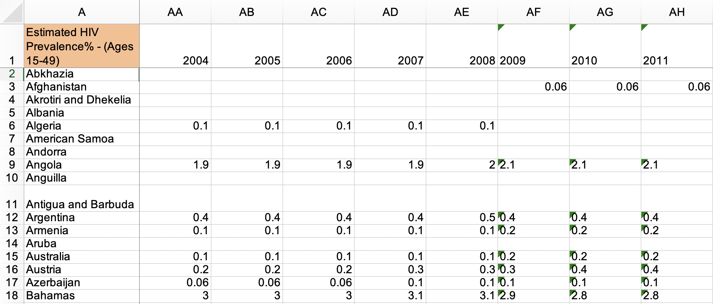
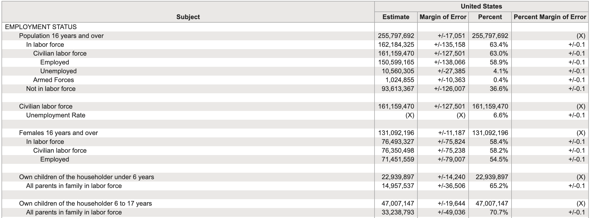

```{r setup, include=FALSE}
options(
  htmltools.dir.version = FALSE,
  dplyr.print_min = 6,
  dplyr.print_max = 6,
  tibble.width = 65,
  width = 65
)
knitr::opts_chunk$set(
  echo = TRUE,
  fig.width = 8,
  fig.asp = 0.618,
  out.width = "60%",
  fig.align = "center",
  dpi = 300,
  message = FALSE,
  warning = FALSE
)
library(tidyverse)
```


## Tidy data

>Happy families are all alike; every unhappy family is unhappy in its own way. 
>
>Leo Tolstoy

::: {.fragment}

> Tidy datasets are all alike; every untidy dataset is untidy in its own way

:::

::: {.columns}
::: {.column width="50%" .fragment}
**Characteristics of tidy data:**

- Each variable forms a column.
- Each observation forms a row.
- Each type of observational unit forms a table.
:::

::: {.column width="50%" .fragment}
**Characteristics of untidy data:**

!@#$%^&*()
:::
:::


## 

::: {.question}
What makes this data not tidy?
:::

{
  width="70%"
  height="500px"
  fig-align="center"
}


::: {.footnote}
Source: [Army Air Forces Statistical Digest, WW II](https://www.ibiblio.org/hyperwar/AAF/StatDigest/aafsd-3.html)
:::

##


::: {.question}
What makes this data not tidy?
:::

<br>

```{r}
#| echo: false
#| out-width: "85%"
#| out-height: "400px"
#| fig-align: center

```

::: {.footnote}
Source: [Gapminder, Estimated HIV prevalence among 15-49 year olds](https://www.gapminder.org/data)
:::


## 

::: {.question}
What makes this data not tidy?
:::

<br>

```{r}
#| echo: false
#| out-width: "85%"
#| out-height: "400px"
#| fig-align: center

```

::: {.footnote}
Source: [US Census Fact Finder, General Economic Characteristics, ACS 2017](https://factfinder.census.gov/faces/tableservices/jsf/pages/productview.xhtml?pid=ACS_17_5YR_DP03&src=pt)
:::


## Grammar of data wrangling {.section-divider .middle}


## A grammar of data wrangling...

... based on the concepts of functions as verbs that manipulate data frames

::: {.columns}

::: {.column width="50%"}
```{r dplyr-part-of-tidyverse, echo=FALSE, out.width="70%"}
knitr::include_graphics("img/dplyr-part-of-tidyverse.png")
```
:::

::: {.column width="50%"}
::: {.midi}
- `select`: pick columns by name
- `arrange`: reorder rows
- `slice`: pick rows using index(es)
- `filter`: pick rows matching criteria
- `distinct`: filter for unique rows
- `mutate`: add new variables
- `summarise`: reduce variables to values
- `group_by`: for grouped operations
- ... and many more
:::
:::

:::


## Rules of **dplyr** functions

- First argument is *always* a data frame
- Subsequent arguments say what to do with that data frame
- Always return a data frame
- Don't modify in place


## Data: Hotel bookings

- Data from two hotels: one resort and one city hotel
- Observations: Each row represents a hotel booking
- Goal for original data collection: Development of prediction models to classify a hotel booking's likelihood to be cancelled ([Antonia et al., 2019](https://www.sciencedirect.com/science/article/pii/S2352340918315191#bib5))

```{r message=FALSE}
hotels <- read_csv("data/hotels.csv")
```

::: {.footnote}
Source: [TidyTuesday](https://github.com/rfordatascience/tidytuesday/blob/master/data/2020/2020-02-11/readme.md)
:::


## First look: Variables

```{r output.lines=18}
names(hotels)
```


## Second look: Overview

```{r output.lines=18}
glimpse(hotels)
```


## `select` a single column

View only `lead_time` (number of days between booking and arrival date):

::: {.columns}

::: {.column width="50%"}
```{r eval=FALSE}
#| code-line-numbers: "1"
select(
  hotels, 
  lead_time
)
```
:::

::: {.column width="50%"}
- Start with the function (a verb): `select()`
:::

:::


## `select` a single column

View only `lead_time` (number of days between booking and arrival date):

::: {.columns}

::: {.column width="50%"}
```{r eval=FALSE}
#| code-line-numbers: "2"
select( 
  hotels,
  lead_time
)
```
:::

::: {.column width="50%"}
- Start with the function (a verb): `select()`
- First argument: data frame we're working with, `hotels`
:::

:::


## `select` a single column

View only `lead_time` (number of days between booking and arrival date):

::: {.columns}

::: {.column width="50%"}
```{r eval=FALSE}
#| code-line-numbers: "3"
select( 
  hotels, 
  lead_time
)
```
:::

::: {.column width="50%"}
- Start with the function (a verb): `select()`
- First argument: data frame we're working with, `hotels`
- Second argument: variable we want to select, `lead_time`
:::

:::


## `select` a single column

View only `lead_time` (number of days between booking and arrival date):

::: {.columns}

::: {.column width="50%"}
```{r}
select( 
  hotels, 
  lead_time
)
```
:::

::: {.column width="50%"}
- Start with the function (a verb): `select()`
- First argument: data frame we're working with, `hotels`
- Second argument: variable we want to select, `lead_time`
- Result: data frame with `r nrow(hotels)` rows and 1 column
:::

:::


## Input and output

::: {.tip}
dplyr functions always expect a data frame and always yield a data frame.
:::

```{r}
select(hotels, lead_time)
```


## `select` multiple columns

View only the `hotel` type and `lead_time`:

::: {.fragment}

```{r}
select(hotels, hotel, lead_time)
```

:::


## `select` to exclude variables

::: {.small}
```{r output.lines=18}
#| code-line-numbers: "2"
hotels |>
  select(-agent)
```
:::


## `select` a range of variables

```{r}
#| code-line-numbers: "2"
hotels |>
  select(hotel:arrival_date_month)
```


## `select` variables with certain characteristics

```{r}
#| code-line-numbers: "2"
hotels |>
  select(starts_with("arrival"))
```


## `select` variables with certain characteristics

```{r}
#| code-line-numbers: "2"
hotels |>
  select(ends_with("type"))
```


## Select helpers

- `starts_with()`: Starts with a prefix
- `ends_with()`: Ends with a suffix
- `contains()`: Contains a literal string
- `num_range()`: Matches a numerical range like x01, x02, x03
- `one_of()`: Matches variable names in a character vector
- `everything()`: Matches all variables
- `last_col()`: Select last variable, possibly with an offset
- `matches()`: Matches a regular expression (a sequence of symbols/characters expressing a string/pattern to be searched for within text)

::: {.fragment}

::: {.question}
What if we wanted to select columns, and then arrange the data in descending order of lead time?
:::

:::


## Data wrangling, step-by-step

::: {.columns}

::: {.column width="50%"}
Select:

```{r}
hotels |>
  select(hotel, lead_time)
```
:::

::: {.column width="50%"}
::: {.fragment}
Select, then arrange:

```{r}
hotels |>
  select(hotel, lead_time) |>
  arrange(desc(lead_time))
```
:::
:::

:::


## Pipes {.section-divider .middle}


## What is a pipe?

In programming, a pipe is a technique for passing information from one process to another.

::: {.fragment}
::: {.columns}

::: {.column width="50%"}
- Start with the data frame `hotels`, and pass it to the `select()` function,
:::

::: {.column width="50%"}
::: {.small}
```{r}
#| code-line-numbers: "1"
hotels |>
  select(hotel, lead_time) |>
  arrange(desc(lead_time))
```
:::
:::

:::
:::


## What is a pipe?

In programming, a pipe is a technique for passing information from one process to another.

::: {.columns}

::: {.column width="50%"}
- Start with the data frame `hotels`, and pass it to the `select()` function,
- then we select the variables `hotel` and `lead_time`,
:::

::: {.column width="50%"}
::: {.small}
```{r}
#| code-line-numbers: "2"
hotels |>
  select(hotel, lead_time) |>
  arrange(desc(lead_time))
```
:::
:::

:::


## What is a pipe?

In programming, a pipe is a technique for passing information from one process to another.

::: {.columns}

::: {.column width="50%"}
- Start with the data frame `hotels`, and pass it to the `select()` function,
- then we select the variables `hotel` and `lead_time`,
- and then we arrange the data frame by `lead_time` in descending order.
:::

::: {.column width="50%"}
::: {.small}
```{r}
#| code-line-numbers: "3"
hotels |>
  select(hotel, lead_time) |> 
  arrange(desc(lead_time))
```
:::
:::

:::


## Aside %>% vs. |>

Historically, the `tidyverse` community has used the `%>%` pipe operator, from the `magrittr` package (loaded with the `tidyverse`)

A couple of years ago, Hadley Wickham & Posit recommended we move to the "native pipe" `|>`

They are equivalent in most circumstances; `|>` supposedly is more streamlined and faster.


## Shortcuts for the pipe {.section-divider}

The following keystroke is a "shortcut" for typing the pipe operator:

+ Command + Shift + M (Mac)
+ Ctrl + Shift + M (Windows)

By default it will type the old pipe `%>%`. To change this, go to Tools > Global Options > Code > Use native pipe operator. 


## How does a pipe work?

- You can think about the following sequence of actions - find keys, start car, drive to work, park.

::: {.fragment}
- Expressed as a set of nested functions in R pseudocode this would look like:

```{r eval=FALSE}
park(drive(start_car(find("keys")), to = "work"))
```
:::

::: {.fragment}
- Writing it out using pipes give it a more natural (and easier to read) 
structure:

```{r eval=FALSE}
find("keys") |>
  start_car() |>
  drive(to = "work") |>
  park()
```
:::


## A note on piping and layering

- `|>` used mainly in **dplyr** pipelines, *we pipe the output of the previous line of code as the first input of the next line of code*

::: {.fragment}
- `+` used in **ggplot2** plots is used for "layering", *we create the plot in layers, separated by `+`*
:::


## dplyr

::: {.midi}
`r emo::ji("x")`

```{r error=TRUE}
hotels +
  select(hotel, lead_time)
```

`r emo::ji("white_check_mark")`

```{r eval=FALSE}
hotels |>
  select(hotel, lead_time)
```

```{r echo=FALSE, output.lines=6}
hotels |>
  select(hotel, lead_time)
```
:::


## ggplot2

::: {.midi}
`r emo::ji("x")`

```{r error=TRUE}
ggplot(hotels, aes(x = hotel, fill = deposit_type)) |>
  geom_bar()
```

`r emo::ji("white_check_mark")`

```{r out.width="25%"}
ggplot(hotels, aes(x = hotel, fill = deposit_type)) +
  geom_bar()
```
:::


## Code styling

Many of the styling principles are consistent across `|>` and `+`:

- always a space before
- always a line break after (for pipelines with more than 2 lines)

`r emo::ji("x")`

```{r eval=FALSE}
ggplot(hotels,aes(x=hotel,y=deposit_type))+geom_bar()
```

`r emo::ji("white_check_mark")`

```{r eval=FALSE}
ggplot(hotels, aes(x = hotel, y = deposit_type)) + 
  geom_bar()
```


## `arrange` in ascending / descending order

::: {.columns}

::: {.column width="50%"}
```{r}
#| code-line-numbers: "3"
hotels |>
  select(adults, children, babies) |>
  arrange(babies)
```
:::

::: {.column width="50%"}
```{r}
#| code-line-numbers: "3"
hotels |>
  select(adults, children, babies) |>
  arrange(desc(babies))
```
:::

:::


## `slice` for certain row numbers

::: {.midi}
```{r output.lines=17}
#| code-line-numbers: "2"
## first five 
hotels |>
  slice(1:5)
```
:::


## R tip

::: {.tip}
In R, you can use the `#` for adding comments to your code. 
Any text following `#` will be printed as is, and won't be run as R code.
This is useful for leaving comments in your code and for temporarily disabling 
certain lines of code while debugging.
:::

::: {.small}
```{r output.lines=10}
hotels |>
  # slice the first five rows  # this line is a comment
  #select(hotel) |>           # this one doesn't run
  slice(1:5)                  # this line runs
```
:::


## Quiz {.section-divider}

How many rows and columns do you expect the following code to produce? `starwars` has 87 rows and 14 columns to begin with (87 x 14).

```{r eval=FALSE}
starwars |> 
  select(name, homeworld, species)
```

    a. 87 x 14
    b. 3 x 14
    c. 87 x 3
    d. 14 x 3


## Quiz {.section-divider}

How many rows and columns do you expect the following code to produce? `starwars` has 87 rows and 14 columns to begin with.

```{r eval=FALSE}
starwars |> 
  slice(1:10)
```

    a. 87 x 10
    b. 10 x 14
    c. 14 x 10
    d. 10 x 87
    
## More `dplyr` verbs for wrangling a single data frame {.section-divider .middle}


## We... {.section-divider .middle}

::: {.hand}
[have]{.huge .green} a single data frame

[want]{.huge .pink} to slice it, dice it, juice it, and process it
:::


## Data: Hotel bookings

- Data from two hotels: one resort and one city hotel
- Observations: Each row represents a hotel booking

```{r message=FALSE}
hotels <- read_csv("data/hotels.csv")
```


## `select`, `arrange`, and `slice` {.section-divider .middle}


## `filter` {.section-divider .middle}


## `filter` to select a subset of rows

::: {.midi}
```{r output.lines=17}
#| code-line-numbers: "3"
# bookings in City Hotels
hotels |>
  filter(hotel == "City Hotel")
```
:::


## Quiz {.section-divider}

What rows remain? 

```{r, eval = FALSE}
df <- data.frame(student = c("A","B","C","D"),
             score = c(90, 80, 85, 95))
df |>  filter(score > 85)
```

    A. Students A and D
    B. Students B and C
    C. Students A, C, and D
    D. All students


## `filter` for many conditions at once

```{r}
#| code-line-numbers: "3-4"
hotels |>
  filter( 
    adults == 0,
    children >= 1
    ) |> 
  select(adults, babies, children)
```


## `filter` for more complex conditions

```{r}
#| code-line-numbers: "5"
# bookings with no adults and some children or babies in the room
hotels |>
  filter( 
    adults == 0,     
    children >= 1 | babies >= 1     # | means or
    ) |>
  select(adults, babies, children)
```


## Logical operators in R

::: {.columns}

::: {.column width="50%"}

| Operator | Definition |
|---|---|
| `<` | Less than |
| `<=` | Less than or equal to |
| `>` | Greater than |
| `>=` | Greater than or equal to |
| `==` | Exactly equal to |
| `!=` | Not equal to |

:::

::: {.column width="50%"}

| Operator | Definition |
|---|---|
| `x & y` | `x` AND `y` |
| `x \| y` | `x` OR `y` |
| `is.na(x)` | Test if `x` is missing |
| `!is.na(x)` | Test if `x` is not missing |
| `x %in% y` | Test if `x` is in `y` |
| `!(x %in% y)` | Test if `x` is not in `y` |

:::

:::


## `distinct` and `count` {.section-divider .middle}


```{r include=FALSE}
options(dplyr.print_max = 20)
```


## `distinct` to filter for unique rows

... and `arrange` to order alphabetically

::: {.small}
::: {.columns}
::: {.column width="50%"}
```{r}
#| code-line-numbers: "2"
hotels |> 
  distinct(market_segment) |>
  arrange(market_segment)
```
:::
::: {.column width="50%"}
```{r output.lines=13}
#| code-line-numbers: "2"
hotels |> 
  distinct(hotel, market_segment) |>
  arrange(hotel, market_segment)
```
:::
:::
:::


## `count` to create frequency tables

::: {.columns}
::: {.column width="50%"}
```{r}
#| code-line-numbers: "3"
# alphabetical order by default
hotels |>
  count(market_segment)
```
:::
::: {.column width="50%" .fragment}
```{r}
#| code-line-numbers: "3"
# descending frequency order
hotels |>
  count(market_segment, sort = TRUE)
```
:::
:::


## `count` and `arrange`

::: {.columns}
::: {.column width="50%"}
```{r}
#| code-line-numbers: "4"
# ascending frequency order
hotels |>
  count(market_segment) |>
  arrange(n)
```
:::
::: {.column width="50%"}
```{r}
#| code-line-numbers: "5"
# descending frequency order
# just like adding sort = TRUE
hotels |>
  count(market_segment) |>
  arrange(desc(n))
```
:::
:::


## `count` for multiple variables

```{r}
#| code-line-numbers: "2"
hotels |>
  count(hotel, market_segment)
```


## order matters when you `count`

::: {.midi}
::: {.columns}
::: {.column width="50%"}
```{r}
#| code-line-numbers: "3"
# hotel type first
hotels |>
  count(hotel, market_segment)
```
:::
::: {.column width="50%"}
```{r}
#| code-line-numbers: "3"
# market segment first
hotels |>
  count(market_segment, hotel)
```
:::
:::
:::


## `mutate` {.section-divider .middle}


## `mutate` to add a new variable

```{r}
#| code-line-numbers: "2"
hotels |>
  mutate(little_ones = children + babies) |>
  select(children, babies, little_ones) |>
  arrange(desc(little_ones))
```


## Little ones in resort and city hotels

::: {.midi}
::: {.columns}
::: {.column width="50%"}
```{r}
# Resort Hotel
hotels |>
  mutate(little_ones = children + babies) |>
  filter(
    little_ones >= 1,
    hotel == "Resort Hotel"
    ) |>
  select(hotel, little_ones)
```
:::
::: {.column width="50%"}
```{r}
# City Hotel
hotels |>
  mutate(little_ones = children + babies) |>
  filter(
    little_ones >= 1,
    hotel == "City Hotel"
    )  |>
  select(hotel, little_ones)
```
:::
:::
:::

## 

::: {.question}
What is happening in the following chunk?
:::

::: {.midi}
```{r}
hotels |>
  mutate(little_ones = children + babies) |>
  count(hotel, little_ones) |>
  mutate(prop = n / sum(n))
```
:::


## `summarise` and `group_by` {.section-divider .middle}


## `summarise` for summary stats

```{r}
#| code-line-numbers: "3"
# mean average daily rate for all bookings
hotels |>
  summarise(mean_adr = mean(adr))
```

::: {.fragment}
::: {.tip}
`summarise()` changes the data frame entirely, it collapses rows down to a single 
summary statistic, and removes all columns that are irrelevant to the calculation.
:::
:::

##

::: {.tip}
`summarise()` also lets you get away with being sloppy and not naming your new 
column, but that's not recommended!
:::

::: {.columns}
::: {.column width="50%"}
`r emo::ji("x")`

```{r}
hotels |>
  summarise(mean(adr))
```
:::
::: {.column width="50%"}
`r emo::ji("white_check_mark")`

```{r}
hotels |>
  summarise(mean_adr = mean(adr))
```
:::
:::


## `group_by` for grouped operations

```{r}
#| code-line-numbers: "3"
# mean average daily rate for all booking at city and resort hotels
hotels |>
  group_by(hotel) |>
  summarise(mean_adr = mean(adr))
```


## Calculating frequencies

The following two give the same result, so `count` is simply short for `group_by` then determine frequencies 

::: {.columns}
::: {.column width="50%"}
```{r}
hotels |>
  group_by(hotel) |>
  summarise(n = n())
```
:::
::: {.column width="50%"}
```{r}
hotels |>
  count(hotel)
```
:::
:::


## Multiple summary statistics

`summarise` can be used for multiple summary statistics as well

```{r}
hotels |>
  summarise(
    min_adr = min(adr),
    mean_adr = mean(adr),
    median_adr = median(adr),
    max_adr = max(adr)
    )
```


## Quiz

What does this code return?

```{r, eval = FALSE}
df |> 
  summarise(mean_score = mean(score))
```

A. A 1x1 data frame with one value: the mean of all scores

B. A new column with each student’s mean score

C. An error: `summarise()` needs `group_by()`

D. The same dataset as before


## Quiz

What's the result of this pipeline?

```{r, eval = FALSE}
df %>%
  mutate(passed = score > 85) %>%
  filter(passed)
```


A. Keeps only students with score > 85

B. Creates a new column passed with TRUE/FALSE for all students

C. Both A and B

D. Neither
