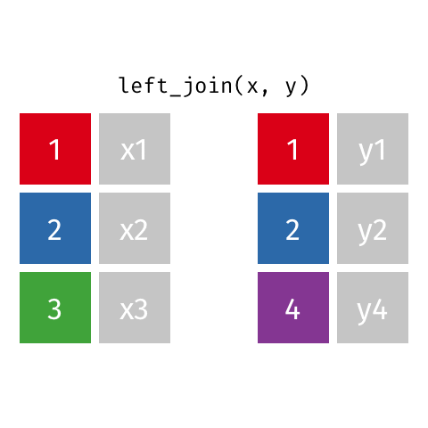
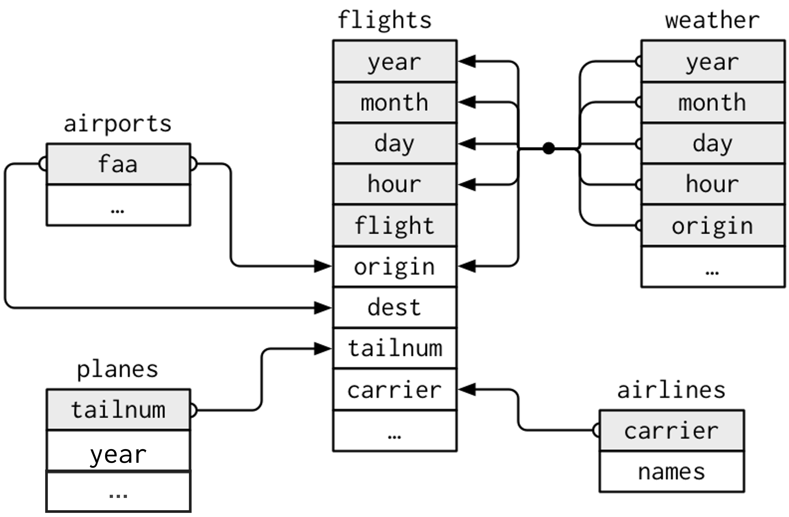
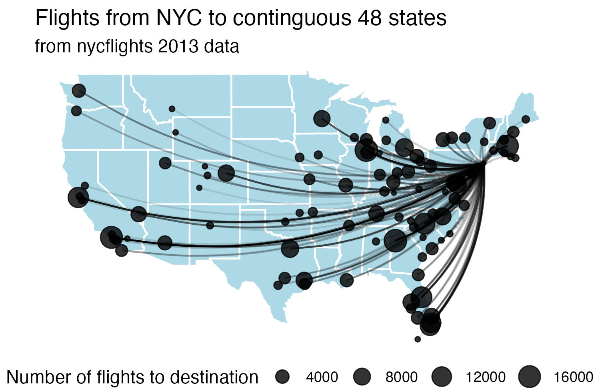

```{r child = "setup.Rmd"}
```

```{r packages, echo=FALSE, message=FALSE, warning=FALSE}
library(tidyverse)
library(knitr)
library(scales)
library(kableExtra)
library(dsbox)
options(
  dplyr.print_min = 10, 
  dplyr.print_max = 10
  )
```

# Goals

Today you will practice: 

+ data wrangling with `dplyr` verbs
+ joining multiple data frames
+ pivoting data frames to wide or long format
+ planning a data wrangling pipeline to accomplished a desired task/visualization

---

# A quick refresh of `dplyr` verbs in R

Which of the following allows you to keep rows that meet a certain criteria?

A. `keep()`  
B. `where()`  
C. `filter()`  
D. `select()`  
E. `mutate()`

---

# A quick refresh of `dplyr` verbs in R

Which of the following allows you to keep rows that meet a certain criteria?

A. `keep()`  
B. `where()`  
<span style="background-color: #FFD580; padding: 2px 4px;">C. `filter()` ✅</span>  
D. `select()`  
E. `mutate()`

---

# A quick refresh of `dplyr` verbs in R

Which of the following allows you to keep specified columns?

A. `keep()`  
B. `colname()`  
C. `filter()`  
D. `select()`  
E. `mutate()`

---

# A quick refresh of `dplyr` verbs in R

Which of the following allows you to keep specified columns?

A. `keep()`  
B. `colname()`  
C. `filter()`  
<span style="background-color: #FFD580; padding: 2px 4px;">D. `select()` ✅</span>  
E. `mutate()`

---

# A quick refresh of `dplyr` verbs in R

Recall the `midwest` dataset you used for homework (dimensions: 437 × 28),  
where each row is a county, and there is data on counties from 5 Midwestern states.

How many rows and columns will the following code produce?

```{r, eval = FALSE}
midwest |> count(state)
```

A. 437 × 3  
B. 5 × 2  
C. 1 × 1  
D. 5 × 28

---

# A quick refresh of `dplyr` verbs in R

Recall the `midwest` dataset you used for homework (dimensions: 437 × 28),  
where each row is a county, and there is data on counties from 5 Midwestern states.

How many rows and columns will the following code produce?

```{r, eval = FALSE}
midwest |> count(state)
```

A. 437 × 3  
<span style="background-color: #FFD580; padding: 2px 4px;">B. 5 × 2 ✅</span>  
C. 1 × 1  
D. 5 × 28

---

# Still thinking about the `midwest` data...

You want to calculate the average percentage of college-educated adults (`percollege`) by state.  
Which verbs do you need?

A. `filter()` and `mutate()`  
B. `group_by()` and `summarize()`  
C. `mutate()` and `arrange()`  
D. `count()` and `summarize()`

---

# Still thinking about the `midwest` data...

You want to calculate the average percentage of college-educated adults (`percollege`) by state.  
Which verbs do you need?

A. `filter()` and `mutate()`  
<span style="background-color: #FFD580; padding: 2px 4px;">B. `group_by()` and `summarize()` ✅</span>  
C. `mutate()` and `arrange()`  
D. `count()` and `summarize()`

---

# Still thinking about the `midwest` data...

You want to keep only counties where less than 10% of the population lives in poverty (`percbelowpoverty`).  
Which verb do you use?

A. `mutate()`  
B. `filter()`  
C. `group_by()`  
D. `summarize()`

---

# Still thinking about the `midwest` data...

You want to keep only counties where less than 10% of the population lives in poverty (`percbelowpoverty`).  
Which verb do you use?

A. `mutate()`  
<span style="background-color: #FFD580; padding: 2px 4px;">B. `filter()` ✅</span>  
C. `group_by()`  
D. `summarize()`

---

# Still thinking about the `midwest` data...

You want to create a new variable for the proportion of children in the population, using  
`perc_child = popchild / poptotal`.  
Which verb should you use?

A. `summarize()`  
B. `filter()`  
C. `mutate()`  
D. `count()`

---

# Still thinking about the `midwest` data...

You want to create a new variable for the proportion of children in the population, using  
`perc_child = popchild / poptotal`.  
Which verb should you use?

A. `summarize()`  
B. `filter()`  
<span style="background-color: #FFD580; padding: 2px 4px;">C. `mutate()` ✅</span>  
D. `count()`

---

# Still thinking about the `midwest` data...

How many rows will the resulting dataset have?

```{r, eval = FALSE}
midwest |> 
  group_by(state) |> 
  mutate(mean_poverty = mean(percbelowpoverty))
```

A. One per state  
B. One per value of `percbelowpoverty`  
C. Same number as the original dataset  
D. Depends on missing values

---

# Still thinking about the `midwest` data...

How many rows will the resulting dataset have?

```{r, eval = FALSE}
midwest |> 
  group_by(state) |> 
  mutate(mean_poverty = mean(percbelowpoverty))
```

A. One per state  
B. One per value of `percbelowpoverty`  
<span style="background-color: #FFD580; padding: 2px 4px;">C. Same number as the original dataset ✅</span>  
D. Depends on missing values

---

# Still thinking about the `midwest` data...

You want to find out which state has the highest average percentage of people in poverty.  
Which pipeline would give you that result?

```{r, eval = FALSE}
# A
midwest |> summarize(max(perpoverty))

# B
midwest |> 
  group_by(state) |> 
  summarize(avg_pov = mean(percbelowpoverty)) |> 
  arrange(desc(avg_pov))

# C
midwest |> mutate(avg_pov = mean(percbelowpoverty)) |> max()

# D 
midwest |> count(percbelowpoverty) |> arrange()
```

---

# Still thinking about the `midwest` data...

You want to find out which state has the highest average percentage of people in poverty.  
Which pipeline would give you that result?

```{r, eval = FALSE}
# A
midwest |> summarize(max(perpoverty))

# B - correct answer
midwest |> 
  group_by(state) |> 
  summarize(avg_pov = mean(percbelowpoverty)) |> 
  arrange(desc(avg_pov)) ✅<

# C
midwest |> mutate(avg_pov = mean(percbelowpoverty)) |> max()

# D 
midwest |> count(percbelowpoverty) |> arrange()
```
---

class: middle

# Data Wrangling: Joining multiple datasets

---

class: middle

# .hand[We...]

.huge[.green[have]] .hand[multiple data frames]

.huge[.pink[want]] .hand[to bring them together]

---

```{r include=FALSE}
professions <- read_csv("data/scientists/professions.csv")
dates <- read_csv("data/scientists/dates.csv")
works <- read_csv("data/scientists/works.csv")
```

## Data: Women in science 

Information on "10 women in science who changed the world"

.small[
```{r echo=FALSE}
professions |> select(name) |> kable()
```
]


.footnote[
Source: [Discover Magazine](https://www.discovermagazine.com/the-sciences/meet-10-women-in-science-who-changed-the-world)
]

---

## Inputs

.panelset[

.panel[.panel-name[professions]
```{r}
professions
```
]

.panel[.panel-name[dates]
```{r}
dates
```
]

.panel[.panel-name[works]
```{r}
works
```
]

]

---

## Desired output

```{r echo=FALSE}
professions |>
  left_join(dates) |>
  left_join(works) #|> write_csv("data/scientists/all_scientists.csv")
```

---

## Inputs, reminder

.pull-left[
```{r}
names(professions)
names(dates)
names(works)
```
]
.pull-right[
```{r}
nrow(professions)
nrow(dates)
nrow(works)
```
]

---

class: middle

# Joining data frames

---

## Joining data frames

```{r eval=FALSE}
something_join(x, y)

x |> 
  something_join(y)
```

#### Mutating joins (add variables in)

- `left_join()`: keeps all rows in x
- `right_join()`: keeps all rows in y
- `full_join()`: keeps all rows in x or y
- `inner_join()`: only keeps rows from x that have a matching key in y

---

## Joining data frames

```{r eval=FALSE}
something_join(x, y)

x |> 
  something_join(y)
```

#### Filtering joins (remove rows based on matches, don't bring in new variables)
- `semi_join()`: only keeps rows from x that have a match in y; does not bring in y's columns
- `anti_join()`: only keeps rows from x that do NOT have a match in y; does not bring in y's columns

 
---

## Setup

For the next few slides...

.pull-left[
```{r echo=FALSE}
x <- tibble(
  id = c(1, 2, 3),
  value_x = c("x1", "x2", "x3")
  )
```
```{r}
x
```
]
.pull-right[
```{r echo=FALSE}
y <- tibble(
  id = c(1, 2, 4),
  value_y = c("y1", "y2", "y4")
  )
```
```{r}
y
```
]

---

## `left_join()`

.pull-left[
```{r echo=FALSE, out.width="80%", out.extra ='style="background-color: #FDF6E3"'}

```
]
.pull-right[
```{r}
left_join(x, y)
```
]

---

## `left_join()`

What do you expect? How many rows and columns?

```{r, eval = FALSE}
professions |>
  left_join(dates) #<<
```

--

```{r, echo = FALSE}
professions |>
  left_join(dates) #<<
```

---

## `right_join()`

.pull-left[
```{r echo=FALSE, out.width="80%", out.extra ='style="background-color: #FDF6E3"'}
include_graphics("img/right-join.gif")
```
]
.pull-right[
```{r}
right_join(x, y)
```
]

---

## `right_join()`

What do you expect? How many rows and columns?

```{r, eval = FALSE}
professions |>
  right_join(dates) #<<
```

--

```{r, echo = FALSE}
professions |>
  right_join(dates) #<<
```

---

## `full_join()`

.pull-left[
```{r echo=FALSE, out.width="80%", out.extra ='style="background-color: #FDF6E3"'}
include_graphics("img/full-join.gif")
```
]
.pull-right[
```{r}
full_join(x, y)
```
]

---

## `full_join()`

```{r}
dates |>
  full_join(works) #<<
```

---

## `inner_join()`

.pull-left[
```{r echo=FALSE, out.width="80%", out.extra ='style="background-color: #FDF6E3"'}
include_graphics("img/inner-join.gif")
```
]
.pull-right[
```{r}
inner_join(x, y)
```
]

---

## `inner_join()`

```{r}
dates |>
  inner_join(works) #<<
```

---

## `semi_join()`

.pull-left[
```{r echo=FALSE, out.width="80%", out.extra ='style="background-color: #FDF6E3"'}
include_graphics("img/semi-join.gif")
```
]
.pull-right[
```{r}
semi_join(x, y)
```
]

---

## `semi_join()`

What do you expect? How many rows and columns?

```{r, eval = FALSE}
dates |>
  semi_join(works) #<<
```

--

```{r, echo = FALSE}
dates |>
  semi_join(works) #<<
```

---

## `anti_join()`

.pull-left[
```{r echo=FALSE, out.width="80%", out.extra ='style="background-color: #FDF6E3"'}
include_graphics("img/anti-join.gif")
```
]
.pull-right[
```{r}
anti_join(x, y)
```
]

---

## `anti_join()`

```{r}
dates |>
  anti_join(works) #<<
```

---

## Putting it altogether

```{r}
professions |>
  left_join(dates) |>
  left_join(works)
```

---

class: middle

# Case study: Student records

---

## Student records

- Have:
  - Enrolment: official university enrolment records
  - Survey: Student provided info; missing students who never filled it out and including students who filled it out but dropped the class
- Want: Survey info for all enrolled in class 

--

```{r include=FALSE}
enrolment <- read_csv("data/students/enrolment.csv")
survey <- read_csv("data/students/survey.csv")
```

.pull-left[
```{r message = FALSE}
enrolment
```
]
.pull-right[
```{r message = FALSE}
survey
```
]

---

# Quiz

Which code is guaranteed to retain rows for all students enrolled in the course, but not students who dropped (i.e. are not currently enrolled)?

A. `enrolment |> left_join(survey, by = "id")`

B. `enrolment |> inner_join(survey, by = "id")`

C. `enrolment |> semi_join(survey, by = "id")`

D. `enrolment |> full_join(survey, by = "id")`

---

# Quiz

Which code is guaranteed to retain rows for all students enrolled in the course, but not students who dropped (i.e. are not currently enrolled)?

<span style="color:orange; font-weight:bold;">A. `enrolment |> left_join(survey, by = "id")`  ✅</span>  
B. `enrolment |> inner_join(survey, by = "id")` 
C. `enrolment |> semi_join(survey, by = "id")`  
D. `enrolment |> full_join(survey, by = "id")`


---

# Quiz

Which code will return rows for students who did not fill out the survey?

A. `enrolment |> semi_join(survey, by = "id")`

B. `enrolment |> anti_join(survey, by = "id")`

C. `survey |> semi_join(enrolment, by = "id")`

D. `survey |> anti_join(enrolment, by = "id")`


---

# Quiz

Which code will return rows for students who did not fill out the survey?

A. `enrolment |> semi_join(survey, by = "id")`  
<span style="color:orange; font-weight:bold;">B. `enrolment |> anti_join(survey, by = "id")` ✅</span>  
C. `survey |> semi_join(enrolment, by = "id")`  
D. `survey |> anti_join(enrolment, by = "id")`

---

# Quiz

Which code will return rows for students who filled out the survey but dropped the course?

A. `enrolment |> semi_join(survey, by = "id")`

B. `enrolment |> anti_join(survey, by = "id")`

C. `survey |> semi_join(enrolment, by = "id")`

D. `survey |> anti_join(enrolment, by = "id")`


---

# Quiz

Which code will return rows for students who filled out the survey but dropped the course?

A. `enrolment |> semi_join(survey, by = "id")`  
B. `enrolment |> anti_join(survey, by = "id")`  
C. `survey |> semi_join(enrolment, by = "id")`  
<span style="color:orange; font-weight:bold;">D. `survey |> anti_join(enrolment, by = "id")` ✅</span>

---


## Student records

.panelset[

.panel[.panel-name[In class]
```{r}
enrolment |> 
  left_join(survey, by = "id") #<<
```
]

.panel[.panel-name[Survey missing]
```{r}
enrolment |> 
  anti_join(survey, by = "id") #<<
```
]

.panel[.panel-name[Dropped]
```{r}
survey |> 
  anti_join(enrolment, by = "id") #<<
```
]

]

---

# Your turn: week_09.qmd

Recall: `flights` contains data about every flight that departed La Guardia, JFK, or Newark airports in 2013

```{r fig-nycflights13, echo=FALSE, out.width='60%'}


```


Exercises 1 - 5

---

# How could we create this? 

.pull-left[

In groups, brainstorm the data wrangling required to create this visualizaton. 

+ What does the data need to look like? What does one row of the data represent? What columns do you need? Sketch out a few "dummy" rows of what you expect the data to contain.
+ Which of the above columns already exist (in which datasets), and which ones need to be created? 
+ What joining and/or aggregation steps need to take place? Write some psuedocode for this.
]

.pull-right[


]

