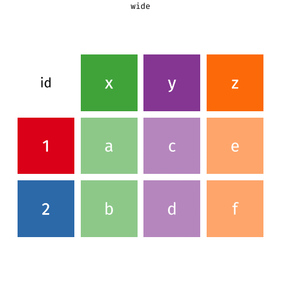
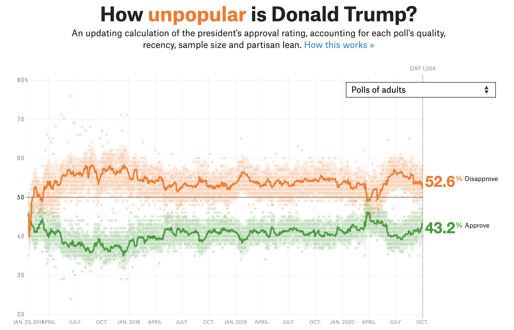

```{r setup, include=FALSE}
options(
  htmltools.dir.version = FALSE,
  dplyr.print_min = 10,
  dplyr.print_max = 10,
  tibble.width = 65,
  width = 65
)
knitr::opts_chunk$set(
  echo = TRUE,
  fig.width = 8,
  fig.asp = 0.618,
  out.width = "60%",
  fig.align = "center",
  dpi = 300,
  message = FALSE,
  warning = FALSE
)
library(tidyverse)
library(knitr)
library(scales)
library(kableExtra)
library(dsbox)
```


## Goals

Today you will practice: 

+ data wrangling with `dplyr` verbs
+ joining multiple data frames
+ pivoting data frames to wide or long format
+ planning a data wrangling pipeline to accomplish a desired task/visualization


## Data Wrangling: Joining multiple datasets {.section-divider .middle}


## We... {.section-divider .middle}

**have** multiple data frames

**want** to bring them together


```{r include=FALSE}
professions <- read_csv("data/scientists/professions.csv")
dates <- read_csv("data/scientists/dates.csv")
works <- read_csv("data/scientists/works.csv")
```

## Data: Women in science 

Information on "10 women in science who changed the world"

::: {.small}
```{r echo=FALSE}
professions |> select(name) |> kable()
```
:::


::: {.footnote}
Source: [Discover Magazine](https://www.discovermagazine.com/the-sciences/meet-10-women-in-science-who-changed-the-world)
:::


## Inputs

::: {.panel-tabset}

### professions
```{r}
professions
```

### dates
```{r}
dates
```

### works
```{r}
works
```

:::


## Desired output

```{r echo=FALSE}
professions |>
  left_join(dates) |>
  left_join(works) #|> write_csv("data/scientists/all_scientists.csv")
```


## Inputs, reminder

::: {.columns}
::: {.column width="50%"}
```{r}
names(professions)
names(dates)
names(works)
```
:::
::: {.column width="50%"}
```{r}
nrow(professions)
nrow(dates)
nrow(works)
```
:::
:::


## Joining data frames {.section-divider .middle}


## Joining data frames

```{r eval=FALSE}
something_join(x, y)

x |> 
  something_join(y)
```

#### Mutating joins (add variables in)

- `left_join()`: keeps all rows in x
- `right_join()`: keeps all rows in y
- `full_join()`: keeps all rows in x or y
- `inner_join()`: only keeps rows from x that have a matching key in y


## Joining data frames

```{r eval=FALSE}
something_join(x, y)

x |> 
  something_join(y)
```

#### Filtering joins (remove rows based on matches, don't bring in new variables)
- `semi_join()`: only keeps rows from x that have a match in y; does not bring in y's columns
- `anti_join()`: only keeps rows from x that do NOT have a match in y; does not bring in y's columns

 


## Setup

For the next few slides...

::: {.columns}
::: {.column width="50%"}
```{r echo=FALSE}
x <- tibble(
  id = c(1, 2, 3),
  value_x = c("x1", "x2", "x3")
  )
```
```{r}
x
```
:::
::: {.column width="50%"}
```{r echo=FALSE}
y <- tibble(
  id = c(1, 2, 4),
  value_y = c("y1", "y2", "y4")
  )
```
```{r}
y
```
:::
:::


## `left_join()`

::: {.columns}
::: {.column width="50%"}
```{r echo=FALSE, out.width="80%", out.extra ='style="background-color: #FDF6E3"'}
include_graphics("img/left-join.gif")
```
:::
::: {.column width="50%"}
```{r}
left_join(x, y)
```
:::
:::


## `left_join()`

What do you expect? How many rows and columns?

```{r, eval = FALSE}
#| code-line-numbers: "2"
professions |>
  left_join(dates)
```

. . .

```{r, echo = FALSE}
#| code-line-numbers: "2"
professions |>
  left_join(dates)
```


## `right_join()`

::: {.columns}
::: {.column width="50%"}
```{r echo=FALSE, out.width="80%", out.extra ='style="background-color: #FDF6E3"'}
include_graphics("img/right-join.gif")
```
:::
::: {.column width="50%"}
```{r}
right_join(x, y)
```
:::
:::


## `right_join()`

What do you expect? How many rows and columns?

```{r, eval = FALSE}
#| code-line-numbers: "2"
professions |>
  right_join(dates)
```

. . .

```{r, echo = FALSE}
#| code-line-numbers: "2"
professions |>
  right_join(dates)
```


## `full_join()`

::: {.columns}
::: {.column width="50%"}
```{r echo=FALSE, out.width="80%", out.extra ='style="background-color: #FDF6E3"'}
include_graphics("img/full-join.gif")
```
:::
::: {.column width="50%"}
```{r}
full_join(x, y)
```
:::
:::


## `full_join()`

```{r}
#| code-line-numbers: "2"
dates |>
  full_join(works)
```


## `inner_join()`

::: {.columns}
::: {.column width="50%"}
```{r echo=FALSE, out.width="80%", out.extra ='style="background-color: #FDF6E3"'}
include_graphics("img/inner-join.gif")
```
:::
::: {.column width="50%"}
```{r}
inner_join(x, y)
```
:::
:::


## `inner_join()`

```{r}
#| code-line-numbers: "2"
dates |>
  inner_join(works)
```


## `semi_join()`

::: {.columns}
::: {.column width="50%"}
```{r echo=FALSE, out.width="80%", out.extra ='style="background-color: #FDF6E3"'}
include_graphics("img/semi-join.gif")
```
:::
::: {.column width="50%"}
```{r}
semi_join(x, y)
```
:::
:::


## `semi_join()`

What do you expect? How many rows and columns?

```{r, eval = FALSE}
#| code-line-numbers: "2"
dates |>
  semi_join(works)
```

. . .

```{r, echo = FALSE}
#| code-line-numbers: "2"
dates |>
  semi_join(works)
```


## `anti_join()`

::: {.columns}
::: {.column width="50%"}
```{r echo=FALSE, out.width="80%", out.extra ='style="background-color: #FDF6E3"'}
include_graphics("img/anti-join.gif")
```
:::
::: {.column width="50%"}
```{r}
anti_join(x, y)
```
:::
:::


## `anti_join()`

```{r}
#| code-line-numbers: "2"
dates |>
  anti_join(works)
```


## Putting it all together

```{r}
professions |>
  left_join(dates) |>
  left_join(works)
```


## Case study: Student records {.section-divider .middle}


## Student records

- Have:
  - Enrolment: official university enrolment records
  - Survey: Student provided info; missing students who never filled it out and including students who filled it out but dropped the class
- Want: Survey info for all enrolled in class 

. . .

```{r include=FALSE}
enrolment <- read_csv("data/students/enrolment.csv")
survey <- read_csv("data/students/survey.csv")
```

::: {.columns}
::: {.column width="50%"}
```{r message = FALSE}
enrolment
```
:::
::: {.column width="50%"}
```{r message = FALSE}
survey
```
:::
:::


## Quiz

Which code is guaranteed to retain rows for all students enrolled in the course, but not students who dropped (i.e. are not currently enrolled)?

A. `enrolment |> left_join(survey, by = "id")`

B. `enrolment |> inner_join(survey, by = "id")`

C. `enrolment |> semi_join(survey, by = "id")`

D. `enrolment |> full_join(survey, by = "id")`


## Quiz

Which code will return rows for students who did not fill out the survey?

A. `enrolment |> semi_join(survey, by = "id")`

B. `enrolment |> anti_join(survey, by = "id")`

C. `survey |> semi_join(enrolment, by = "id")`

D. `survey |> anti_join(enrolment, by = "id")`


## Quiz

Which code will return rows for students who filled out the survey but dropped the course?

A. `enrolment |> semi_join(survey, by = "id")`

B. `enrolment |> anti_join(survey, by = "id")`

C. `survey |> semi_join(enrolment, by = "id")`

D. `survey |> anti_join(enrolment, by = "id")`


## Student records

::: {.panel-tabset}

### In class
```{r}
#| code-line-numbers: "2"
enrolment |> 
  left_join(survey, by = "id")
```

### Survey missing
```{r}
#| code-line-numbers: "2"
enrolment |> 
  anti_join(survey, by = "id")
```

### Dropped
```{r}
#| code-line-numbers: "2"
survey |> 
  anti_join(enrolment, by = "id")
```

:::


## Your turn: week_05.qmd

Recall: `flights` contains data about every flight that departed La Guardia, JFK, or Newark airports in 2013

```{r fig-nycflights13, echo=FALSE, out.width='60%'}
knitr::include_graphics("img/nycflights13.png")

```


Exercises 1 - 5


## How could we create this?

::: {.columns}
::: {.column width="50%"}

In groups, brainstorm the data wrangling required to create this visualization. 

+ What does the data need to look like? What does one row of the data represent? What columns do you need? Sketch out a few "dummy" rows of what you expect the data to contain.
+ Which of the above columns already exist (in which datasets), and which ones need to be created? 
+ What joining and/or aggregation steps need to take place? Write some pseudocode for this.
:::

::: {.column width="50%"}


:::
:::


## Case study: Grocery sales {.section-divider .middle}


## Grocery sales

- Have:
  - Purchases: One row per customer per item, listing purchases they made
  - Prices: One row per item in the store, listing their prices
- Want: Total revenue

. . .

```{r include=FALSE}
purchases <- read_csv("data/sales/purchases.csv")
prices <- read_csv("data/sales/prices.csv")
```

::: {.columns}
::: {.column width="50%"}
```{r message = FALSE}
purchases
```
:::
::: {.column width="50%"}
```{r message = FALSE}
prices
```
:::
:::


## Grocery sales

::: {.panel-tabset}

### Total revenue
::: {.columns}
::: {.column width="50%"}
```{r}
#| code-line-numbers: "2"
purchases |> 
  left_join(prices)
```
:::
::: {.column width="50%"}
```{r}
#| code-line-numbers: "3"
purchases |> 
  left_join(prices) |>
  summarise(total_revenue = sum(price))
```
:::
:::

### Revenue per customer

::: {.columns}
::: {.column width="50%"}
```{r}
purchases |> 
  left_join(prices)
```
:::
::: {.column width="50%"}
```{r}
#| code-line-numbers: "3"
purchases |> 
  left_join(prices) |>
  group_by(customer_id) |>
  summarise(total_revenue = sum(price))
```
:::
:::


:::


## We... {.section-divider .middle}

**have** data organized in a way that does not support our analysis

**want** to reorganise the data to carry on with our analysis


## Data: Sales

```{r include=FALSE}
customers <- read_csv("data/sales/customers.csv")
prices <- read_csv("data/sales/prices.csv")
```


<br>

::: {.columns}
::: {.column width="50%"}
### **We have...**
```{r echo=FALSE}
customers
```
:::

. . .
::: {.column width="50%"}
### **We want...**
```{r echo=FALSE}
customers |>
  pivot_longer(cols = item_1:item_3, names_to = "item_no", values_to = "item")
```
:::
:::


## A grammar of data tidying

::: {.columns}
::: {.column width="50%"}
```{r dplyr-part-of-tidyverse, echo=FALSE, out.width="60%", caption = "tidyr is part of the tidyverse"}
include_graphics("img/tidyr-part-of-tidyverse.png")
```
:::
::: {.column width="50%"}
The goal of tidyr is to help you tidy your data via

- pivoting for going between wide and long data
- splitting and combining character columns
- nesting and unnesting columns
- clarifying how `NA`s should be treated
:::
:::


## Pivoting data {.section-divider .middle}


## Not this...

```{r echo=FALSE,out.width="70%"}
include_graphics("img/pivot.gif")
```


## but this!

::: {.center}
```{r echo=FALSE, out.width="45%", out.extra ='style="background-color: #FDF6E3"'}

```
:::


## Wider vs. longer

::: {.columns}
::: {.column width="50%"}
### **wider**
more columns
```{r echo=FALSE}
customers
```
:::

. . .
::: {.column width="50%"}
### **longer**
more rows
```{r echo=FALSE}
customers |>
  pivot_longer(cols = item_1:item_3, names_to = "item_no", values_to = "item")
```
:::
:::


## `pivot_longer()`

::: {.columns}
::: {.column width="50%"}
- `data` (as usual)
:::
::: {.column width="50%"}
```{r eval=FALSE}
#| code-line-numbers: "2"
pivot_longer(
  data,
  cols, 
  names_to = "name", 
  values_to = "value"
  )
```
:::
:::


## `pivot_longer()`

::: {.columns}
::: {.column width="50%"}
- `data` (as usual)
- `cols`: columns to pivot into longer format 
:::
::: {.column width="50%"}
```{r eval=FALSE}
#| code-line-numbers: "3"
pivot_longer(
  data, 
  cols,
  names_to = "name", 
  values_to = "value"
  )
```
:::
:::


## `pivot_longer()`

::: {.columns}
::: {.column width="50%"}
- `data` (as usual)
- `cols`: columns to pivot into longer format 
- `names_to`: name of the column where column names of pivoted variables go (character string)
:::
::: {.column width="50%"}
```{r eval=FALSE}
#| code-line-numbers: "4"
pivot_longer(
  data, 
  cols, 
  names_to = "name",
  values_to = "value"
  )
```
:::
:::


## `pivot_longer()`

::: {.columns}
::: {.column width="50%"}
- `data` (as usual)
- `cols`: columns to pivot into longer format 
- `names_to`: name of the column where column names of pivoted variables go (character string)
- `values_to`: name of the column where data in pivoted variables go (character string)
:::
::: {.column width="50%"}
```{r eval=FALSE}
#| code-line-numbers: "5"
pivot_longer(
  data, 
  cols, 
  names_to = "name", 
  values_to = "value"
  )
```
:::
:::


## Customers $\rightarrow$ purchases

```{r}
#| code-line-numbers: "2-6"
purchases <- customers |>
  pivot_longer(
    cols = item_1:item_3,  # variables item_1 to item_3
    names_to = "item_no",  # column names -> new column called item_no
    values_to = "item"     # values in columns -> new column called item
    )

purchases
```


## Why pivot?

Most likely, because the next step of your analysis needs it

. . .

::: {.columns}
::: {.column width="50%"}
```{r}
prices
```
:::
::: {.column width="50%"}
```{r}
#| code-line-numbers: "2"
purchases |>
  left_join(prices)
```
:::
:::


## Purchases $\rightarrow$ customers

::: {.columns}
::: {.column width="35%"}
- `data` (as usual)
- `names_from`: which column contains the values that should become column names in the wide format
- `values_from`: which column contains the values that should fill the new columns in the wide format
:::
::: {.column width="65%"}
```{r}
#| code-line-numbers: "2-5"
purchases |>
  pivot_wider(
    names_from = item_no,
    values_from = item
  )
```
:::
:::


## Case study: Approval rating of Donald Trump {.section-divider .middle}


---


```{r echo=FALSE, out.width="70%"}

```

::: {.footnote}
Source: [FiveThirtyEight](https://projects.fivethirtyeight.com/trump-approval-ratings/adults/)
:::


## Goal

```{r include=FALSE}
trump <- read_csv("data/trump/trump.csv")
```

Write pseudocode for the steps required to create this visualization

```{r echo=FALSE, out.width="80%"}
trump |>
  pivot_longer(
    cols = c(approval, disapproval),
    names_to = "rating_type",
    values_to = "rating_value"
  ) |>
  ggplot(aes(x = date, y = rating_value, 
             color = rating_type, group = rating_type)) +
  geom_line() +
  facet_wrap(~ subgroup) +
  scale_color_manual(values = c("darkgreen", "orange")) + 
  labs( 
    x = "Date", y = "Rating", 
    color = NULL, 
    title = "How (un)popular is Donald Trump?", 
    subtitle = "Estimates based on polls of all adults and polls of likely/registered voters", 
    caption = "Source: FiveThirtyEight modeling estimates" 
  ) + 
  theme_minimal() +
  theme(legend.position = "bottom")
```


## Data

::: {.columns}
::: {.column width="65%"}

```{r}
trump
```

:::

. . .

::: {.column width="35%"}
**Aesthetic mappings:**  
✓  x = `date`  
✗      y = `rating_value`  
✗      color = `rating_type`

**Facet:**  
✓  `subgroup` (Adults and Voters)
:::
:::


## Goal

```{r echo=FALSE, out.width="100%"}
trump |>
  pivot_longer(
    cols = c(approval, disapproval),
    names_to = "rating_type",
    values_to = "rating_value"
  ) |>
  ggplot(aes(x = date, y = rating_value, 
             color = rating_type, group = rating_type)) +
  geom_line() +
  facet_wrap(~ subgroup) +
  scale_color_manual(values = c("darkgreen", "orange")) + 
  labs( 
    x = "Date", y = "Rating", 
    color = NULL, 
    title = "How (un)popular is Donald Trump?", 
    subtitle = "Estimates based on polls of all adults and polls of likely/registered voters", 
    caption = "Source: FiveThirtyEight modeling estimates" 
  ) + 
  theme_minimal() +
  theme(legend.position = "bottom")
```


## Pivot

```{r output.lines=11}
trump_longer <- trump |>
  pivot_longer(
    cols = c(approval, disapproval),
    names_to = "rating_type",
    values_to = "rating_value"
  )

trump_longer
```


## Plot

```{r fig.asp = 0.5}
ggplot(trump_longer, 
       aes(x = date, y = rating_value, color = rating_type, group = rating_type)) +
  geom_line() +
  facet_wrap(~ subgroup)
```


---


::: {.panel-tabset}

### Code
```{r trump-plot, fig.show="hide"}
#| code-line-numbers: "6-13"
ggplot(trump_longer, 
       aes(x = date, y = rating_value, 
           color = rating_type, group = rating_type)) +
  geom_line() +
  facet_wrap(~ subgroup) +
  scale_color_manual(values = c("darkgreen", "orange")) +
  labs(
    x = "Date", y = "Rating",
    color = NULL,
    title = "How (un)popular is Donald Trump?",
    subtitle = "Estimates based on polls of all adults and polls of likely/registered voters",
    caption = "Source: FiveThirtyEight modeling estimates"
  )
```

### Plot
```{r ref.label="trump-plot", echo = FALSE, out.width="75%"}
```

:::


---


::: {.panel-tabset}

### Code
```{r trump-plot-2, fig.show="hide"}
#| code-line-numbers: "14-15"
ggplot(trump_longer, 
       aes(x = date, y = rating_value, 
           color = rating_type, group = rating_type)) +
  geom_line() +
  facet_wrap(~ subgroup) +
  scale_color_manual(values = c("darkgreen", "orange")) + 
  labs( 
    x = "Date", y = "Rating", 
    color = NULL, 
    title = "How (un)popular is Donald Trump?", 
    subtitle = "Estimates based on polls of all adults and polls of likely/registered voters", 
    caption = "Source: FiveThirtyEight modeling estimates" 
  ) + 
  theme_minimal() +
  theme(legend.position = "bottom")
```

### Plot
```{r ref.label="trump-plot-2", echo = FALSE, out.width="75%", fig.width=6}
```

:::


## Extra slides: Case study: Berkeley admission data {.section-divider .middle}


## Berkeley admission data

- The Graduate Division of the University of California, Berkeley conducted this study in the early 1970s to evaluate whether graduate admissions showed gender bias.
- The data come from six departments. For confidentiality we'll call them A-F. 
- We have information on whether the applicant was male or female and whether they were admitted or rejected. 
- First, we will evaluate whether the percentage of males admitted is indeed higher than females, overall. Next, we will calculate the same percentage for each department.


## Data

::: {.columns}
::: {.column width="50%"}
```{r message=FALSE, echo=FALSE}
ucbadmit |>
  print(n = 15)
```
:::
::: {.column width="50%"}
```{r message=FALSE, echo=FALSE}
ucbadmit |>
  count(gender)

ucbadmit |>
  count(dept)

ucbadmit |>
  count(admit)
```
:::
:::


---


::: {.question}
What can you say about the overall gender distribution? Hint: Calculate the following probabilities: $P(Admit | Male)$ and $P(Admit | Female)$.
:::

```{r}
ucbadmit |>
  count(gender, admit)
```


---


```{r ucbadmit-overall-prop}
ucbadmit |>
  count(gender, admit) |>
  group_by(gender) |>
  mutate(prop_admit = n / sum(n))
```

- $P(Admit | Female)$ = 0.304
- $P(Admit | Male)$ = 0.445


## Overall gender distribution

::: {.panel-tabset}

### Plot
```{r ref.label="gender-admit", echo = FALSE}
```

### Code
```{r gender-admit, fig.show = "hide"}
ggplot(ucbadmit, aes(y = gender, fill = admit)) +
  geom_bar(position = "fill") + 
  scale_fill_viridis_d() +
  labs(title = "Admit by gender",
       y = NULL, x = NULL)
```

:::


---


::: {.question}
What can you say about the gender distribution by department?
:::

```{r}
ucbadmit |>
  count(dept, gender, admit)
```


---


::: {.question}
Let's try again... What can you say about the gender distribution by department?
:::

```{r}
ucbadmit |>
  count(dept, gender, admit) |>
  pivot_wider(names_from = dept, values_from = n)
```


## Gender distribution, by department

::: {.panel-tabset}

### Plot
```{r ref.label="gender-dept-admit", echo = FALSE}
```

### Code
```{r gender-dept-admit, fig.show = "hide"}
ggplot(ucbadmit, aes(y = gender, fill = admit)) +
  geom_bar(position = "fill") +
  facet_wrap(. ~ dept) +
  scale_x_continuous(labels = label_percent()) +
  scale_fill_viridis_d() +
  labs(title = "Admissions by gender and department",
       x = NULL, y = NULL, fill = NULL) +
  theme(legend.position = "bottom")
```

:::


## Case for gender discrimination?

::: {.columns}
::: {.column width="50%"}
```{r ref.label="gender-admit", echo=FALSE, out.width="100%"}
```
:::
::: {.column width="50%"}
```{r ref.label="gender-dept-admit", echo=FALSE, out.width="100%"}
```
:::
:::


## Closer look at departments

::: {.panel-tabset}

### Output
```{r ref.label="gender-dept-admit-table", echo = FALSE}
```

### Code
```{r gender-dept-admit-table, eval = FALSE}
ucbadmit |>
  count(dept, gender, admit) |>
  group_by(dept, gender) |>
  mutate(
    n_applied  = sum(n),
    prop_admit = n / n_applied
    ) |>
  filter(admit == "Admitted") |>
  rename(n_admitted = n) |>
  select(-admit) |>
  print(n = 12)
```

:::


## Simpson's paradox {.section-divider .middle}


## Relationship between two variables

::: {.columns}
::: {.column width="50%"}
```{r echo=FALSE, message=FALSE}
df <- tribble(
  ~x, ~y, ~z,
  2,   4,  "A",
  3,   3,  "A",
  4,   2,  "A",
  5,   1,  "A",
  6,   11, "B",
  7,   10, "B",
  8,   9,  "B",
  9,   8,  "B"
)
df
```
:::
::: {.column width="50%"}
```{r echo=FALSE, out.width="100%"}
ggplot(df) +
  geom_point(aes(x = x, y = y), color = "darkgray", size = 5) +
  theme_minimal()
```
:::
:::


## Relationship between two variables

::: {.columns}
::: {.column width="50%"}
```{r echo=FALSE, message=FALSE}
df
```
:::
::: {.column width="50%"}
```{r echo=FALSE, out.width="100%"}
ggplot(data = df) +
  geom_point(aes(x = x, y = y), color = "darkgray", size = 5) +
  geom_smooth(aes(x = x, y = x), color = "darkgray") +
  theme_minimal()
```
:::
:::


## Considering a third variable

::: {.columns}
::: {.column width="50%"}
```{r echo=FALSE, message=FALSE}
df
```
:::
::: {.column width="50%"}
```{r echo=FALSE, out.width="100%"}
ggplot(data = df) +
  geom_point(aes(x = x, y = y, color = z), size = 5) +
  geom_smooth(aes(x = x, y = x), method = "lm", color = "darkgray") +
  scale_color_viridis_d() +
  theme_minimal()
```
:::
:::


## Relationship between three variables

::: {.columns}
::: {.column width="50%"}
```{r echo=FALSE, message=FALSE}
df
```
:::
::: {.column width="50%"}
```{r echo=FALSE, out.width="100%"}
ggplot(data = df) +
  geom_point(aes(x = x, y = y, color = z), size = 5) +
  geom_smooth(aes(x = x, y = x), method = "lm", color = "darkgray") +
  geom_smooth(aes(x = x, y = y, color = z), method = "lm") +
  scale_color_viridis_d() +
  theme_minimal()
```
:::
:::


## Simpson's paradox

- Not considering an important variable when studying a relationship can result in **Simpson's paradox**
- Simpson's paradox illustrates the effect that omission of an explanatory variable can have on the measure of association between another explanatory variable and a response variable
- The inclusion of a third variable in the analysis can change the apparent relationship between the other two variables


## Aside: `group_by()` and `count()` {.section-divider .middle}


## What does group_by() do?

`group_by()` takes an existing data frame and converts it into a grouped data frame where subsequent operations are performed "once per group"

::: {.columns}
::: {.column width="50%"}
```{r}
ucbadmit
```
:::
::: {.column width="50%"}
```{r}
ucbadmit |> 
  group_by(gender)
```
:::
:::


## What does group_by() not do?

`group_by()` does not sort the data, `arrange()` does

::: {.columns}
::: {.column width="50%"}
```{r}
ucbadmit |> 
  group_by(gender)
```
:::
::: {.column width="50%"}
```{r}
ucbadmit |> 
  arrange(gender)
```
:::
:::


## What does group_by() not do?

`group_by()` does not create frequency tables, `count()` does

::: {.columns}
::: {.column width="50%"}
```{r}
ucbadmit |> 
  group_by(gender)
```
:::
::: {.column width="50%"}
```{r}
ucbadmit |> 
  count(gender)
```
:::
:::


## Undo grouping with ungroup()

::: {.columns}
::: {.column width="50%"}
```{r}
ucbadmit |>
  count(gender, admit) |>
  group_by(gender) |>
  mutate(prop_admit = n / sum(n)) |>
  select(gender, prop_admit)
```
:::
::: {.column width="50%"}
```{r}
ucbadmit |>
  count(gender, admit) |>
  group_by(gender) |>
  mutate(prop_admit = n / sum(n)) |>
  select(gender, prop_admit) |>
  ungroup()
```
:::
:::


## `count()` is shorthand

`count()` is shorthand for `group_by()` followed by `summarise()` to count the number of observations in each group

::: {.columns}
::: {.column width="50%"}
```{r}
ucbadmit |>
  group_by(gender) |>
  summarise(n = n()) 
```
:::
::: {.column width="50%"}
```{r}
ucbadmit |>
  count(gender)
```
:::
:::


## count can take multiple arguments

::: {.columns}
::: {.column width="50%"}
```{r}
ucbadmit |>
  group_by(gender, admit) |>
  summarise(n = n()) 
```

:::
::: {.column width="50%"}
```{r}
ucbadmit |>
  count(gender, admit)
```
:::
:::


## `summarise()` after `group_by()`

- `count()` ungroups after itself
- `summarise()` peels off one layer of grouping by default, or you can specify a different behavior


```{r message=TRUE}
ucbadmit |>
  group_by(gender, admit) |>
  summarise(n = n()) 
```
