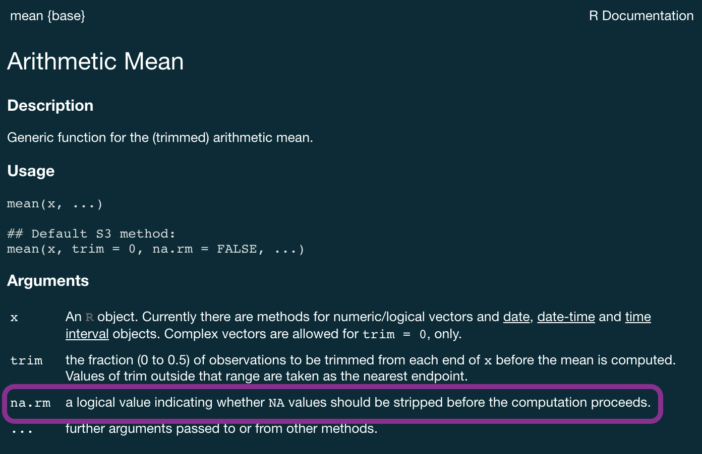
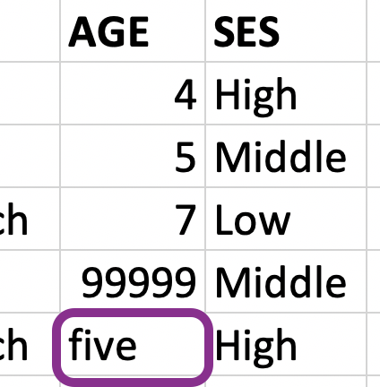
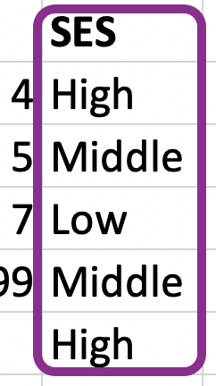

```{r setup, include=FALSE}
options(
  htmltools.dir.version = FALSE,
  dplyr.print_min = 6,
  dplyr.print_max = 6,
  tibble.width = 65,
  width = 65
)
knitr::opts_chunk$set(
  fig.width = 8,
  fig.asp = 0.5,
  out.width = "70%",
  fig.align = "center",
  dpi = 300
)
library(tidyverse)
library(scales)
library(readxl)
library(knitr)
library(lubridate)
library(DT)
```

<!-- Uses the original course data/ and img/ folders plus
stat7500-slides.css. The hotels dataset is read from its original URL.
CSV/RDS round-trip examples write the original derived filenames in data/.
The introductory import/export and df-na missing-code walkthroughs were
covered in Week 2 and have been removed. -->


## Why should you care about data types? {.section-divider .middle}

---

## Example: Cat lovers

A survey asked respondents their name and number of cats. The instructions said to enter the number of cats as a numerical value.

```{r message=FALSE}
cat_lovers <- read_csv("data/cat-lovers.csv")
```

```{r echo=FALSE}
cat_lovers
```

---

## Oh why won't you work?!

```{r warning=TRUE}
cat_lovers |>
  summarise(mean_cats = mean(number_of_cats))
```

---

## What input does `mean()` expect?

```{r eval=FALSE}
?mean
```

```{r echo=FALSE, out.width="75%"}

```

---

## Oh why won't you still work??!!

```{r warning=TRUE}
cat_lovers |>
  summarise(mean_cats = mean(number_of_cats, na.rm = TRUE))
```

---

## Take a breath and look at your data


What is the type of the `number_of_cats` variable?


```{r}
glimpse(cat_lovers)
```

---

## Let's take another look

```{r}
#| echo: false

options(htmltools.preserve.raw = FALSE)

cat_lovers |>
  DT::datatable(
    rownames = FALSE,
    options = list(
      pageLength = 5,
      lengthChange = FALSE,
      scrollX = TRUE
    )
  )
```

Which entries might explain why the whole column was read as character?

---

## Your turn: Diagnose before fixing

*3 minutes · Practice 1 in the companion document*

Use the original `cat_lovers` data.

1. Inspect the distinct responses and their frequencies.
2. Find the original responses from Ginger Clark and Doug Bass.
3. Propose a cleaning rule. Which changes are unambiguous, and which require an assumption?

Explain why `na.rm = TRUE` does not solve the problem.

::: {.notes}
Pause before showing the recoding solution. Students inspect using count(),
distinct(), and filter(). Ask for evidence supporting a correction; if an
answer is ambiguous, retain that uncertainty in the discussion.
:::

---

## `distinct()` can help

```{r}
cat_lovers |> 
  distinct(number_of_cats) |> 
  print(n = 10)
```

Inspect the original responses before deciding what to replace.

---

## A first attempt at recoding

```{r eval=FALSE}
cat_lovers |>
  mutate(number_of_cats = case_when(
    name == "Ginger Clark" ~ 2,
    name == "Doug Bass"    ~ 3,
    TRUE                  ~ number_of_cats
  )) |>
  summarise(mean_cats = mean(number_of_cats))
```

::: {.fragment}
The numeric replacements and the existing character values are incompatible.

All results in `case_when()` must have compatible types.
:::

::: {.notes}
Retains the original corrections for Ginger Clark and Doug Bass. Inspect
their original responses before applying them: a respondent's name alone
does not justify choosing a number. If a response is ambiguous, explain
what additional information or documented rule would be needed.
:::

---

## Respect data types when recoding

```{r}
cat_lovers |>
  mutate(number_of_cats = case_when(
    name == "Ginger Clark" ~ "2", #if name is Ginger Clark, assign value 2
    name == "Doug Bass"    ~ "3", #if names is Doug Bass, assign value 3
    TRUE                   ~ number_of_cats #else, keep original value
    ), 
    number_of_cats = as.numeric(number_of_cats)
    ) |>
  summarise(mean_cats = mean(number_of_cats))
```

---

## Now that we know what we're doing...

```{r}
cat_lovers_raw <- cat_lovers
cat_lovers <- cat_lovers |>
  mutate(
    number_of_cats = case_when(
      name == "Ginger Clark" ~ "2",
      name == "Doug Bass"    ~ "3",
      TRUE                   ~ number_of_cats
      ),
    number_of_cats = as.numeric(number_of_cats)
    )

cat_lovers |> 
  summarise(mean_cats = mean(number_of_cats))
```

---

## Moral of the story

- If your data do not behave as expected, inspect the values and their types.
- Apply a justified fix in code and save the result to an object.
- Check whether conversion introduced new missing values.
- Keep the original data so you can revisit your decisions.

`na.rm = TRUE` removes missing values; it does not fix a character column.

---

## Check the result of a conversion

```{r}
cat_lovers |>
  filter(is.na(number_of_cats))
```

Are there any missing values? Were they already missing, or did the conversion create them?

If needed, return to the original data to inspect those responses.


---

## Data types {.section-divider .middle}

---

## Data types in R

You have seen these labels in `glimpse()`. They describe how values are stored.

| Type | Example | Common use |
|:--|:--|:--|
| Logical | `TRUE`, `FALSE` | Conditions and indicators |
| Double | `1.335`, `7` | Numerical measurements |
| Integer | `7L` | Integer values |
| Character | `"hello"`, `"7"` | Text |

The type affects which operations make sense: `"7"` is not the number `7`.

---

## Converting between types

*with intention...*

::: {.columns}

::: {.column width="50%"}

```{r}
x <- 1:3
x
typeof(x)
```

:::


::: {.column width="50%"}

```{r}
y <- as.character(x)
y
typeof(y)
```

:::


:::

---

## Converting between types

*with intention...*

::: {.columns}

::: {.column width="50%"}

```{r}
x <- c(TRUE, FALSE)
x
typeof(x)
```

:::


::: {.column width="50%"}

```{r}
y <- as.numeric(x)
y
typeof(y)
```

:::


:::

---

## Converting between types

*without intention...*

R will happily convert between various types without complaint when different types of data are concatenated in a vector, and that's not always a great thing!

::: {.columns}

::: {.column width="50%"}

```{r}
c(1, "Hello")
c(FALSE, 3L)
```

:::


::: {.column width="50%"}

```{r}
c(1.2, 3L)
c(2L, "two")
```

:::


:::

---

## Explicit vs. implicit coercion

Let's give formal names to what we've seen so far:

. . .

- **Explicit coercion** is when you call a function like `as.logical()`, `as.numeric()`, `as.integer()`, `as.double()`, or `as.character()`


. . .

- **Implicit coercion** happens when R converts values automatically, such as when combining numbers and text in one vector

---

## Special values

- `NA`: Not available
- `NaN`: Not a number
- `Inf`: Positive infinity
- `-Inf`: Negative infinity


::: {.columns}

::: {.column width="50%"}

```{r}
pi / 0
0 / 0
```

:::

::: {.column width="50%"}

```{r}
1/0 - 1/0
1/0 + 1/0
```

:::


:::

---

## Data classes {.section-divider .middle}

---

## Data classes

A **type** describes the underlying storage; a **class** helps determine how R treats an object.

- The same stored numbers can represent quantities, category codes, or dates.
- Class information tells R how to print and work with those values.
- Examples include factors, dates, and data frames.

We will focus on what this means for cleaning and plotting.

---

## Factors

R uses factors to handle categorical variables, variables that have a fixed and known set of possible values

```{r}
x <- factor(c("BS", "MS", "PhD", "MS"))
x
```


::: {.columns}

::: {.column width="50%"}

```{r}
typeof(x)
```

:::

::: {.column width="50%"}

```{r}
class(x)
```

:::


:::

---

## More on factors

Factors store integer codes together with category labels called **levels**.

```{r}
levels(x)
as.integer(x)
```

The codes are positions in the level list, not measurements.

Changing the level order can change the order of categories in a plot.

---

## Dates

```{r}
y <- as.Date("2020-01-01")
y
typeof(y)
class(y)
```

---

## More on dates

A `Date` object stores the number of days since **1 January 1970**, together with its date class.

```{r}
as.numeric(y)
as.numeric(y) / 365 # roughly 50 years
```

The class lets R display calendar dates and place them in chronological order.

---

## Data frames

We can think of data frames like vectors of equal length glued together

```{r}
df <- data.frame(x = 1:2, y = 3:4)
df
```

::: {.columns}

::: {.column width="50%"}

```{r}
typeof(df)
```

:::

::: {.column width="50%"}

```{r}
class(df)
```

:::


:::

---

## Lists

Lists are a generic vector container; vectors of any type can go in them

```{r}
l <- list(
  x = 1:4,
  y = c("hi", "hello", "jello"),
  z = c(TRUE, FALSE)
)
l
```

---

## Lists and data frames

- A data frame is a special list containing vectors of equal length
- When we use the `pull()` function, we extract a vector from the data frame

```{r}
df

df |>
  pull(y)
```

---

## Working with factors {.section-divider .middle}

---

## Character values can represent categories

```{r}
cat_lovers |> count(handedness)
```

A column can be stored as character even when its values represent categories.

What order would be useful for displaying these categories?

---

## Default category order {.nostretch}

```{r}
ggplot(cat_lovers, aes(x = handedness)) +
  geom_bar()
```

Character categories are displayed alphabetically by default.

---

## Use forcats to manipulate factors {.nostretch}

```{r out.width="55%"}
cat_lovers |>
  mutate(handedness = fct_infreq(handedness)) |>
  ggplot(mapping = aes(x = handedness)) +
  geom_bar()
```

---

## Use factors to control category order

- `fct_infreq()`: order categories by their frequency.
- `fct_relevel()`: specify an order based on meaning.
- `fct_rev()`: reverse the current order.

**forcats** provides tools for working with factors and is part of the tidyverse.

Reordering rows with `arrange()` does not change a factor's level order.

::: {.notes}
The favourite-food example later demonstrates fct_relevel() using Low,
Middle, High. Keep other applications for students to explore.
:::

---

## Your turn: Change the display, preserve the counts

*Practice 2 in the companion document*

Make a **horizontal** bar chart of handedness with the most common category at the top.

- Plan the ordering before writing the code.
- Use `fct_infreq()` and, if needed, `fct_rev()`.
- Check that the counts have not changed.

What changed about the data's presentation? What stayed the same?

::: {.notes}
An approach is aes(y = fct_rev(fct_infreq(handedness))) + geom_bar().
Discrete y levels run from bottom to top. Let students discover the
orientation and order rather than showing a worked homework-like plot.
:::

---

## Working with dates {.section-divider .middle}

---

## Make a date

**lubridate** provides tools for parsing and working with dates.

```{r}
ymd("2020-01-31")
mdy("01/31/2020")
dmy("31/01/2020")
```

The function name describes the order of the **input** components.

What would you need to know before parsing `"01/02/2020"`?

---

## `hotels` data

Each row represents a hotel booking.

```{r include=FALSE}
hotels <- read_csv(
  "https://raw.githubusercontent.com/rfordatascience/tidytuesday/master/data/2020/2020-02-11/hotels.csv"
)
```

```{r}
hotels |>
  select(hotel, starts_with("arrival_")) |>
  glimpse()
```

---

## Goal: Bookings by arrival date

Calculate and visualise the number of bookings on any given arrival date.


```{r}
hotels |>
  select(starts_with("arrival_"))
```

---

## Step 1. Construct dates

::: {.small}

```{r}
hotels |>
  unite(col = arrival_date, arrival_date_year,
        arrival_date_month, arrival_date_day_of_month,
         sep = " ") |> 
  relocate(arrival_date)
```

:::

---

## Step 2. Count bookings per date

::: {.small}

```{r}
hotels |>
  unite(col = arrival_date, arrival_date_year,
        arrival_date_month, arrival_date_day_of_month,
         sep = " ") |>
  count(arrival_date)
```

:::

---

## Step 3. Visualise bookings per date

::: {.panel-tabset}
### Plot

```{r out.width="80%", fig.asp = 0.4, echo=FALSE}
hotels |>
  unite(col = arrival_date, arrival_date_year,
        arrival_date_month, arrival_date_day_of_month,
         sep = " ") |>
  count(arrival_date) |>
  ggplot(aes(x = arrival_date, y = n, group = 1)) +
  geom_line()
```

### Code

```{r eval=FALSE}
hotels |>
  unite(col = arrival_date, arrival_date_year,
        arrival_date_month, arrival_date_day_of_month,
         sep = " ") |>
  count(arrival_date) |>
  ggplot(aes(x = arrival_date, y = n, group = 1)) +
  geom_line()
```
:::


---

## Zooming in: What went wrong?

*Zooming in a bit...*


Why does the plot start with August when we know our data start in July? And why does 10 August come after 1 August?


::: {.small}

```{r out.width="80%", echo=FALSE, fig.asp = 0.4}
hotels |>
  unite(col = arrival_date, arrival_date_year,
        arrival_date_month, arrival_date_day_of_month,
         sep = " ") |>
  count(arrival_date) |>
  slice(1:7) |>
  ggplot(aes(x = arrival_date, y = n, group = 1)) +
  geom_line()
```

:::

---

## Your turn: Repair the date pipeline

The hotel pipeline runs, but its plot has an ordering problem.

1. Identify where the pipeline creates text rather than a date.
2. Insert a conversion and recreate the plot.
3. Explain how you checked that the new order is chronological.

**Predict first:** Will converting dates change the counts, the order, or both?

::: {.notes}
Students adapt the pipeline in their practice document using ymd(), which
was introduced before the hotel example. With these inputs, date parsing
changes the representation and order, not which bookings share a date.
The next slides provide the walkthrough for the debrief.
:::

---

## Step 1. *REVISED* Construct dates "as dates"

::: {.small}

```{r}
library(lubridate)

hotels |>
  unite(col = arrival_date, arrival_date_year,
        arrival_date_month, arrival_date_day_of_month,
         sep = " ") |> 
  mutate(arrival_date = ymd(arrival_date)) |> 
  relocate(arrival_date)
```

:::

---

## Step 2. Count bookings per date

::: {.small}

```{r}
hotels |>
  unite(col = arrival_date, arrival_date_year,
        arrival_date_month, arrival_date_day_of_month,
         sep = " ") |> 
  mutate(arrival_date = ymd(arrival_date)) |> 
  count(arrival_date)
```

:::

---

## Step 3a. Visualise bookings per date

::: {.panel-tabset}
### Plot

```{r out.width="80%", fig.asp = 0.4, echo=FALSE}
hotels |>
  unite(col = arrival_date, arrival_date_year,
        arrival_date_month, arrival_date_day_of_month,
         sep = " ") |> 
  mutate(arrival_date = ymd(arrival_date)) |> 
  count(arrival_date) |>
  ggplot(aes(x = arrival_date, y = n, group = 1)) +
  geom_line()
```

### Code

```{r eval=FALSE}
hotels |>
  unite(col = arrival_date, arrival_date_year,
        arrival_date_month, arrival_date_day_of_month,
         sep = " ") |> 
  mutate(arrival_date = ymd(arrival_date)) |> 
  count(arrival_date) |>
  ggplot(aes(x = arrival_date, y = n, group = 1)) +
  geom_line()
```
:::


---

## Step 3b. Visualise using a smooth curve

::: {.panel-tabset}
### Plot

```{r out.width="80%", fig.asp = 0.4, message = FALSE, echo=FALSE}
hotels |>
  unite(col = arrival_date, arrival_date_year,
        arrival_date_month, arrival_date_day_of_month,
         sep = " ") |> 
  mutate(arrival_date = ymd(arrival_date)) |> 
  count(arrival_date) |>
  ggplot(aes(x = arrival_date, y = n, group = 1)) +
  geom_smooth()
```

### Code

```{r eval=FALSE}
hotels |>
  unite(col = arrival_date, arrival_date_year,
        arrival_date_month, arrival_date_day_of_month,
         sep = " ") |> 
  mutate(arrival_date = ymd(arrival_date)) |> 
  count(arrival_date) |>
  ggplot(aes(x = arrival_date, y = n, group = 1)) +
  geom_smooth()
```
:::


---

## Dates and date-times

Some variables include a time of day as well as a date.

```{r}
mdy_hms("01/31/2020 14:30:00", tz = "UTC")
```

- `_hms` adds hours, minutes, and seconds to the parser.
- Use the source's time zone; this example assumes UTC.
- Check that nonmissing inputs did not become missing after parsing.

The same principle applies: match the parser to the input format.


---

## Variable names {.section-divider .middle}

---

## Data with awkward names

```{r}
edibnb_badnames <- read_csv("data/edibnb-badnames.csv")
names(edibnb_badnames)
```

R permits spaces in names, but you need backticks to refer to them:

```{r eval=FALSE}
ggplot(edibnb_badnames,
       aes(x = `Number of bathrooms`, y = Price)) +
  geom_point()
```

---

## Option 1: Define column names

```{r}
edibnb_col_names <- read_csv(
  "data/edibnb-badnames.csv",
  skip = 1,
  col_names = c(
    "id", "price", "neighbourhood", "accommodates",
    "bathroom", "bedroom", "bed", "review_scores_rating",
    "n_reviews", "url"
  )
)
names(edibnb_col_names)
```

`skip = 1` skips the existing header. Names must match the columns' **number and order**.

::: {.notes}
See https://readr.tidyverse.org/reference/read_delim.html for col_names
and skip behavior. Supplying names without skipping the existing header
would read that header as a data row.
:::

---

## Option 2 - Format text to snake_case

```{r warning=FALSE}
edibnb_clean_names <- read_csv("data/edibnb-badnames.csv") |>
  janitor::clean_names()

names(edibnb_clean_names)
```

---

## Variable types {.section-divider .middle}

---

## Beyond guessing column types

In Week 2, we used `na = ...` to identify documented missing-value codes in `df-na.csv`.

We can also state the types we expect:

```{r}
df_na <- read_csv(
  "data/df-na.csv",
  na = c("", "NA", ".", "9999", "Not applicable"),
  col_types = cols(
    x = col_double(),
    y = col_character(),
    z = col_character()
  )
)
```

---

## Specifying a type does not clean the values

If a value cannot be parsed as the requested type, it can become `NA` with a parsing warning.

```{r}
problems(df_na)
```

- Investigate warnings and unexpected missing values.
- Specify missing-value codes from the documentation.
- Recode meaningful text responses separately when needed.

Forcing a numeric type would not explain what a response like `"two or three"` means.

---

## Some useful column types

| Function | Expected values |
|:--|:--|
| `col_character()` | Text, including IDs with leading zeros |
| `col_double()` | Numbers |
| `col_integer()` | Integer values |
| `col_logical()` | Logical values |
| `col_date()` | Dates |
| `col_datetime()` | Dates and times |
| `col_skip()` | Do not import this column |

Choose types based on what a variable represents, not just how its values look.

---

## Case study: Favourite foods {.section-divider .middle}

---

## Favourite foods

::: {.panel-tabset}
### Spreadsheet

```{r echo=FALSE}
knitr::include_graphics("img/fav-food/fav-food.png")
```

### Code and result

```{r}
fav_food <- read_excel("data/favourite-food.xlsx")

fav_food
```
:::

---

## Variable names

::: {.panel-tabset}
### Spreadsheet

```{r echo=FALSE}
knitr::include_graphics("img/fav-food/fav-food-names.png")
```

### Code and result

```{r warning=FALSE}
fav_food <- read_excel("data/favourite-food.xlsx") |>
  janitor::clean_names()

fav_food 
```
:::

---

## Handling NAs

::: {.panel-tabset}
### Spreadsheet

```{r echo=FALSE}
knitr::include_graphics("img/fav-food/fav-food-nas.png")
```

### Code and result

```{r warning=FALSE}
fav_food <- read_excel("data/favourite-food.xlsx",
                       na = c("N/A", "99999")) |>
  janitor::clean_names()

fav_food 
```
:::

Here, `N/A` and `99999` are documented missing-value codes.

---

## Make `age` numeric

::: {.columns}

::: {.column width="65%"}

```{r warning=FALSE}
fav_food <- fav_food |>
  mutate(
    age = if_else(age == "five", "5", age),
    age = as.numeric(age)
    )

glimpse(fav_food) 
```

:::

::: {.column width="35%"}

```{r echo=FALSE}

```

:::


:::

---

## Socio-economic status


What order are the levels of `ses` listed in?


::: {.columns}

::: {.column width="65%"}

```{r}
fav_food |>
  count(ses)
```

:::

::: {.column width="35%"}

```{r echo=FALSE}

```

:::


:::

---

## Make `ses` factor

::: {.columns}

::: {.column width="65%"}

```{r warning=FALSE}
fav_food <- fav_food |>
  mutate(ses = fct_relevel(ses, "Low", "Middle", "High"))

fav_food |>
  count(ses)
```

:::


:::

The order is based on meaning, not alphabetical order or frequency.

---

## Putting it all together

```{r warning=FALSE}
fav_food <- read_excel("data/favourite-food.xlsx", na = c("N/A", "99999")) |>
  janitor::clean_names() |>
  mutate(
    age = if_else(age == "five", "5", age), 
    age = as.numeric(age),
    ses = fct_relevel(ses, "Low", "Middle", "High")
  )

fav_food
```

---

## Out and back in

```{r}
write_csv(fav_food, file = "data/fav-food-clean.csv")

fav_food_clean <- read_csv("data/fav-food-clean.csv")
```

---

## What survived the round trip?

What happened to `ses` again?


```{r}
fav_food_clean |>
  count(ses)
```

---

## `read_rds()` and `write_rds()`

CSV stores a rectangular table as text; it does not preserve factor levels or their order.

RDS preserves an R object, including its classes and factor levels.

```{r eval=FALSE}
write_rds(x, "data/clean-data.rds")
x <- read_rds("data/clean-data.rds")
```

Use CSV for exchange with other tools; use RDS when you need to retain an R object's structure.

---

## Out and back in, take 2

```{r}
write_rds(fav_food, file = "data/fav-food-clean.rds")

fav_food_clean <- read_rds("data/fav-food-clean.rds")

fav_food_clean |>
  count(ses)
```

---

## Cleaning is part of the analysis

Before moving on, ask:

- Do the variable types match what the values represent?
- Are category labels and their order meaningful?
- Did a cleaning step introduce missing values or discard information?
- Can someone reproduce the changes from the original data?

A pipeline that runs is not necessarily a pipeline that preserves the meaning of the data.


---

## Your turn: Begin R HW 07

