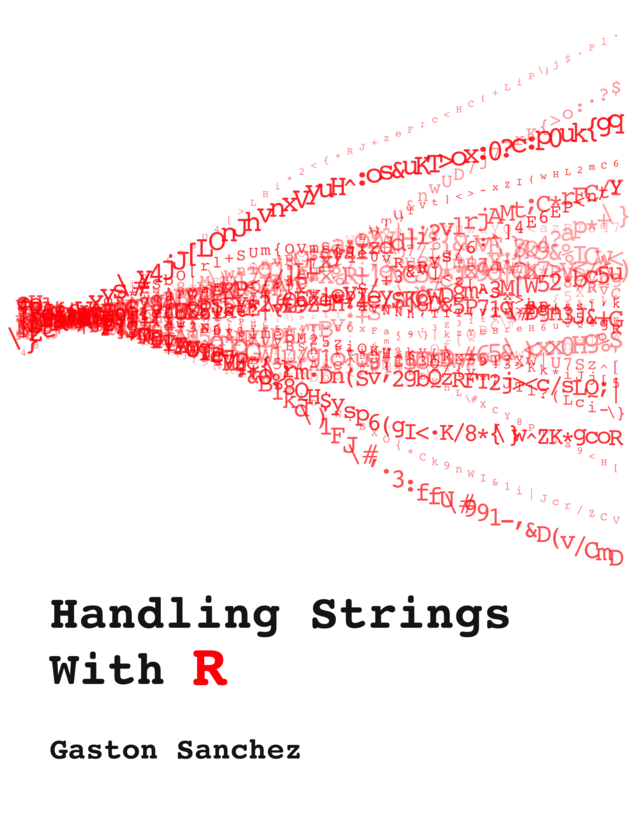
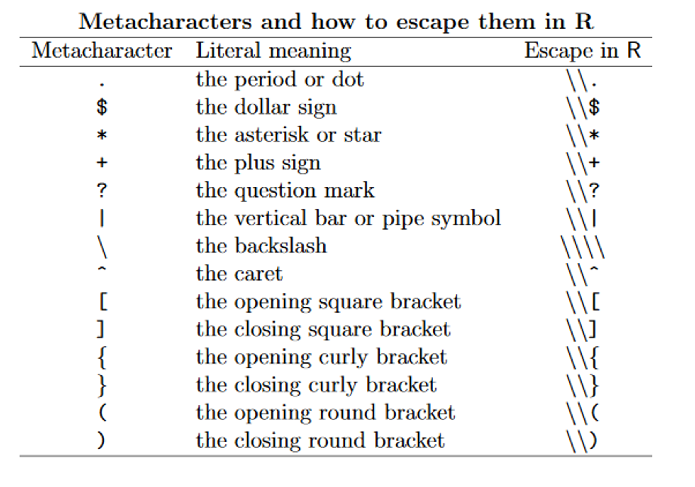

```{r child = "setup.Rmd"}
```

```{r packages, echo=FALSE, message=FALSE, warning=FALSE}
library(tidyverse)
library(DT)
library(scales)
library(readxl)
library(skimr)
library(knitr)
library(here)
```


## Working with Strings

.pull-left[
`stringr` package (in tidyverse)  
]
 
.pull-right[
[Handling Strings with R](https://leanpub.com/r4strings)
```{r echo=FALSE, out.width="50%"}

```
]

---

## Reading in Character Strings from Files
```r
read_file()    # reads entire file as single string
read_lines()   # creates vector of strings, each line separate
```

---

## Changing the Case

```{r}
str_to_lower("Villanova")
```
--
```{r}
str_to_upper("Go cats!")
```

--
```{r}
str_to_title("Make this look like a title of an article")
```
--
```{r}
str_to_sentence("Make This Look Like A Regular Sentence")
```


---

## Substrings

```r
str_sub(string, start, end)  # negative numbers count from end
str_sub("Villanova", 1, 1)   # extracts first value
str_sub("Villanova", 6, 9)   # extracts nickname
str_sub("Villanova", 6)      # from 6 to end
str_sub("Villanova", -4)     # 4th from end
```

---

## Find Character Strings
```r
str_which(vector, pattern)      # returns indices of matches (grep in base R)
str_subset(vector, pattern)     # returns values of matches (grep with value = TRUE)
str_detect(vector, pattern)     # returns logical vector (grepl in base R)
```
--
```{r}
str_which(c("Aardvark","Anteater","Alligator"),"k")
```

--

```{r}
str_subset(c("Aardvark","Anteater","Alligator"),"k")
```

--

```{r}
str_detect(c("Aardvark","Anteater","Alligator"),"k")
```

---

## Find Character Strings II

+ You can use “[]” to identify series of characters
+ You can use “-” within “[]” to identify related characters

```{r}
str_detect(c("Aardvark","Anteater","Alligator"),"[gk]")
```

```r
str_detect(vector,"[a-z]")    # to detect any lower case letters
str_detect(vector,"[A-Z]")    # to detect any upper case letters
str_detect(vector,"[A-Za-z]") # to detect any letter
str_detect(vector,"[0-9]")    # to detect any number
```
---

## Your Turn: State Names

```r
str_which(state.name,"V")
str_subset(state.name,"V")
str_subset(str_to_upper(state.name),"V")
str_subset(state.name,"[Vv]")
```
---

## Find and Replace
```r
str_replace(string, pattern, replacement)      # first occurrence
str_replace_all(string, pattern, replacement)  # all occurrences
```

```{r, eval = FALSE}
fruits <- c("one apple", "two pears", "three bananas")
str_remove(fruits, "[aeiou]")
str_remove_all(fruits, "[aeiou]")
```

--

```{r, echo = FALSE}
fruits <- c("one apple", "two pears", "three bananas")
str_remove(fruits, "[aeiou]")
```

```{r, echo = FALSE}
str_remove_all(fruits, "[aeiou]")
```

---

## Counting String Occurrence
```r 
str_count(string, pattern)
str_count("supercalifragilisticexpialidocious","[aeiou]") #returns 16
```
--
```{r, eval = FALSE}
fruit <- c("apple","banana","pear","pineapple")
p_count <- str_count(fruit,"p")
fruit[p_count > 1]
str_count(read_file("https://en.wikipedia.org/wiki/Villanova_University"),"Villanova")
```

---

## Paste (Concatenate)
```r
paste("Pi is ", pi)
paste("Pi is about", round(pi,5))
paste("Pi=", pi)
paste("Pi=", pi, sep="")
paste0("Pi=", pi)  # shortcut

# Combine values:
paste("MAT", 1:5, sep="-")
```
---

## Using Paste in Plot Labels

```{r, out.height="10%"}
ggplot(mtcars, aes(x = wt, y = mpg)) +
  geom_point() +
  geom_smooth(method = "lm") +
  labs(subtitle = paste("Correlation =", round(cor(mtcars$wt,mtcars$mpg),4)))
```

---

## Meta-characters

```r
string <- c("$20.00", "$40")
str_remove_all(string, "$") #wrong 
str_remove_all(string, "\\$") #correct
```

```{r echo=FALSE, out.height="50%"}

```

---
<div style="font-size: 70%; line-height: 1.2;">
.pull-left[
### Regex Character Classes

- `[aeiou]` → match any one lower case vowel  
- `[AEIOU]` → match any one upper case vowel  
- `[0123456789]` → match any digit  
- `[0-9]` → match any digit (same as previous class)  
- `[a-z]` → match any lower case ASCII letter  
- `[A-Z]` → match any upper case ASCII letter  
- `[a-zA-Z0-9]` → match any of the above classes  
- `[^aeiou]` → match anything other than a lowercase vowel  
- `[^0-9]` → match anything other than a digit  


NOTE: ^ negates
]

.pull-right[
### POSIX Character Classes

- `[:lower:]` → Lower-case letters  
- `[:upper:]` → Upper-case letters  
- `[:alpha:]` → Alphabetic characters (`[:lower:]` and `[:upper:]`)  
- `[:digit:]` → Digits: 0–9  
- `[:alnum:]` → Alphanumeric characters (`[:alpha:]` and `[:digit:]`)  
- `[:blank:]` → Blank characters: space and tab  
- `[:cntrl:]` → Control characters  
- `[:punct:]` → Punctuation characters: `! " # % & ’ ( ) * + , - . / : ;`  
- `[:space:]` → Space characters: tab, newline, vertical tab, form feed, carriage return, and space  
- `[:xdigit:]` → Hexadecimal digits: 0–9 A–F a–f  
- `[:print:]` → Printable characters (`[:alpha:]`, `[:punct:]`, and space)  
- `[:graph:]` → Graphical characters (`[:alpha:]` and `[:punct:]`)  ]
</div>

---

## And many more complicated combinations!

This is a GREAT place to use AI :) 

Describe in words what you're trying to accomplish, it will provide you code for the regular expression.

Just make sure to double check that it works as expected! 

---

## Your Turn - Babynames & Movie Titles

You should turn in your .html when you are finished with the Exercises in `week_12.qmd`. I will code some of them here, and others are left for you to do on your own. 


