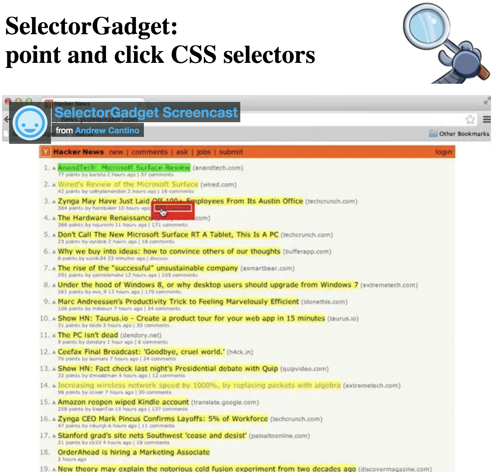
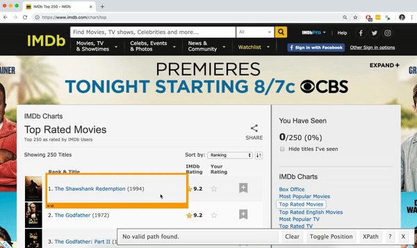
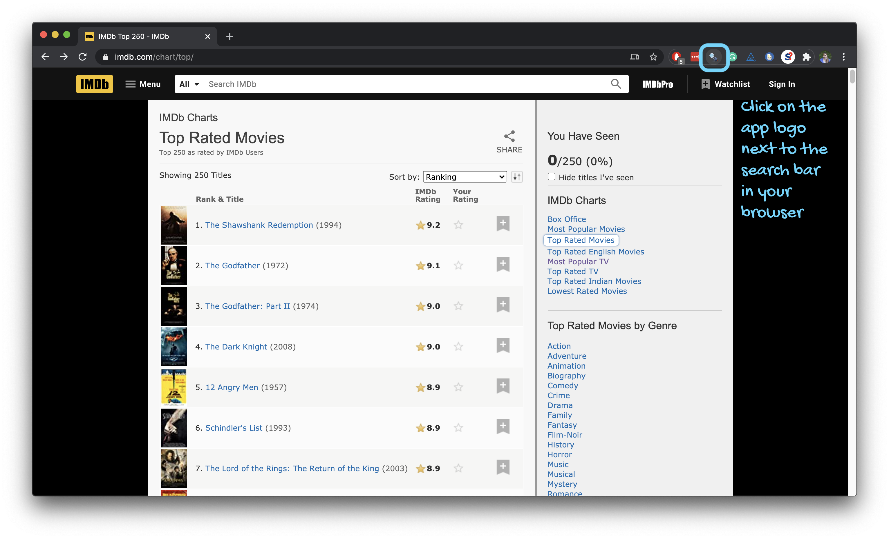
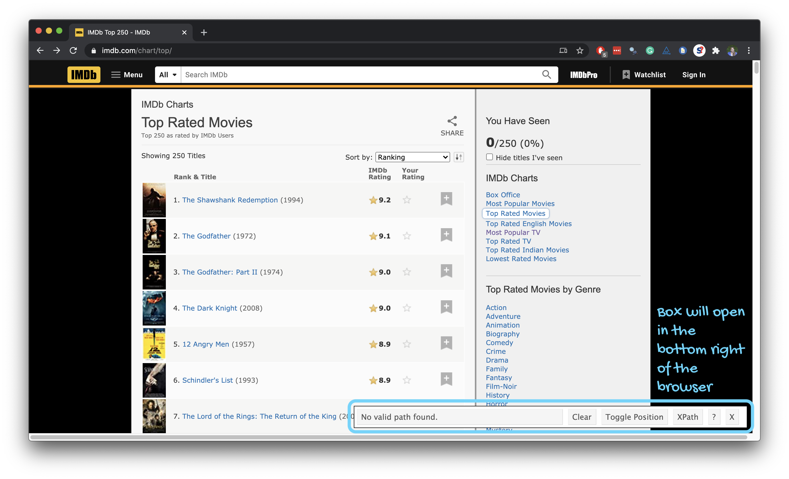
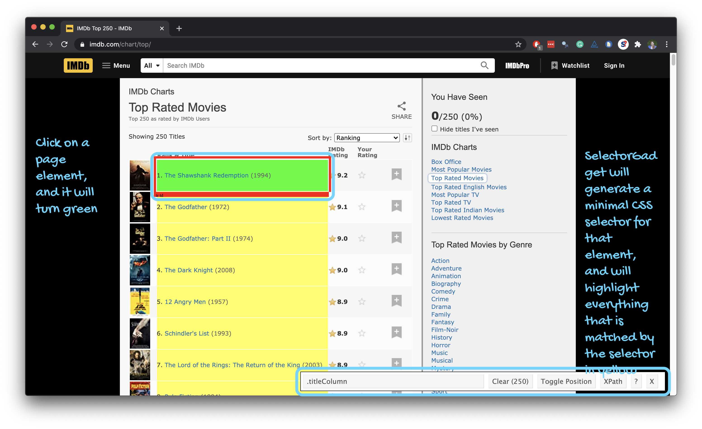
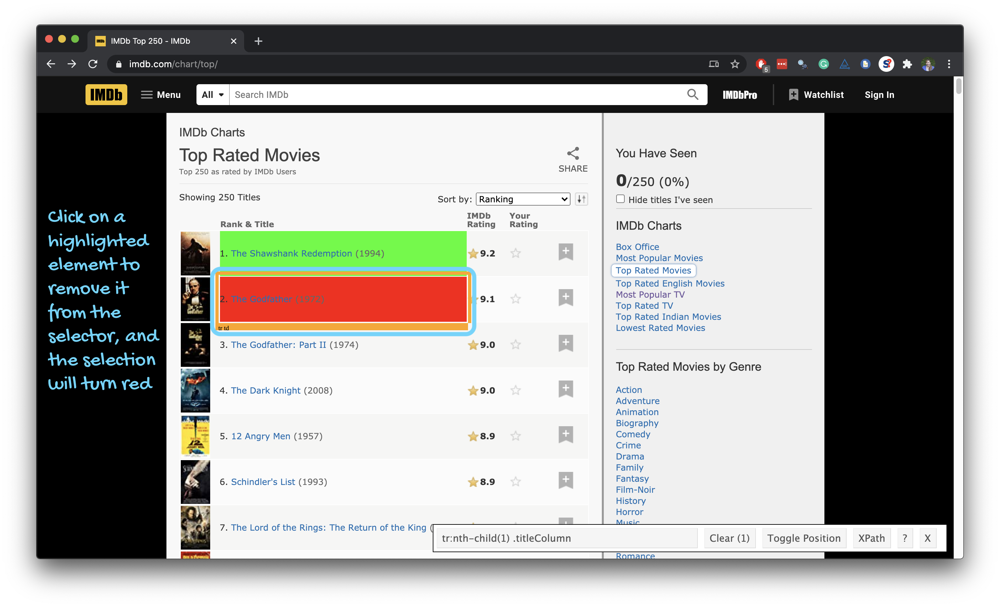
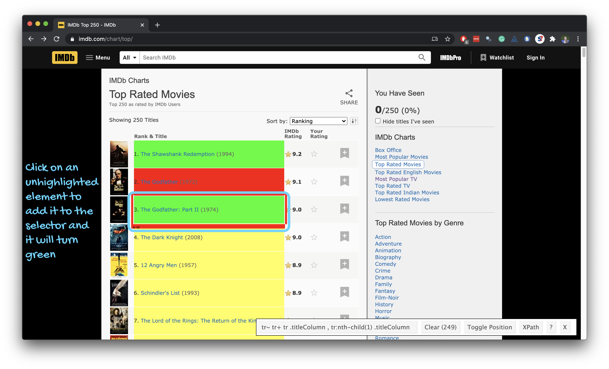
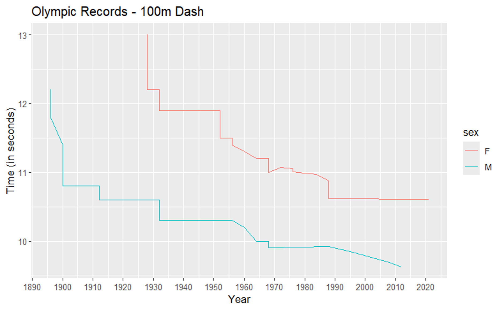

```{r child = "setup.Rmd"}
```

```{r packages, echo = FALSE, message=FALSE, warning=FALSE}
library(tidyverse)
library(rvest)
library(DT)
```


# Data Wrangling Overview

- Isolating data – `filter`, `select`, `arrange`
- Piping operator – `|>`
- Deriving information – `summarize`, `group_by`, `mutate`
- Combining datasets – `bind_rows`, joins
- Tidy data – `pivot_longer`, `pivot_wider`
- Working with strings – `stringr`
- Scraping data – `rvest`

---

# Data Scraping (from the internet)

+ Reference a file on the internet

--

+ Download a file from the internet

--

+ Scrape a table from an HTML file

--

+ The selector gadget

--
+ Using Twitter’s Application Programming Interface (API)

--

---

# Example 1: FiveThirtyEight

Nate Silver --> ABC News

+ Sports, Politics, More
+ The Signal & The Noise (Book)

[fivethirtyeight.com](fivethirtyeight.com) now redirects to ABC news, but [https://github.com/fivethirtyeight](https://github.com/fivethirtyeight) has a treasure trove of data.

---

# Example 1: FiveThirtyEight

College major data:  
https://github.com/fivethirtyeight/data/blob/master/college-majors/all-ages.csv

```{r}
collmaj538_file <- "https://raw.githubusercontent.com/fivethirtyeight/data/master/college-majors/all-ages.csv"
collmaj <- read_csv(collmaj538_file)
head(collmaj)
```

---

# Explore the Data — Median Salary

```{r, eval = FALSE}
collmaj |>
  select(Major, Median) |>
  arrange(desc(Median)) |>
  slice(c(1:5, (nrow(collmaj)-4):nrow(collmaj)))
```

--

```{r, echo = FALSE}
collmaj |>
  select(Major, Median) |>
  arrange(desc(Median)) |>
  slice(c(1:5, (nrow(collmaj)-4):nrow(collmaj))) |> 
  print(n = 10)
```

---

# Explore the Data — Unemployment

```{r}
collmaj |>
  select(Major, Unemployment_rate) |>
  arrange(desc(Unemployment_rate)) |>
  slice(c(1:5, (nrow(collmaj)-4):nrow(collmaj))) |> 
  print(n = 10)
```

---

## Explore the Data — Unemployment vs Median

```{r}
ggplot(collmaj, aes(x = Unemployment_rate, y = Median)) +
  geom_point() + geom_smooth()
```

---

## Explore — Stat/CS Majors

```{r}
collmaj |>
  filter(Major_code %in% c(2101, 2102, 3700, 3701, 3702, 4005)) |>
  arrange(desc(Median)) |>
  select(Major_code, Major, Total, Unemployment_rate, Median)
```

---

# Is This Good Coding?

Problems:
- Website or structure changes → code breaks
- Data updates → not reproducible

Solutions:
- Record date/time (`Sys.time()`)
- Save local copy

---

# Download a File

```{r}
collmaj538_file <- "https://raw.githubusercontent.com/fivethirtyeight/data/master/college-majors/all-ages.csv"
download.file(collmaj538_file, "collmaj538.csv")
```

*Try this code - best to do in R script (not qmd) when retrieving data from internet*

+ See also the `RCurl` package

---

# Example 2: Social Security data

https://www.ssa.gov/oact/babynames/numberUSbirths.html

+ View source code – right-click (in most browsers)
+ How could we extract this?? 

---

class: middle

# Web Scraping with rvest

---

## Hypertext Markup Language

- Most of the data on the web is still largely available as HTML 
- It is structured (hierarchical / tree based), but it's often not available in a form useful for analysis (flat / tidy).

```html
<html>
  <head>
    <title>This is a title</title>
  </head>
  <body>
    <p align="center">Hello world!</p>
  </body>
</html>
```

+ To learn more anatomy of HTML files - see w3schools (or DesignShack or Mozilla Developer Network)

---

## rvest

.pull-left[
- The **rvest** package makes basic processing and manipulation of HTML data straight forward
- It's designed to work with pipelines built with `|>`
]
.pull-right[
```{r echo=FALSE,out.width=230,fig.align="right"}
knitr::include_graphics("img/rvest.png")
```
]

---

## Core rvest functions

- `read_html`   - Read HTML data from a url or character string
- `html_node `  - Select a specified node from HTML document
- `html_nodes`  - Select specified nodes from HTML document
- `html_table`  - Parse an HTML table into a data frame
- `html_text`   - Extract tag pairs' content
- `html_name`   - Extract tags' names
- `html_attrs`  - Extract all of each tag's attributes
- `html_attr`   - Extract tags' attribute value by name

---

# Scrape an HTML Table

```{r, eval = FALSE}
birth_file <- "https://www.ssa.gov/oact/babynames/numberUSbirths.html"

birth_file |>
  read_html() |>
  html_nodes("table") |>
  pluck(1) |>
  html_table()
```

*Try this code - in R script. Add comments!*

*What should we explore?*

---

# Example 3: State populations (Wikipedia) 

Source: https://simple.wikipedia.org/wiki/List_of_U.S._states_by_population

```{r}
statepop_file <- "https://simple.wikipedia.org/wiki/List_of_U.S._states_by_population"
```

Let's try:

+ Reading in the html table
+ Selecting & renaming columns of interest
+ Creating a population heat map


```{r, echo = FALSE}
statepop <- statepop_file |>
  read_html() |>
  html_nodes("table") |>
  pluck(1) |>
  html_table() |>
  select(3,4,8)

names(statepop) <- c("state", "pop_2020", "pop_per_electoral_vote")
```

---

# Example 3: State populations

.panelset[

.panel[.panel-name[Plot]
```{r "map-plot", echo = FALSE}
library(maps)

states <- map_data("state")

statepop |>
  mutate(state = str_to_lower(state)) |>
  right_join(states, by = c("state" = "region")) |>
  mutate(
    pop = as.numeric(str_remove_all(pop_2020, ",")),
    pop_mil = round(pop / 1000000, 1)
  ) |>
  ggplot() +
  geom_polygon(aes(long, lat, fill = pop_mil, group = state))
```
]

.panel[.panel-name[Code]
```{r ref.label="map-plot", fig.show="hide"}
```
]

]

---

# Example 4: PSSA Results

+ Pennsylvania Department of Education: [www.education.pa.gov](www.education.pa.gov)
+ PSSA is  the Pennsylvania System of School Assessment
--

+ Measures student achievement “according to Pennsylvania's world-class academic standards”

--
> “By using these standards, educators, parents and administrators can evaluate their students' strengths and weaknesses to increase students' achievement scores”

--
+ Subjects - reading & mathematics
--
+ Scored as “Below Basic”, “Basic”, “Proficient” or “Advanced” (sometimes the latter two categories are combined)
--
+ Replaced by the Keystone exams for high school which are required for graduation…or maybe not!

Data page:  
https://www.education.pa.gov/DataAndReporting/Assessments/Pages/PSSA-Results.aspx

```{r, echo = FALSE}
pssa_2019_url <- "https://www.education.pa.gov/DataAndReporting/Assessments/Pages/PSSA-Results.aspx"
download.file(pssa_2019_url, "pssa_2019.html")
pssa_2019_file <- "pssa_2019.html"
```


---

# Example 5: Villanova on Reddit

```{r}
library(httr)
library(jsonlite)
library(dplyr)
library(tibble)

# Reddit API search for "Villanova"
url <- "https://www.reddit.com/search.json?q=Villanova&limit=100"

res <- GET(url, user_agent("vu-class-app"))
txt <- content(res, as = "text", encoding = "UTF-8")
dat <- fromJSON(txt)

# Extract post data
VU_posts <- dat$data$children$data
```


---

# One more example: Zipcodes (SAS MP)

```{r}
zip15003 <- "https://www.zip-codes.com/zip-code/15003/zip-code-15003.asp"
thisURL <- zip15003

# Function to read one ZIP code page
read_zip_url <- function(thisURL) {
  this_zip <- thisURL %>% 
    read_html() %>% 
    html_nodes("table") %>% 
    html_table(fill = TRUE) %>% 
    keep(~ ncol(.x) == 2) %>% 
    bind_rows()
  
  thisZip <- data.frame(t(this_zip %>% select(2)))
  names(thisZip) <- make.names(t(this_zip %>% select(1)), unique = TRUE)
  
  return(thisZip)
}
```

---

# One more example: Zipcodes (SAS MP)

```{r}
# Vectorized function that creates one row of data per zip code provided
read_zip_vector <- function(zip_vector) {
  map_dfr(zip_vector, function(z) {   # here z is the current ZIP code
    url <- paste0("https://www.zip-codes.com/zip-code/", z, "/zip-code-", z, ".asp")
    df <- read_zip_url(url)
    
    # Correct: use z here, not zipcode
    df <- df %>% mutate(ZipCode = z)
    return(df)
  })
}

# Example usage
zip_vector <- c("75116", "60201", "91101")
zip_df <- read_zip_vector(zip_vector)
```

---

## SelectorGadget

.pull-left-narrow[
- Open source tool that eases CSS selector generation and discovery
- Easiest to use with the [Chrome Extension](https://chrome.google.com/webstore/detail/selectorgadget/mhjhnkcfbdhnjickkkdbjoemdmbfginb) 
- Find out more on the [SelectorGadget vignette](https://cran.r-project.org/web/packages/rvest/vignettes/selectorgadget.html)
]
.pull-right-wide[
```{r echo=FALSE, out.width="75%"}

```
]

---

## Using the SelectorGadget

```{r echo=FALSE, out.width="80%"}

```

---

```{r echo=FALSE, out.width="95%"}

```

---

```{r echo=FALSE, out.width="95%"}

```

---

```{r echo=FALSE, out.width="95%"}

```

---

```{r echo=FALSE, out.width="95%"}

```

---

```{r echo=FALSE, out.width="95%"}

```

---

## Using the SelectorGadget

Through this process of selection and rejection, SelectorGadget helps you come up with the appropriate CSS selector for your needs

```{r echo=FALSE, out.width="65%"}

```

---

# Your Turn

Scrape the 100m Olympic record progression tables and create the following plot  
https://en.wikipedia.org/wiki/100_metres_at_the_Olympics

```{r, echo = FALSE}

```

---


<!-- --- -->

<!-- # PSSA — ELA Scores -->

<!-- ```{r} -->
<!-- pssa_2019_file |> -->
<!--   read_html() |> -->
<!--   html_nodes("table") |> -->
<!--   pluck(1) |> -->
<!--   html_table() -> pssa_ela -->
<!-- ``` -->

<!-- --- -->

<!-- # PSSA — Combine All Subjects -->

<!-- (Example of repeated scraping for ELA, math, science.) -->

<!-- --- -->

<!-- # Graphing PSSA Results -->

<!-- ```{r, eval = FALSE} -->
<!-- pssa |> -->
<!--   ggplot(aes(grade_num, ap_num, color = subject)) + -->
<!--   geom_point() + -->
<!--   geom_line(size = 1) + -->
<!--   labs(title = "2019 PSSA", -->
<!--        y = "% Proficient/Advanced", -->
<!--        x = "Grade") -->
<!-- ``` -->

<!-- --- -->

<!-- # Baseball example -->

<!-- ```{r} -->
<!-- statcast_url <- "https://baseballsavant.mlb.com/savant-player/justin-verlander-434378?stats=statcast-r-pitching-mlb" -->

<!-- statcast_url %>% -->
<!--   read_html() %>%  -->
<!--   html_node("#statcast_stats_pitching") |>  -->
<!--   html_table() |>  -->
<!--   head() -->
<!-- ``` -->

<!-- --- -->
